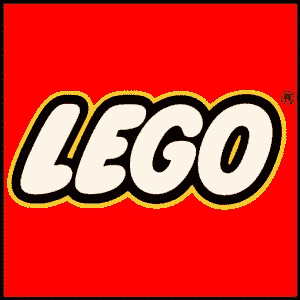

# 标志设计基础，第 5 部分:重要问题

> 原文：<https://www.sitepoint.com/logo-design-fundamentals-part-5-important-questions/>

之前，我们已经了解了徽标的三个主要类别:

*   [仅符号](https://www.sitepoint.com/fundamentals-of-logo-design-part-4-symbol-only-logos/)
*   [类型&符号](https://www.sitepoint.com/fundamentals-of-logo-design-part-3-type-symbol-logos/)
*   [排版](https://www.sitepoint.com/fundamentals-of-logo-design-part-2-typographic-logos/)

在设计师继续创作标志之前，有两个最基本的问题需要回答:

*   谁是客户？
*   **谁是观众？**

这个标志将从这些问题的答案中成长。平面设计师是问题的解决者，但是与其把想法强加给问题，不如由问题本身来决定解决方案。

客户是谁？这个问题涉及公司的目标、价值观、当前和未来的业务。五年或十年后，公司想达到什么目标？找出客户提供了什么，并承诺给他们的观众是非常重要的。

观众是谁？是女性爱普拉提吗？是十几岁的男孩子喜欢跑步吗？是孩子(还是他们的父母)喜欢积木？

为了找到这些大问题的答案，设计师需要… **问更多的问题**。

**关于公司**

*   客户的业务是什么？他们的目的是什么？
*   营销目标是什么，为什么他们想要一个新的标志？
*   目前的目标是什么？
*   长期目标是什么？5 年、10 年、20 年时间的计划是什么？
*   客户的主要竞争对手是谁？
*   客户的文化是什么？是否有某些行为使其与竞争对手不同？
*   抛开经济学，客户的使命是什么？

**关于观众**

*   客户目前的受众是谁？在哪里？什么时候？为什么？
*   客户是否试图获得新的受众？
*   受众目前如何看待客户端？
*   客户希望观众如何看待新品牌？
*   目标受众应该对此有什么反应？

回答这些问题有助于深入了解公司及其受众的本质。一旦你明白了这一点，只有到那时，才是时候开始谈论颜色，类型和象征意义。

你还会在这个列表中添加哪些问题来帮助你更好地了解公司及其受众？请补充自己的问题。

## 分享这篇文章