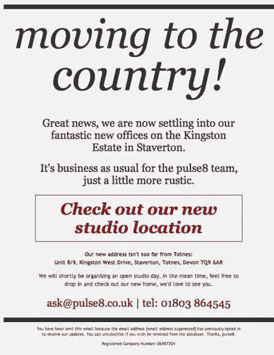

# 15 封华丽而有效的 HTML 邮件

> 原文：<https://www.sitepoint.com/15-gorgeous-and-effective-html-emails/>

SitePoint 的最新著作《创造出令人惊叹的 HTML 电子邮件》 ,是设计和编写与任何电子邮件客户端兼容的漂亮 HTML 电子邮件的最佳实践建议汇编。我们制作了第三章，收件箱的设计，[免费提供 PDF 格式](https://www.sitepoint.com/books/htmlemail1/samplechapters.php)，让你领略一下书中的内容。上周我们给了你一个章节的摘录，是关于学习设计成功的电子邮件背后的原则。本周，我们将展示结束这一章节的设计画廊，从中你可以获得灵感。

如果你想学习如何为自己创建这样的电子邮件，[拿起书](https://www.sitepoint.com/blog/)开始阅读吧！

## HTML 电子邮件图库

浏览一些顶级 HTML 电子邮件的截图，想想他们想要达到什么目的。为了方便起见，对它们进行了分类，但是它们中的许多可以归入多个类别。

### 明确的行动号召

这些电子邮件非常清楚他们想要读者做什么。给你的读者一个明显的选择会显著提高你的点击率。

[bgroup](http://www.thebgroup.co.uk) 创意公司的简讯，如图[图 1，“bgroup 创意简讯”](#fig_bgroup "Figure 1. bgroup creative newsletter")所示，将人们的注意力吸引到一个已经很大的按钮上，上面有一个滑稽的角色。

**图一。b 集团创意简讯**

## 准备好了吗？

我希望这些邮件能激励你重新考虑 HTML 邮件，把它作为你网站设计服务的有效补充。请记住，您可以免费下载本文引用的整个章节，作为[示例 PDF](https://www.sitepoint.com/books/htmlemail1/samplechapters.php) 的一部分。如果你渴望马上开始创建令人惊叹的 HTML 电子邮件，[拿起你的那本书](https://www.sitepoint.com/blog/)。它有印刷版，也有包含 PDF、Mobi 和 EPUB 版本的电子书包。

## 分享这篇文章