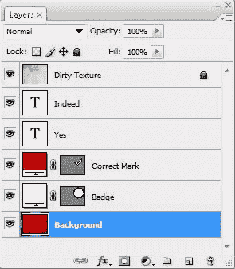
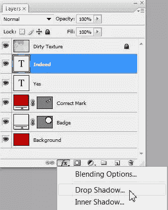
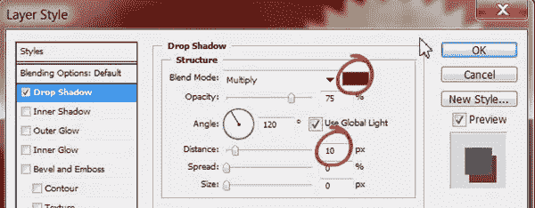
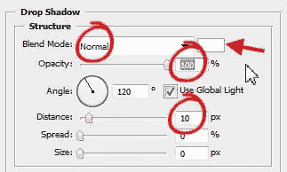
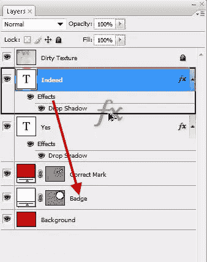

# Photoshop 中丰富多彩和微妙的阴影

> 原文：<https://www.sitepoint.com/colorful-subtle-drop-shadows-in-photoshop/>

啊，阴影，深受全世界设计师的喜爱。众所周知，Photoshop 可以让你轻松地在任何图层(除了锁定的背景图层)的对象上添加阴影。然而，更多的时候，新的设计师会在他们的作品中加入黑色的阴影，当有一个选项可以选择你想要的任何颜色的阴影时，包括白色。使用黑色阴影没有错，但是如果你想得到更微妙的效果，你可以使用默认黑色以外的颜色。让我们来看看选项。

1.我用几层文字和两个形状制作了一个非常简单的图像。你可以看到下面的层结构。使用 Multiply 将顶层(脏纹理)混合到它下面的层上，文本设置为 Arial Rounded。正确的标记和徽章是使用 Photoshop 的自定义形状工具创建的形状图层。

2.选择你想要投影的图层，点击图层面板底部的“添加图层样式”按钮。从弹出式菜单中，选取“投影”。我在给“确实”这个词加上阴影。

3.将打开图层样式对话框。确保选中“预览”复选框，这样您就可以看到这些更改如何影响您的图像。默认情况下，混合模式设置为乘法，颜色设置为黑色，这通常是大多数人留下阴影的方式。单击色样或颜色池以打开拾色器。您可以从颜色选择器样本中选择一种颜色，也可以使用滴管从设计中选择一种颜色。我选择了比我的主要背景颜色稍微深一点的红色。将“大小”滑块向下拖到 0px，然后将“距离”滑块拖到您满意对象从页面“抬起”的程度的位置。

图像现在看起来像这样:

现在，如果你想添加一个白色的阴影，过程是相同的，但这一次你需要改变混合模式。

4.选择要添加白色阴影的图层，然后像以前一样点击添加图层样式按钮，从弹出菜单中选择投影。当图层样式对话框打开，改变混合模式为正常，否则你不会看到白色的阴影。我还增加了 100%的不透明度，以获得一个纯白色，并设置距离为 10 像素。

这是它看起来的样子:

最后，为了完成这张图片，我想给徽章添加和我给单词“的确”添加的一样的阴影。我可以使用快捷方式将样式从一个图层复制到另一个图层，而不必再次经历添加图层样式对话框。

5.按住 Alt (Windows)/ Option(Mac)键，然后在要复制样式的图层上单击单词“Effects ”,并将其拖放到要应用样式的图层上。

我的最终图像现在看起来像这样:

如果我接受了投影效果的默认选项，图像将会变成这样:

因此，两种不同的外观实现了阴影层的效果。

## 分享这篇文章