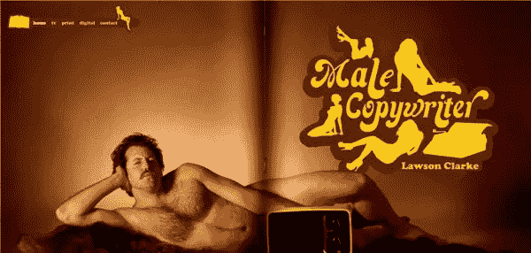
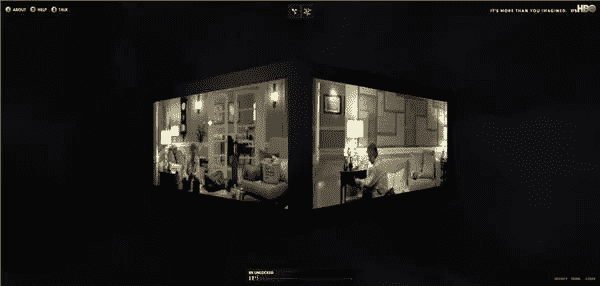
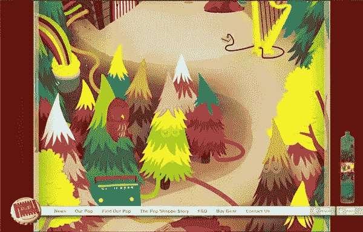
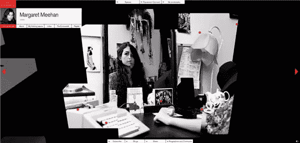
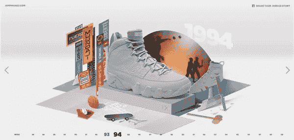

# 威比奖获奖者设计

> 原文：<https://www.sitepoint.com/webby-award-winners-design/>

过去的一周，2010 年威比奖的获奖者已经揭晓。类别包括[网站](http://www.webbyawards.com/current.php?media_id=96&season=14)、[互动广告](http://www.webbyawards.com/current.php?media_id=98&season=14)、[网络电影&视频](http://www.webbyawards.com/current.php?media_id=97&season=14)、[手机](http://www.webbyawards.com/current.php?media_id=127&season=14)再细分为七十个类别。我挑选了一些与设计相关类别的获奖者。

**最佳主页/欢迎页**由[男文案](http://malecopywriter.com/)获得。这是一个基于 flash 的网站，展示劳森·克拉克的作品，他似乎很有幽默感。该网站还获得了**最佳自我推广/组合**网站。导航简单明了，最引人注目的设计是克拉克先生的全幅背景照片，上面有一个巨大的黄色和棕色 70 年代风格的标志。

[HBO/Imagine](http://www.hboimagine.com) 获得**最佳结构/导航**奖。另一个 Flash 网站，但有一个非常不寻常的 3D 菜单系统。最初当网站开放时，我以为它会是那种你必须花更多时间去弄清楚*如何*使用它的网站，但它是相当容易移动的。导航包括漂浮在太空中的大型图像和视频立方体。点击一个方框，你就可以看到节目的预览。

Pop Shoppe 获得最佳动画/动态图像奖。是的，更多的闪光灯。这个网站在设计和出现在网站上的角色方面都充满了色彩。在有蹦蹦跳跳的怪物、紫色的大象和竖琴演奏小兔子的地方，那是相当“另类”的。这当然很有想象力。

最佳摄影使用奖的获得者是经济学人思维空间。这个网站也有一个非常不寻常的导航系统，我最初觉得很讨厌，但网站上的内容是优秀的，照片的使用无疑是一流的。这个网站还获得了**最佳视觉设计-功能**奖，它是用 Flash 制作的。

**最佳视觉设计**——美学奖授予了[飞行的历史](http://www.nike.com/jumpman23/historyofflight/)，这是一个专门介绍飞人乔丹鞋的耐克网站。一条从 1985 年到现在的时间线充当了这个网站的导航。点击年份，你会得到一本看起来像是弹出式的书，里面有关于迈克尔·乔丹的鞋子和一些相关的随身用品。这个网站有一种很好的质感，通过时间线的移动非常流畅。

当然，还有更多的获奖者，如果你还没有看过，请访问[威比奖](http://www.webbyawards.com/webbys/current.php?season=14)网站查看所有的获奖者和被提名者。

你怎么看？这些是当之无愧的赢家吗？

## 分享这篇文章