# 11 个最好的 WordPress 作者简历插件

> 原文：<https://www.sitepoint.com/11-of-the-best-wordpress-author-bio-plugins/>

如今，作者传记不仅仅是一种在线趋势，尤其是在多作者网站上。事实上，在研究这篇文章时，我找不到一个抵制作者 bios 的例子。显然，在你的 WordPress 网站上有可靠的作者简历是必须的。

不管你从事什么行业，一份作者简历可以建立声誉和信任；它向你的读者展示了你是谁，你做什么，你为什么这样做，以及什么使你有资格成为一名专家。当你只知道一个作者的名字时，所有这些都不明显。作为一个作者，你需要付出一点你自己来和你的观众联系。在简历中加入简历有助于这一点，使阅读体验更加个性化。在一天结束的时候，每一笔交易(每一次通过在线文章传递知识)都只是两个人之间的互动。

一个作者的生物箱应该是引人注目的和有吸引力的。它应该补充你网站的主题，使用相似的字体、颜色和布局。毕竟，即使你在每篇文章的结尾都附上了作者简介，如果没有人注意或阅读，也不会有什么影响。

对我们大多数人来说，创建和显示作者简历框最简单的方法就是使用插件。所以，今天，我展示了 11 个最好的 WordPress 作者简历插件。

## [Fancier 作者箱 by Themato 汤](https://wordpress.org/plugins/fancier-author-box/)

声称 Fancier Author Box 是“你需要的唯一的作者简历插件”，Themato Soup 用他们的插件激起了我的兴趣。这个免费的、相对较轻的作者传记插件已经被下载了 115，000 次，并获得了 4.7 星的评级。

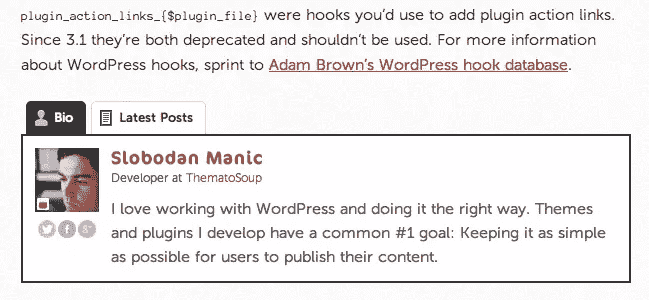

Fancier Author Box 的功能包括整合所有主要社交媒体网络(Twitter、脸书、Google+、LinkedIn、Instagram、Flickr、Pinterest、Tumblr、YouTube 和 Vimeo)的能力。您可以添加简短的简历描述、职位、公司、公司 URL 和社交媒体图标。它会自动拉进并显示你的 gravatar 图片，以及你最近所有的帖子。

与其他一些作者简介插件不同，Fancier Author Box 让你能够选择作者简介出现在你网站的哪个位置。您可以指定您的作者简历出现在帖子、页面和自定义帖子类型中，甚至可以选择指定它出现的位置(在您的帖子或页面上方或下方，两者都有，甚至根本不出现)。您可以更改作者简介框中几乎所有元素的颜色，包括标签、边框和背景。这个作者框插件是完全响应的，并且被设计成与响应的 WordPress 主题一起工作。

## [最喜欢的作者框](http://thematosoup.com/plugins/fanciest-author-box/)

我必须承认，当我遇到最有趣的作者框插件时，我有点惊讶:Themato Soup 已经宣称最有趣的作者框是“你需要的唯一的作者框插件”。然而，这是他们插件的一个高级付费版本。我很好奇…

你可以花 17 美元购买 Fanciest Author Box，让你更好地控制你的作者简历，以及一长串方便的功能，包括:视网膜就绪显示，合作作者插件支持，随机作者选项，以及提高页面速度的惰性加载。

然而，在我看来，有两个*最奇特的特征*，它们确实与众不同。使用 Fanciest Author Box，你可以加载一个作者简介作为一个小部件。这意味着你可以把你的作者简历放在你网站的任何地方，而不是局限在你的页面或文章中。

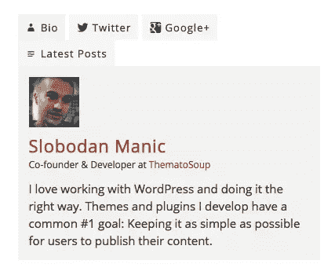

这个特殊的作者框插件的另一个最有趣的特性是它的延迟加载社交标签。这些最大限度地提高了你的页面加载速度，同时还允许你的读者通过社交媒体与你的作者联系。每个社交标签都会加载作者最近的帖子，让读者快速浏览他们最近分享的内容，鼓励他们参与社交媒体。

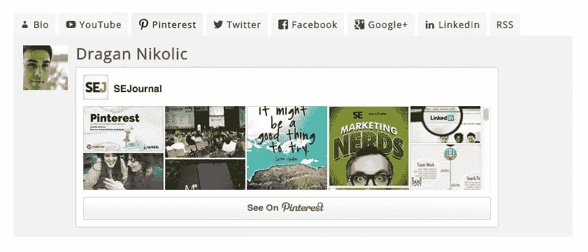

## [性感作者简介](https://wordpress.org/plugins/sexy-author-bio/)

虽然这个插件只被下载了 3000 次，但我还是忍不住偷偷看了一眼(也许那句老话真的是对的:性确实有卖点！).

我又惊又喜。与市场上相当多的其他 author box 插件不同，这个插件与 WordPress 的当前版本(4.0 版)兼容。作者框的外观和感觉是光滑，圆滑和专业的，许多设计元素可以很容易地定制，包括 gravatar 大小，字体大小和颜色，背景和高亮颜色，以及边框样式和颜色。插件也有短代码，所以你可以把你的作者简历框放在你网站的任何地方。

## [Starbox——人类的作者盒子](https://wordpress.org/plugins/starbox/)

顾名思义，这个特殊的作者框插件非常专注于为人类创造积极的成果(相对于搜索引擎和软件)。因此，Starbox 的主要名声是产生了看起来很漂亮的作者框，因此更有可能让你的读者一路点击，并更好地了解你的作者。我不得不承认；Starbox author 的 bios 看起来确实不错，尤其是右边的社交媒体图标显示。

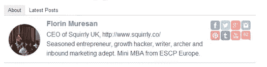

如果你想在你的 WordPress 站点上创建不同的作者框，Starbox 可能是你的作者简介插件。它为个人作者提供了广泛的可定制设置。你可以为不同的作者设置不同的主题和颜色。或者，您可以选择不显示特定作者的简历。你可以上传自己的图片或头像，这样你就不局限于使用你的 gravatar 图片了。

当谈到可用性和设置时，人又是第一优先考虑的，Starbox 甚至提供了“为人类”的保证。不需要编码，菜单非常用户友好和直观。设置每个作者简介只需要几分钟的时间，插件后端的外观和感觉也非常完美。

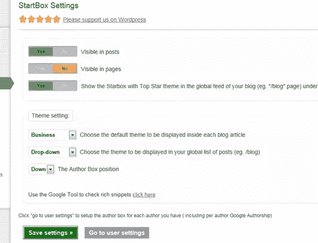

还有一种高级付费版本的 Starbox，通常售价为 39.99 美元。这个插件的高级版本允许你删除“Starbox 粉”标签，链接和订阅表格，并提供优先支持。

## [WP 关于作者](https://wordpress.org/plugins/wp-about-author/)

Jon Bishop 的 author box 插件有 54000 次下载，非常简单、直观、易用。如果你正在寻找一个没有太多花里胡哨的插件，这是一个完美的作者简介插件。

这并不是说 WP About Author 没有漂亮的功能。事实上，这个插件提供了一系列的定制，允许你改变你的作者框的背景颜色和边框样式，以及你的 gravatar 的大小和形状。你甚至可以选择是否显示社交媒体资料，或者简单的文本链接。

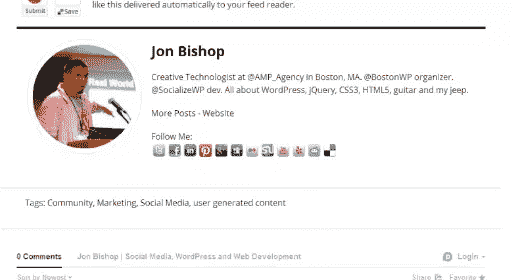

## WP 传记

这个插件提供了一系列非凡的功能。你可以在文章和页面中添加可定制的作者简介，以及 RSS 源、存档、小工具，甚至是定制的文章类型。你的作者框可以全局隐藏，或者有选择地对某些文章、页面甚至类别隐藏，它可以显示在你的内容的上面或者下面。

你可以用多种方式改变你的 WP 传记作者框的外观和感觉，可以选择改变边框和背景，你的 gravatar 的大小和你的简历的长度。该插件集成了所有主要的社交媒体平台，以及雅虎！Messenger、AIM、Windows Live Messenger 和 Jabber/Google Talk 即时消息配置文件。

我对这个插件有一点小小的警告。这个插件的后端不像其他插件那样用户友好。它有七个不同的菜单选项卡，所有选项卡都包括必须配置的多个设置和选项。所以，如果你是 WordPress 的新手用户，这可能不适合你。

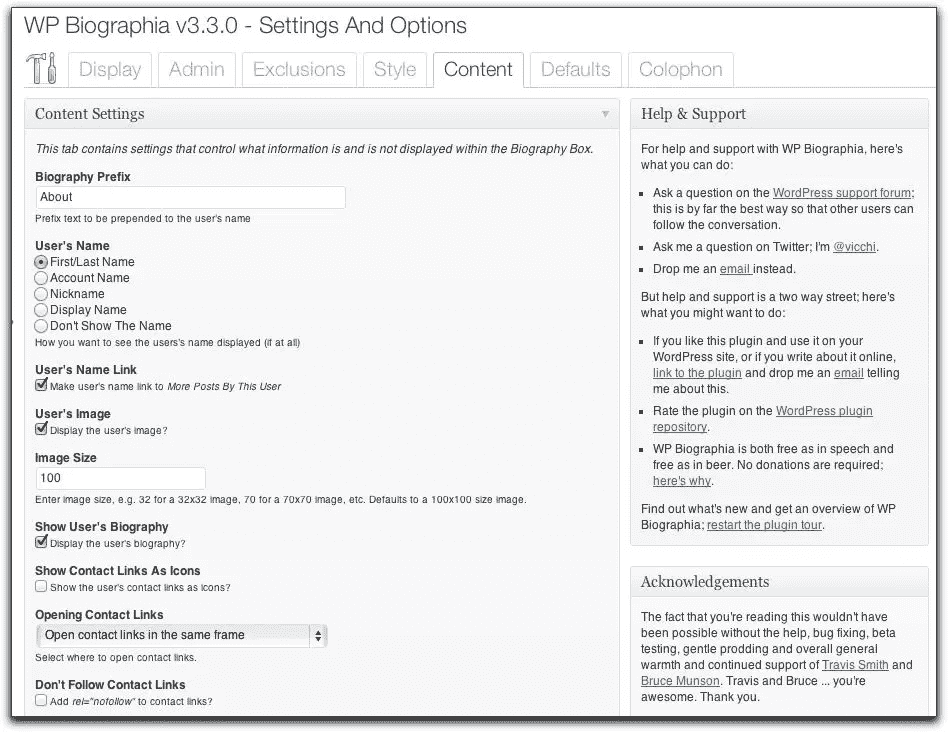

## [简单作者框](https://wordpress.org/plugins/simple-author-box/)

当涉及到生成最精致、最现代外观的作者框时，这个插件绝对是最棒的。事实上，这个插件生成的作者框看起来好像是由一个图形设计师团队设计的，他们的任务是创建一个时髦的极简设计。

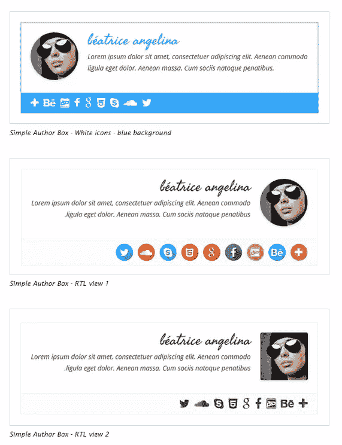

最重要的是，Simple Author Box 是移动响应的，它支持多达 30 种不同的社交媒体配置文件，可以设置为当读者悬停在它们上面时产生旋转效果。你可以设计一个简单的作者框来显示你的作者的名字，标题和简短的传记。它也是完全可定制的(包括颜色、大小、字体和样式)，这样你就可以快速方便地将你的作者框与你网站的主题相匹配。

简单的作者框插件有一个缺点:你只能在文章的结尾插入作者框(而不是在文章的开头，或者在一个小部件中)。

## [作者盒重装](https://wordpress.org/plugins/author-box-2/)

这个插件比其他许多作者框插件更具限制性。它只允许你在单个页面或文章的末尾添加一个作者框(而不是在开头，或者在一个小部件中，甚至是跨特定类别或文章类型的全局)。

然而，它确实能让你链接到许多其他作者框插件无法提供的外部网站(包括一个图标),包括 WordPress.org 和 Drupal 协会。所以，如果你特别想突出你的作者与 WordPress 和 Drupal 的联系，这个插件可能是个不错的选择。

## [关于作者的习俗](https://wordpress.org/plugins/custom-about-author/)

超过 35，000 次下载，如果你的网站有多个作者，而每个作者没有自己的用户帐户，这个作者框插件是完美的。通过使用自定义关于作者，您可以创建多个作者简档，然后指定应该为您的每个帖子显示哪个简档。和所有其他的作者框插件一样，你可以很容易地定制你的作者简介，你可以包含所有主要社交媒体平台和网站的链接。

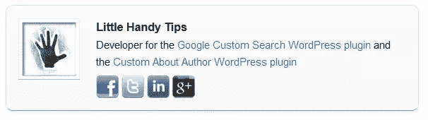

## [不同描述的作者框插件](https://wordpress.org/plugins/author-box-with-different-description/)

就像所有其他的作者框插件一样，这为你所有的网站文章添加了一个作者框，包括作者姓名，gravatar，社交媒体帐户，网站 URL 和以前的文章。你甚至可以指定作者框出现的位置(在你的文章之前或之后)。

但是，这个插件所提供的其他插件都没有的功能是为同一作者添加不同的描述，这取决于作者框显示的是哪篇文章。因此，如果你的网站提供许多不同主题的建议(就像 SitePoint 一样)，你可能会让同一作者写多个主题的文章(例如，在 SitePoint 的情况下，同一作者可能为 WordPress 和移动频道写文章)。所以，你可能想要两个不同的 bios(一个突出作者在 WordPress 的体验，另一个在 Mobile)。这个插件允许你这样做。

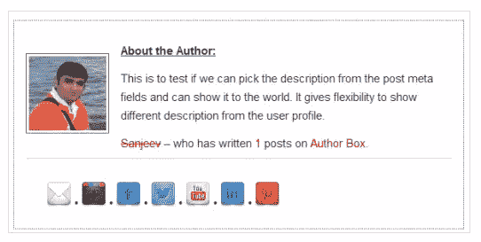

## [合著者加](https://wordpress.org/plugins/co-authors-plus/)

最后，但绝不是最不重要的，我们来到共同作者加。如果你有多个作者写同一个帖子、页面或自定义帖子类型，那就不用再找了。Co-Authors Plus 是一个免费的插件(已经被下载了近 100，000 次),它允许你为同一篇文章的多个作者打分，甚至不用为他们创建一个 WordPress 帐户。虽然这在技术上不是一个作者框插件，但它肯定会派上用场。

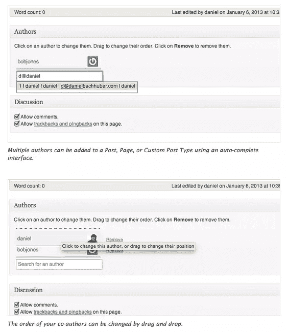

## 适合各种场合的 WordPress 作者框插件

WordPress 作者框插件共享许多相同的标准特性。它们都允许你包含一个 gravatar，一个简短的传记，一个网站 URL，以及所有主要社交媒体网络的链接。这些插件中的大多数也允许一定程度的定制；字体，颜色，背景，甚至 gravatar 图像大小都可以改变，以更好地适应你的网站的外观和感觉。

作者框插件真正脱颖而出的地方在于它们小小的附加功能。因此，Fanciest Author Box 提供了延迟加载社交媒体标签；Starbox 极其好用，界面应该每个人都能看懂；简单的作者盒有一个圆滑的设计，抛光，和专业；不同描述的作者框插件允许你根据每个帖子的内容为同一个作者设置不同的 bios。

所以，在你决定一个作者框插件之前，想想你的目标是什么，你希望用你的作者框实现什么。一旦你确定了这一点，市场上肯定会有一个插件提供你需要的附加功能。

## 分享这篇文章