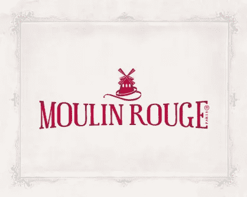
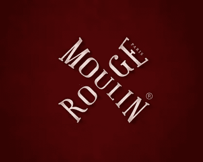
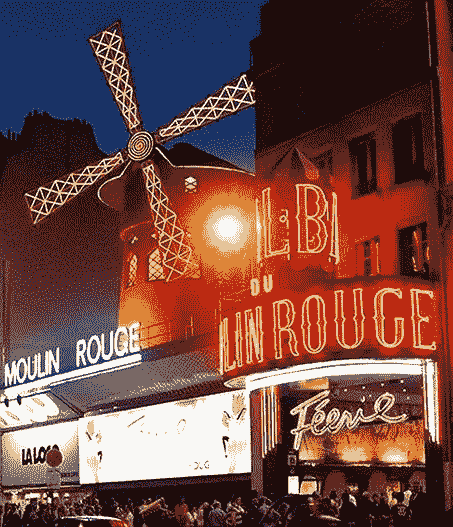

# 红磨坊庆祝其 120 岁生日时的新身份

> 原文：<https://www.sitepoint.com/new-identity-for-moulin-rouge-as-it-celebrates-its-120th-birthday/>

世界著名的巴黎红磨坊夜总会正在庆祝其 120 年的历史。为了纪念周年纪念日，它公布了一个新的现代标识，包括著名的红色风车的改造图像。总部设在巴黎的约翰·布赖特曼公司进行了重新设计。设计概要是重新思考红磨坊作为一个全球品牌的身份，包括特许经营，品牌授权，当然还有表演本身。

新的公司标志以风车帆形状的风格化字体“红磨坊”为特色。单词 Paris 位于大写字母 e 的衬线之间。

*红磨坊的企业标志*

新的授权标志交叉着红磨坊的字样，形成一个风车形状，在暗红色的背景上使用相同风格的银灰色字体。

*红磨坊授权标志*

不同寻常的是，这个标志是由布赖特曼公司的三名设计师设计的。

该项目的艺术总监之一宝琳·尼古拉斯说:“我们的目的是改造风车，让它更有女人味和魅力！这就是为什么我们想把它做成不同深浅的红色，又大又有活力。”创意总监夏羽·戈蒂埃说:“困难在于设计一个与这个世界闻名的机构相称的标志。”。

新推出的标志只是红磨坊全球传播战略新时代的一部分。将有新的红磨坊视觉效果值得期待，以及新的创意宣传材料和活动。

约翰·布赖特曼的网站采访了新身份背后的创作团队。

 
*巴黎红磨坊外*

就我个人而言，我喜欢这个新标志，尤其是公司标志。它保留了有着如此有趣历史的红磨坊的波西米亚风味，同时保持了它的简单和迷人。

但是更重要的是，你觉得新的标志怎么样？

## 分享这篇文章