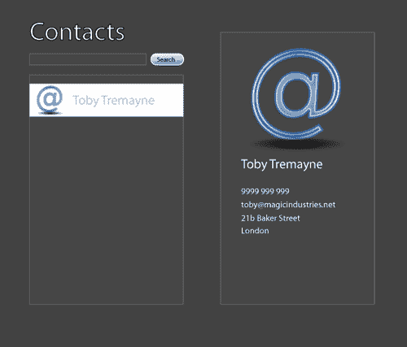
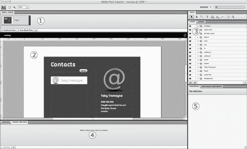
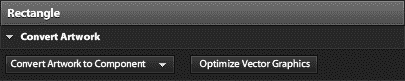
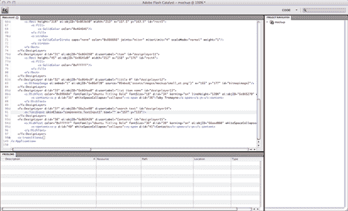
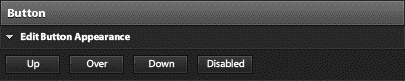

# 使用 Flash Catalyst 从概念到工作原型

> 原文：<https://www.sitepoint.com/prototype-with-flash-catalyst/>

adobe Flash Catalyst CS5 代表了设计人员-开发人员工作流程的一场革命。在这个由三部分组成的系列的第一部分中，您将了解如何将您现有的模型作品导入 Flash Catalyst，并将各种元素转换为可工作的 Flex 组件。我们假设您对 Flex 及其组件库有一些基本的了解，并对 Photoshop 和 Illustrator 有初步的了解。您可以[下载设计文件和完成的 Flash Catalyst 项目](https://i2.sitepoint.com/examples/flashcatalyst/catalyst_part_1.zip)，并确保[在之后的测验中测试自己](https://www.sitepoint.com/quiz/flex4/prototype-with-flash-catalyst)。

web 和软件开发的第 22 条军规是，客户总是希望在它存在之前看到他们所支付的东西。到目前为止，我们已经尽最大努力用截图和模型来展示我们的应用程序，以演示任何实际的功能。在最好的情况下，当原型有时间和预算时，开发人员与设计人员密切合作，从模型中构建一个工作外观。Flash Catalyst 改变了这一切，允许设计师在 Photoshop、Illustrator 或 Fireworks 中创建原创作品，然后将其导入 Flash Catalyst，并将其转换为工作原型，包括移动部件、过渡和组件。这让客户看到所有的工作和移动，这可以在交付他们想要的东西方面产生很大的影响。

## 简述

例如，我们将为一个非常简单的联系人列表创建一个原型，客户将把它放在他们的内部网中。经过协商，客户表示他们喜欢以下功能:

*   按姓名排序的联系人列表。

*   单击列表中的联系人后，右侧将显示联系人窗格。

*   每个联系人都有这些字段:姓名、地址、电话、电子邮件和照片位置。

*   用于搜索联系人的搜索框。

从这份简报中，我们的设计师设计出了 Adobe Illustrator 中令人难以置信的模型，您可以在[图 1“Adobe Illustrator 模型”](#fig_mockup "Figure 1. Adobe Illustrator mockup")中看到。

**图一。Adobe Illustrator 模型**

客户对外观很满意，但他们希望在同意继续项目的其余部分之前能够进行测试。为了看到工作上线，我们需要提供一个工作原型，而不需要花钱聘请我们的开发人员。闪光催化剂来拯救！

## 开始一个新项目

打开 Flash Catalyst，在右侧下的欢迎屏幕上，从设计文件标题中创建新项目，从 Adobe Illustrator AI 文件中选择。

浏览到您从本教程中提取项目档案的位置，并选择文件`mockup.ai`。点击确定按钮，当 Illustrator 导入选项对话框弹出时，保留默认设置，点击确定。Flash Catalyst 需要一些时间来导入 Illustrator 文件，然后您将看到如图[图 2 所示的界面，“Flash Catalyst 界面”](#fig_interface "Figure 2. Flash Catalyst Interface")。

**图二。闪光催化剂界面**

1.  顾名思义，页面/状态面板显示了应用程序中可用的页面或状态。开始时只有默认的基本状态，但是您可以在这里添加新的状态。这与在 Flash Builder 的设计模式中修改状态的方式相同。如果您复制基本状态，请选择新状态，并从中删除一些可视组件——它们将从新状态中删除，在基本状态中仍然可用。我们将在教程的后面看到一个例子。

2.  这是*画板*，是您导入的作品出现的地方。您可以四处拖放图稿，并使用有限的 Illustrator 样式工具来操作它，以及创建新的图稿，包括简单的线条、形状和文本。

    当在画板上选择一个艺术作品元素或组件时，将出现一个平视显示器或 HUD(如图[图 3 中所示的“HUD”](#fig_hud "Figure 3. The HUD")),为您提供与所选项目相关的选项。

    **图 3。平视显示器**

    
3.  这是层的面板；您可以看到原始 Illustrator 文件中的图层实际上已被导入并保留。这个面板让我们玩实体模型的单个元素，并将它们转换成组件。库面板的工作方式类似于 Adobe Flash Professional 中的库面板，显示应用程序中可用的各种组件。首先，您没有定义任何组件，因此这将是空的。

4.  底部窗格包含设计时数据面板，例如，它允许您添加可以在列表组件中使用的数据项。另一个面板是时间轴，它将允许您以类似于 Adobe Flash Professional 中时间轴的方式操作图稿，并创建过渡和行为。

5.  属性面板将显示所选组件或艺术品元素的属性，并允许您对其进行编辑。线框组件面板是一个小型组件库，你可以添加到设计中，比如滚动条、按钮和文本输入。

## 创建组件

Flash Catalyst 的最大优势之一是它允许您将艺术品项目指定为实际的 Flex 组件。首先，我们将通过把搜索框变成一个`TextInput`元素来制作一个非常简单的组件。点击“联系人”文本下面的搜索框，或者在图层面板中选择其图层。你的平视显示器应该改变成类似[图 3，“平视显示器”](#fig_hud "Figure 3. The HUD")。点击将插图转换为组件按钮，从下拉菜单中选择文本输入。现在保存你的项目，打开文件菜单，选择运行项目。这将从项目中编译一个 SWF 文件。您现在应该能够在搜索框内单击，并看到它作为一个合适的`TextInput`元素工作！

信不信由你，Flash Catalyst 刚刚将我们作品中的矩形转换成真正的 Flex `TextInput`组件，甚至还为它生成了代码。在 Flash Catalyst 界面的右上角是工作区弹出菜单(如图[图 4，“设计工作区”](#fig_design_view "Figure 4. Design workspace")所示)，允许您在设计和代码工作区之间切换。目前会说设计。

**图 4。设计工作空间**

点击它，切换到[图 5【代码工作区】](#fig_code_view "Figure 5. Code workspace")所示的代码工作区。

**图 5。代码工作区**

您可以看到(在第 91 行或附近), Flash Catalyst 生成了一个正确的`<s:TextInput/>` MXML 标签，甚至添加了一个`skinClass`属性值。如果你展开右边的项目导航器面板，你也可以找到皮肤，你会看到一个完整的 [Spark 皮肤](https://www.sitepoint.com/article/flickr-browser-flex/2)已经创建好了。

最重要的是，皮肤是使用 Flash 绘图 API 而不是嵌入式图像来呈现的，这使得我们的应用程序变得更加轻便和可伸缩。

### 好得难以置信？用按钮试试。

返回到 Flash Catalyst 中的设计工作区，选择搜索按钮 *和* 上的文本(确保两者都已选择)。然后使用 HUD 将它们转换成一个`Button`组件。当你完成这些后，HUD 会改变显示四个新按钮(如图[图 6，“按钮状态编辑”](#fig_button "Figure 6. Button state editing"))；这些新按钮代表新按钮的状态，我们可以在这里编辑这些不同的状态。

**图 6。按钮状态编辑**

点击下按钮，Flash Catalyst 将进入隔离模式，在按钮的`Down`状态进行编辑。当处于`Down`状态时，选择按钮并向右下方移动一个像素。当我们点击按钮时，它会有一点移动，所以我们可以看到它在工作。

在正常开发中，您最好在 Illustrator 中将每个状态创建为层，然后在 Flash Catalyst 中分配它们，但我们现在将保持简单。如果您现在再次运行您的项目，您可以单击按钮并查看它的响应。

## 使用设计时数据创建列表组件

现在我们来看更复杂的部分。`Buttons`和`TextInput` s 相当简单，但是我们这个小应用程序的真正功能集中在联系人列表上。Flash Catalyst 实际上可以将我们的作品转换成一个工作的`List`组件，并配有数据和一个`itemRenderer`。

点击 **退出** 键，或者进入修改菜单并选择退出编辑，确保你已经退出隔离模式。首先选择右侧的以下图层:列表、小@ 、列表项目名称和项目。当它们都被选中时，使用 HUD 将插图转换成一个数据列表。您应该会看到 HUD 变成图 7 所示的[“数据列表 HUD”](#fig_data_list "Figure 7. Data List HUD")。

**图 7。数据列表 HUD**

在 HUD 的右上角，您可以看到一条警告消息，告诉我们该组件有问题。点击编辑部分按钮，你会发现自己处于隔离模式，有你之前选择的四个层。选择除了列表层之外的所有层，你会看到 HUD 改变为显示一个标记为的按钮将艺术品转换为数据列表部分。点击它，然后从下拉列表中选择重复项。Flash Catalyst 会思考片刻，然后会发生一些很酷的事情。

Flash Catalyst 识别出重复的项目是列表中的一个数据项，并为您生成几个，所以现在您将在列表中有五个看起来相同的项目。如果你跳出隔离模式，点击设计时数据面板，你会看到它甚至为我们分离了小图像和文本！将四个新条目的文本更改为其他名称，这样我们就可以区分不同之处，就像我在[图 8 中所做的那样，“向列表中添加虚构的名称”](#fig_name_list "Figure 8. Add fictional names to the list")。

**图 8。将虚构的名字添加到列表中**

通过使用设计时数据面板底部的控件，您甚至可以添加更多数据项或从列表中删除一些数据项。如果您简单地切换到代码工作区，您将能够看到 list 组件已经用它自己的皮肤创建了，它指定了项目渲染器皮肤和我们需要的所有子组件。

**note:** hover and selected States

理想情况下，您现在可以修改项目渲染器，使其包含一个`hover`状态和一个`selected`状态，以便于使用，但是在这个例子中，我们还是保持简单。

## 添加状态

最后，我们将尝试向应用程序添加一个新状态。您可能认为当应用程序加载时，右侧的联系人窗格是隐藏的，因为用户还没有选择联系人。我们将设置该面板来处理一个新状态，该状态由选择列表中的一个项目触发。

右键单击界面顶部页面/状态面板中的状态缩略图，选择复制状态。双击新状态缩略图，将其重命名为`contactView`。双击原来的状态，应该已经命名为`Page1`，重命名为`listView`。确保选择了`listView`状态，然后在画板中删除右侧的大@符号和联系信息。别担心，它们会被保存在`contactView`州。

这就是全部内容——Flash Catalyst 现在已经在幕后创建了状态代码，告诉 Flex 在用户查看`listView`状态时从屏幕上删除这些组件，并在它们进入`contactView`状态时添加它们。

现在点击界面底部的时间轴面板，你会看到那里列出的状态转换，如图[图 9，“状态转换”](#fig_transitions "Figure 9. State transitions")所示。

**图 9。状态转换**

点击左侧的列表视图>联系人视图层。

您可以在时间线中间看到，Flash Catalyst 为我们从`listView`状态移除的每个元素添加了一个过渡。如果你将鼠标放在其中一个图层上“淡入”字样左边的小竖条上，你会看到一个调整大小的手柄出现，如图[图 10，“调整大小手柄”](#fig_handle "Figure 10. Resize handle")。

**图 10。调整大小手柄**

点击调整大小手柄，向右拖动滚动条，直到工具提示显示持续时间 2.0s ，它将看起来像[图 11，“增加持续时间”](#fig_duration "Figure 11. Increasing the duration")。

**图 11。增加持续时间**

如果你现在点击播放图标，你会看到过渡生效。它看起来有点简单，因为我们只调整了一个组件，但你仍然可以看到它的工作。

下去，并作出同样的调整，为每一层的过渡。然后切换到联系人视图>列表视图过渡，对那里的淡出效果做同样的处理。

现在，我们需要做的就是将转换与用户交互联系起来。在画板中，右键单击联系人列表组件，并选择添加交互。将弹出一个对话框，允许您设置交互规则；更改数值以匹配[图 12，“设置交互规则”](#fig_interaction "Figure 12. Setting interaction rules")。

**图 12。设置交互规则**

现在保存并运行您的项目，并尝试单击联系人列表中的一个项目。您应该会在右侧看到联系人详细信息很好地淡入，显示了我们向新状态的过渡。

## 下次

我们已经可以看到 Flash Catalyst 在原型开发和 Flex 项目的初始设置方面有多么强大。Flash Catalyst 生成的代码实际上可以直接在 Flash Builder 中打开和操作，因为这两个应用程序共享一个通用的项目格式。在本系列的下一篇文章中，我们将研究 Flash Builder 中的代码，并查看 Flash Builder 提供的一些 PHP 特定的功能，以帮助我们开始将应用程序与一些真实数据挂钩。

同时，在 Flash Catalyst 中尝试演示应用程序。尝试为各种组件添加一些新的转换和完整状态。记得参加 Adobe 赞助的测验来测试你的知识。

## 分享这篇文章