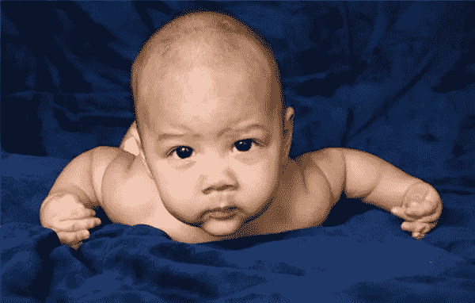
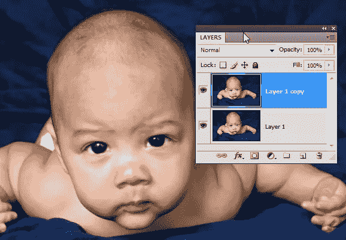
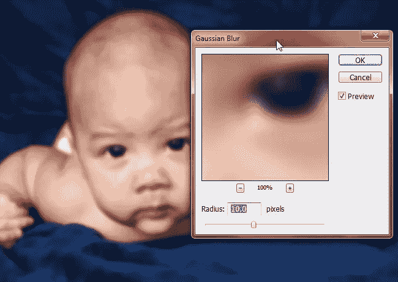
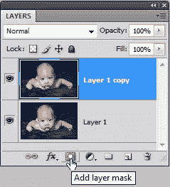
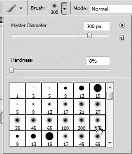
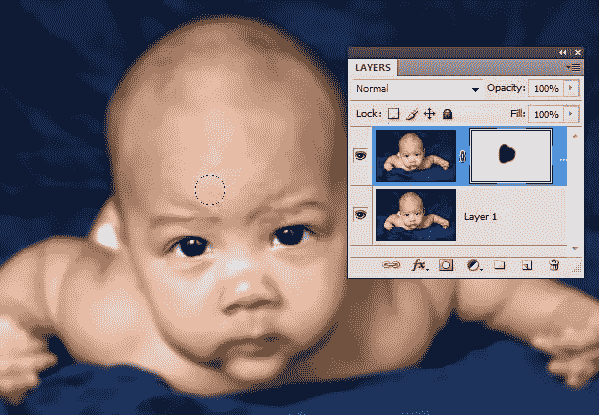
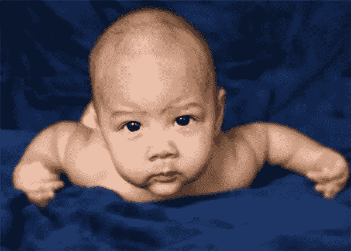

# 在 Photoshop 中更改景深

> 原文：<https://www.sitepoint.com/changing-depth-of-field-in-photoshop/>

在摄影中，景深是指照片中清晰聚焦的区域。您可以创建完全对焦的照片(大景深)，或有一小块区域清晰对焦但其余部分模糊的照片(小景深)，或一半一半混合的照片(中等景深)。

调整相机的光圈是改变景深的一个因素。然而，如果你的相机是全自动的，它可能很难实现景深效果，或者如果你需要改变现有照片的景深，这就是 Photoshop 的用武之地。

在这个快速、简单的教程中，我们将处理一张照片，给出一个清晰的前景(脸部)和一个模糊的背景(身体的其他部分)。

1.打开您想要应用效果的照片。我正在用这张由 [coolza](http://www.sxc.hu/profile/coolza) 在[股票 Xchng](http://www.sxc.hu/photo/1271837) 上拍摄的漂亮的婴儿照片。(你可以免费下载，但必须注明出处。)

2.在图层面板中按 Ctrl + J (windows)或 Cmd + J (mac)复制图层。

3.选择“滤镜”>“模糊”>“高斯模糊”,当对话框打开时，将半径增加到大约 10 个像素，这样整个图像就模糊了。

4.现在，我们可以使用图层蒙版来显示图层堆栈底部未被触及的图层的一部分。在图层面板上，点击添加图层蒙版图标。

添加图层蒙版缩略图后，单击它以确保图层蒙版被选中，而不是整个图层。

5.在工具栏中，选择画笔工具，设置前景色为黑色，在选项栏中设置为 300 像素和 0%硬度的圆形笔尖。

6.开始在宝宝的脸上绘画，你会从原始图像中看到清晰度。

7.继续绘画，直到婴儿的头部完全清晰，但身体的其他部分仍然模糊不清。你的最终图像应该是这样的。

## 分享这篇文章