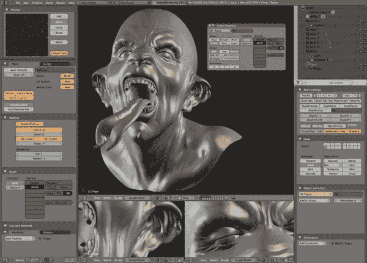
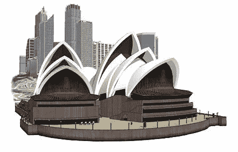
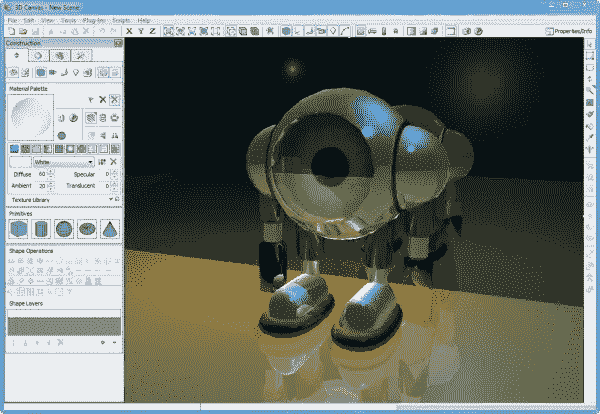
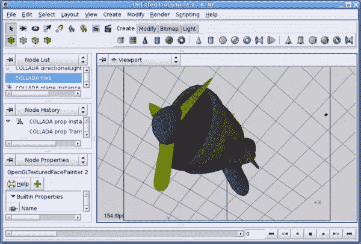
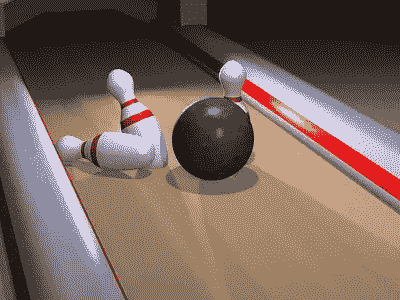

# 免费提供八个 3D 建模和图形应用程序

> 原文：<https://www.sitepoint.com/eight-3d-modeling-graphics-applications-available-for-free/>

如果你对开始使用三维(3D)图形感兴趣，有大量的应用程序可用，如果你只是尝试一下，免费的应用程序总是受欢迎的。3D 图形广泛应用于产品设计、广告和网站，当然还有电影。

大多数创作工具都提供 3D 建模、3D 动画和 3D 渲染。创建 3D 模型并不容易，您可能会在学习过程中花费大量时间。以下是十款免费 3D 软件应用的简要概述，供您试用。

[搅拌机](http://www.blender.org/)

Blender 是众所周知的免费开源 3D 建模和动画应用。重要的是，它也有一个伟大的社区贡献教程，帮助和附加组件。 [Blender 的功能](http://www.blender.org/features-gallery/features/)包括动画、装配、非线性编辑、粒子和其他模拟。

[谷歌 SketchUp](http://sketchup.google.com/product/gsu.html)

目前在 7.1 版本中，Google SketchUp 允许你创建、分享和展示 3D 模型。您可以使用您的模型制作影片，或者导出 3D 图像以在其他程序(包括 Photoshop)中使用。Sketchup 与谷歌地图密切相关，用户可以在谷歌地图上创建世界各地地标和建筑的 3D 模型。在[仓库](http://sketchup.google.com/3dwarehouse/)有[免费视频培训](http://sketchup.google.com/training/videos.html)和社区共享的大量 3D 模型。

[3D 画布](http://www.amabilis.com/)

3D Canvas 是一个 3D 建模和动画工具，它使用拖放方法进行 3D 建模。可以从简单的 3D 图元构建模型，或者使用 3D Canvas 的对象构建工具创建模型。提供建模工具来变形、雕刻和绘制 3D 对象。免费版仅允许您将模型导出为 POV-Ray 格式，但它是全功能免费软件。

[TrueSpace](http://www.caligari.com/)

Caligari 的 TrueSpace7.6 是一款建模、纹理、动画、渲染和 3D 协作工具。2008 年 7 月该公司被微软收购后，它就可以免费使用了。有一些优秀的免费视频教程可以帮助你开始使用这个工具。

[幻术](http://www.artofillusion.org/)

Art of Illusion 是另一个开源的 3D 建模和渲染包。它可能不像其他一些应用程序那样复杂，但它确实有一些好的建模工具和一个简单的界面。

K-3D
K-3D 是一个建模和动画应用程序，包括 NURBS、面片、曲线和动画的基本工具。“它的所有内容都有一个面向插件的程序引擎，使 K-3D 成为一个非常通用和强大的软件包。”

[视觉光线跟踪器(POV 光线)的持久性](http://www.povray.org/download/)

POV Ray 是一款免费的开源 3D 图形工具。这已经存在 ***年*** 了，我记得在一本计算机杂志的封面上得到一个软盘的早期版本，然后等了几个小时让它呈现一些无法辨认的东西。尽管这不是程序的错。POVRay 围绕着它建立了一个非常热情的社区，并且有大量的[插件和插件可用](http://www.povray.org/resources/links/)。

[动画 8 或](http://www.anim8or.com/main/)

Anim8or 是一个 3D 建模和角色动画程序，自 2004 年作为个人项目开始以来一直存在。它允许用户创建和修改带有内置图元的 3D 模型，如球体、圆柱体、柏拉图立体等。；网格编辑和细分；样条线，挤出，车削，修改器，斜面和扭曲。我不知道多久更新一次，但可能会有兴趣。

您使用过这些 3D 图形应用程序吗？你认为哪个是最好的？

当然，免费的 3D 应用程序越来越多，而且数量还在增长。你会推荐哪些人？

## 分享这篇文章