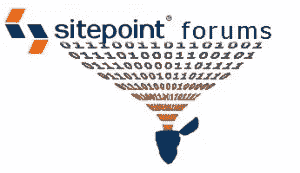

# 如果你要给我发垃圾邮件，至少要有趣一点。

> 原文：<https://www.sitepoint.com/if-youre-going-to-spam-me-at-least-make-it-interesting/>

就这几周来看，这一周开始得并不太好。我正在享受一个难得的周日享受——没有我的孩子的一天——当我犯了一个致命的错误，登录工作以确保没有灾难性的事情发生。所以我想你可以说，我活该发现它有。

当你的工作是管理一个在线社区时，有一些事情你祈祷永远不会发生。雷击服务器是其中之一，但这比周日的怪物垃圾邮件攻击更可取。显然，数百名名字奇怪的人在同一时间销售同一种产品，他们选择了我们的论坛。他们现在已经得到妥善处理，我为他们造成的任何不便道歉。

这周剩下的时间过得很普通，我在墨尔本的 SitePoint 总部度过了最后两天。我对社区项目有一些非常令人兴奋的想法，所以我在这里由团队的其他成员来运行它们。

目前我特别兴奋的一件事是最近我们的通用聊天任务组的成立。这群充满活力的角色被赋予了给 SitePoint 论坛的“发泄”部分注入一点活力的责任。他们已经通过一些有趣的话题让人们感觉到他们的存在，比如[你有多谷歌化？](https://www.sitepoint.com/forums/showthread.php?t=669871)和[你在 YouTube 上见过最奇怪的事情是什么？](https://www.sitepoint.com/forums/showthread.php?t=670487)所以，如果你需要从极客生活中休息一下，来看看[普通聊天室](https://www.sitepoint.com/forums/forumdisplay.php?f=9)，看看他们还想出了什么。

**本周热门话题**
Shayne Tilley 在[推广技巧论坛](https://www.sitepoint.com/forums/forumdisplay.php?f=2)上分享了一些有趣的见解。阅读[理解为什么，而不是什么](https://www.sitepoint.com/forums/showthread.php?t=670688)。

在[普通聊天](https://www.sitepoint.com/forums/forumdisplay.php?f=9)中，我们正在讨论[人体工程学](https://www.sitepoint.com/forums/showthread.php?t=670250)的来龙去脉。这是你考虑的事情吗？

在[商业和法律问题](https://www.sitepoint.com/forums/forumdisplay.php?f=61)中有一个非常有趣的对话，dvduval 问[如果一个聪明人每小时只收 3 美元，你会怎么做？](https://www.sitepoint.com/forums/forumdisplay.php?f=61)

我把最好的留到了最后。如果你是 SitePoint book 的所有者，你会想要查看[新闻和公告](https://www.sitepoint.com/forums/forumdisplay.php?f=38)。我们已经发布了大部分 Mobi 和 ePub 格式的游戏，如果你已经拥有一个 PDF 格式的游戏，[你可以免费下载新的格式](https://www.sitepoint.com/forums/showthread.php?t=670430)。

*特征图像由克里斯·罗伯茨从[数字精度](http://www.digitalprecisionnc.com/)到*

## 分享这篇文章