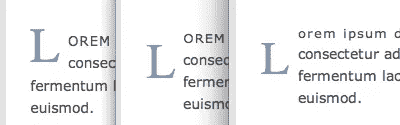
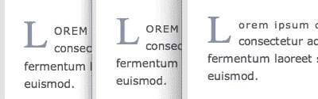

# 一个简单的 CSS 首字下沉

> 原文：<https://www.sitepoint.com/a-simple-css-drop-cap/>

你不可能没有注意到我们在新博客设计中使用的首字下沉效果，以及大多数浏览器显示的首行大写字母(除了 Safari，原因我稍后会解释)。

实现这种效果的方法有很多，但最干净、最易维护的是纯 <abbr title="Cascading Style Sheets">CSS</abbr> ，使用了`:first-letter`和`:first-line`伪类。

这种方法意味着没有额外的标记，没有图像，也不需要了解内容——无论第一个字母和第一行是什么，它们都会应用效果。

下面是实现这一点的 <abbr title="Cascading Style Sheets">CSS</abbr> :

```
#post-content > p:first-child:first-line, 
#post-content > .ad:first-child + p:first-line
{
    text-transform:uppercase;
    position:relative;
    font-size:0.95em;
    letter-spacing:1px;
}

#post-content > p:first-child:first-letter, 
#post-content > .ad:first-child + p:first-letter
{
    letter-spacing:0;
    text-transform:uppercase;
    color:#628fbe;
    font-family:times,serif;
    font-size:3.5em;
    float:left;
    margin:0.13em 0.2em 0 0;
    line-height:0.7;
}
```

您会注意到有两个不同的选择器试图将效果应用到内容区域内的第一段。它需要足够灵活，以允许在段落之前有或没有广告*，标记为`<div class="ad">`。所以理想情况下，我会使用`:first-of-type`，它选择父上下文中指定类型的第一个元素:*

```
#post-content > p:first-of-type:first-line
{
}

#post-content > p:first-of-type:first-letter
{
}
```

但是这并没有得到广泛的支持。我们使用的选择器意味着我们获得了对 <abbr title="Internet Explorer 8">IE8</abbr> 的支持，否则我们将得不到支持。

不幸的是，我们不支持首行大写字母。这并不是因为选择器——它支持这里显示的所有例子，并在那些规则中应用其他属性——它只是不应用`text-transform`。这是我在许多不同情况下注意到的，Safari 没有应用转换，没有明显的原因。我见过它不能应用于一个`<input>`元素，而它对一个相应的`<button>`有效，这里我们看到它不能应用于段落的第一行，即使它可以应用于整个段落！去想想。

对于首字下沉本身，您可以看到实现起来非常简单。该规则中值得注意的是将字母定位的`margin-top`和`line-height`的组合。如果我们忽略这两个属性，我们会得到:


**应用行高前的首字下沉。**

你在那里看到的，从左到右，是 Firefox，Opera 和 Safari。事实上，是 **Firefox 错误地渲染了**，而 Opera 和 Safari 得到了正确的渲染——Firefox 仍然将父段落的行高应用于第一个字母，忽略了其大得多的字体大小，而其他浏览器则正确地应用了与字母字体大小相对应的行高。

因此，我们可以利用这种差异来平衡浏览器之间的结果——逐渐降低行高，这对 Firefox 没有影响，直到我们在 Opera 和 Safari 中获得类似的结果(以及 <abbr title="Internet Explorer 8">IE8</abbr> ):


**应用行高后的首字下沉。**

然后就是简单的加`margin-top`直到垂直位置看起来对的情况。

我已经不是第一次在 Firefox 中看到这种渲染行为了。由于我们没有只适用于 Firefox 的 CSS 技术，像这样的差异是我们应用浏览器调整的唯一方式。随着浏览器的调整，这款浏览器完全是面向未来的——如果 Firefox 修复了它的实现并应用了正确的行高，它会像其他浏览器一样在第一时间出现。

真的很讽刺，我们最终应该修复除了 Firefox 之外的所有浏览器，而 Firefox 是唯一一个出错的浏览器！但这就是我们这个行业的运作方式——火狐，就像你的妻子一样，“永远是对的”。

*缩略图鸣谢:[透特](http://www.flickr.com/photos/thoth-god/4489364604/)*

## 分享这篇文章