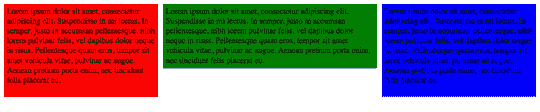
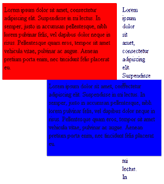
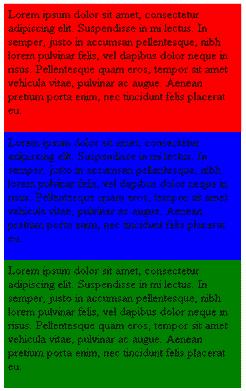

# CSS 测验评论:iPhone 挑战，一个可折叠的多栏布局

> 原文：<https://www.sitepoint.com/css-quiz-iphone-challenge/>

在 [SitePoint CSS 论坛](https://www.sitepoint.com/forums/forumdisplay.php?f=53)的[最近测试](https://www.sitepoint.com/forums/showthread.php?p=4462884#post4462884)中，我设置了以下挑战:当浏览器调整到 320 像素左右时，创建一个由上下垂直对齐的三列组成的全幅布局。这些列是按照源的顺序排列的，因此它们在源中的顺序与在水平和垂直布局中的顺序相同。

我提出的前提是，该方法可以用于在 iPhone 上查看正常宽度的网站，而不必为设备创建单独的样式表或多个规则。后来我发现需要一些额外的样式才能在 iPhone 上工作，我将在文章的最后详细介绍这一点。

和我所有的测验一样，在 iPhone 上的实现真的是次要的；我真正想要实现的是一个三列布局，在所有现代浏览器中以大约 320px 的浏览器宽度排列成一列。由于没有 iPhone，我在苹果的 [iPhone 测试器](http://developer.apple.com/programs/iphone/)中测试了布局。

在这个简短的教程中，我将介绍完成这一壮举所需的技术，并在中途停下来更详细地解释原因和方法。您可以通过下载[示例代码档案](http://sitepoint-examples.s3.amazonaws.com/cssquiz/demos.zip)来继续学习。

## 第一次尝试

乍一看，你可能会认为这种效果很容易实现，但事实证明这相当复杂。

为了使页面为全宽，我允许左右栏为固定宽度，中间栏填充浏览器窗口的剩余宽度。

通常在三列布局中，第一列向左浮动，第二列向右浮动；中间的列是标记中的最后一列，有左、右边距来清除浮动，并在旁边形成一个矩形框。

我们将从最基本的方法开始。忽略 [`hasLayout`](http://https://reference.sitepoint.com/css/haslayout/css/haslayout) 问题和 [IE6 3 像素点动](https://www.sitepoint.com/forums/showpost.php?p=1374925&postcount=15)，代码如下所示。

首先，CSS:

**例 1。`example1.htm`(节选)**

```
.column1 {  width:300px;  background:red;  float:left;}.column2 {  background:green;  margin:0 310px;}.column3 {  width:300px;  background:blue;  float:right;}
```

基本的标记结构如下所示:

**例二。`example.htm`(节选)**

```
<div class="column1"></div><div class="column3"></div><div class="column2"></div>
```

这些样式的结果是一个类似于[图 1 所示的布局，“我们的三列布局”](#fig_initial "Figure 1. Our three-column layout")。

**图一。我们的三栏布局**



这为我们提供了我们正在寻找的基本的三列布局，尽管这些列在源代码中的顺序是错误的。让我们以后再来处理这个问题，相反，我们首先要关心当浏览器窗口水平调整大小时会发生什么。

结果发现，左右两列开始垂直排列得相当好，但是中间一列被压扁了，错位了，如图[图 2，“浏览器水平调整大小时布局断裂”](#fig_squashed "Figure 2. The layout breaks when the browser is resized horizontally")。

**图二。水平调整浏览器大小时布局会中断**



这种行为并不令人惊讶:中间的列在左右两边都有边距，因此永远不会移动到屏幕的边缘，不像浮动的内容会下拉并对齐到边上。

因为我们无法让中间的列在窗口的左侧对齐，所以我们需要放弃这种方法，尝试一种不同的方法。

## 回到制图板

我们可以尝试使用 [`overflow`](https://reference.sitepoint.com/css/overflow) 属性，而不是在中间列使用边距。下面的技术完全移除中间列的边距并应用`overflow: hidden`，其效果是创建一个在两个浮动列之间滑动的矩形非浮动列。

当一个元素应用了`overflow: hidden`(或`auto`)后，它将不再环绕一个浮动的元素；取而代之的是，它以一个矩形块的形式包裹在它的旁边，就像另一个浮动一样。

可惜 IE6 不理解这种行为。幸运的是，我们可以通过简单地确保元素处于`hasLayout`模式来实现相同的效果；然后，它按照我们想要的方式运行，并在矩形块中的两个浮动列之间滑动。

标记保持不变，但是`column2`的 CSS 变化如下:

**例 3。`example2.htm`(节选)**

```
.column2 {  background:green;  overflow:hidden;}* html .column2 {  height:1%;  overflow:visible;}
```

注意，我们已经用`height: 1%`黑客触发了`hasLayout`，但同时我们必须将`overflow`设置回`visible`；否则，我们将面临 1%以上的内容被隐藏的风险。在这种情况下，不存在任何问题，因为 1%没有任何东西作为其高度的基础，所以实际上是自动的。因此，没有什么是隐藏的——但情况可能并不总是如此，所以最好采取这种预防措施。

这些样式的结果是，我们实现了三列效果，而不需要使用边距。页面现在看起来与图 1 中的[“我们的三列布局”](#fig_initial "Figure 1. Our three-column layout")非常相似。

如果我们进一步缩小浏览器，我们会发现在 IE 的所有版本中，这三列在一列中排列得很好，如下面的[图 3“在 Internet Explorer 上三列布局折叠成一列”](#fig_working_ie "Figure 3. A three-column layout collapsed into one column on Internet Explorer")所示。

**图 3。一个三栏布局在 ie 浏览器上折叠成一栏**



不幸的是，Firefox 和 Safari 都无法正确显示这种布局。这两种浏览器都把中间栏挂在一边，破坏了这个聚会。

看来我们又走上了一条死胡同，所以我们需要想出另一个解决办法。我们还必须记住，任务也是按照源顺序排列列，这是我们迄今为止的两个解决方案都没有做到的。

## 分享这篇文章