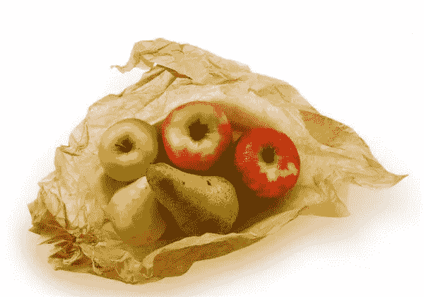
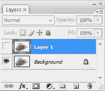
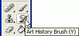
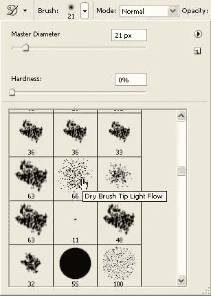
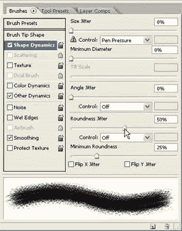
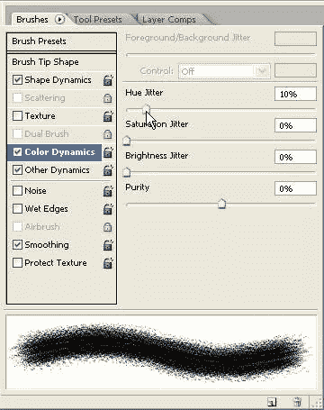
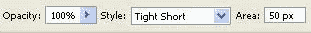
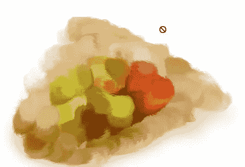
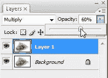
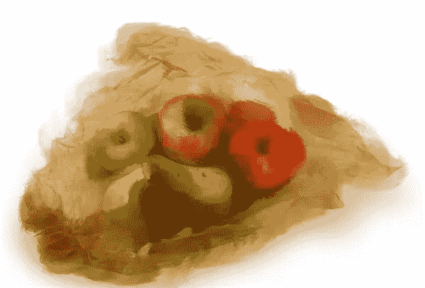

# 使用 Photoshop 中的艺术史笔刷获得绘画效果

> 原文：<https://www.sitepoint.com/getting-painterly-with-the-art-history-brush-in-photoshop/>

昨天是 Adobe Creative Suite 5 的盛大发布日，如果你还没有看到一些新功能，你可以在 [CS5 发布网站](http://cs5launch.adobe.com/)上查看一下。CS5 中提到的一个新特性是强大的新绘画工具。然而，对于我们这些将继续使用“旧”Photoshop 一段时间的普通人来说，这里有一种方法可以创建一种绘画效果，这是 Photoshop 5.5 版本以来的一部分。

艺术历史画笔允许您使用历史状态或快照作为来源，将绘画样式应用于您的图像。该工具有几个选项会影响像素的外观，包括各种混合模式、不透明度、笔画样式、保真度、面积和容差。这个工具可能不会欺骗任何人认为你已经用传统的方法创作了一幅水彩画，但是使用起来很有趣，而且可以创作出漂亮的图像。

1.打开您想要“绘制”的图像。我用的是这张免费从[库存 Xchng](http://www.sxc.hu/photo/1267674) 下载的水果图片。感谢摄影师 [NKS](http://www.sxc.hu/photo/1267674) 的高分辨率图像。这张图片是 T4 2800 x 2100 像素，300ppi。为了这篇文章的目的，我把它缩小到 1000 x 680 像素，分辨率为 72。只是提一下，以防你想知道为什么我用不同大小的笔刷。

2.通过按下`Ctrl` + `J`或`Cmd` + `J` (Mac)，在图层面板中复制图像。现在关闭这个复制层，选择背景层。

2.从工具箱中选择艺术历史画笔(Y)。它可能隐藏在历史画笔下，但不要把两者混为一谈。

3.在工具选项栏上，点击笔刷选项。从可用的笔刷列表中选择一个“干笔刷尖轻流”笔刷。您可能需要根据图像的大小来改变画笔笔尖的大小。对于这张图片，我将保持画笔大小为 66 像素。这样会让“画”看起来真的很粗糙很抽象。

4.打开画笔调色板，点击画笔笔尖形状下的形状动态。我们将改变一些笔刷的特性来帮助获得绘画效果。

5.将圆度抖动拖到 50%左右。

6.点击颜色动态。将色调抖动拖到 10%左右。这就是我们需要做的所有笔刷调整。

7.在工具选项栏上，将艺术历史画笔的样式设置为“短”。

(根据您想要达到的效果，您可能想要尝试不同的风格)。将该区域设置为 50 像素。

8.开始在图像上绘画。这是一个好主意，在大面积相似的颜色上绘画，以感受艺术史画笔是如何工作的。正如我提到的，这个图像看起来非常抽象。对于更复杂的区域，您可以减小画笔大小或更改画笔笔尖。在我画完我的之后，它看起来像这样:

很好，不是吗？

9.现在我们将打开我们的复制层。单击调色板中的眼睛图标来切换可见性。这完全隐藏了你的抽象画，所以在图层面板的顶部，点击混合模式下拉框，将它从普通模式改为叠加模式。你现在应该可以看到你的原作和抽象画的完美结合。降低复制图层的不透明度，使其更加艺术化。

我将不透明度降低到 60%，因为我很喜欢我得到的效果，就是这个:

如果你愿意，你可以在顶层使用图层蒙版，并选择在某些区域显示更多或更少的细节。

现在你知道了。艺术史笔刷上有很多选项可以选择，通过将它与你的原始图像混合，你可以获得一些非常好的效果。

你以前用过艺术史笔刷吗？你对使用这个工具有什么建议吗？

## 分享这篇文章