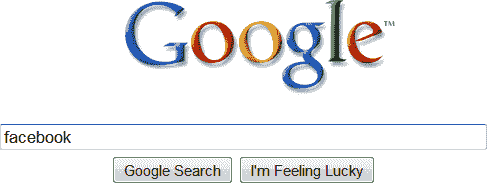

# 谷歌实现预测搜索

> 原文：<https://www.sitepoint.com/google-implements-predictive-searching/>

谷歌的研发团队投入大量时间寻找简化用户体验的新方法。一个[淡入效果](https://www.sitepoint.com/googles-search-fade-in-useless/)最近在搜索引擎上实现，它隐藏不太重要的链接，直到你需要它们。

“预测搜索”是该公司迄今为止最雄心勃勃的功能。令人惊讶的是，它完全不需要搜索框。谷歌的算法在过去 12 年里一直在监控你的活动，该系统可以在你进入之前准确预测你想去的地方。

谷歌将在今天晚些时候推出预测搜索，但 SitePoint 可以透露有关该功能的独家信息。当访问[google.com](http://www.google.com/)时，你会看到一个徽标和一个“Go”按钮:

“Go”实际上是一个没有搜索输入框的“我感觉很幸运”按钮。一旦你点击它，你就会被带到一个基于人工智能分析你的历史冲浪行为的相关网站。

一旦您开始键入普通搜索词，标准输入框和按钮就会出现:

预测搜索，内部称为快速优化组织链接系统，是谷歌最秘密的项目之一。队长在休眠火山下隐蔽的地下掩体中对我们说:

> 大多数人都有可预见的冲浪习惯。普通用户会在一天开始时查看他们的脸书收件箱。午餐时间，他们会更新自己在脸书的状态，并给朋友发消息。然后他们会在晚上玩 FarmVille 或黑手党战争。在脸书。
> 
> 我们的系统有 98.4%的准确率。我们知道你是谁，你在哪里，你在做什么，你想要什么，你什么时候想要。

你试过预测搜索吗？你的结果准确吗？它会引起严重的隐私问题吗？

## 分享这篇文章