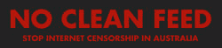

# 救命啊！我的政府想要审查我的互联网

> 原文：<https://www.sitepoint.com/help-my-government-wants-to-censor-my-internets/>

 **如果你没听说的话，澳大利亚[联邦政府](http://en.wikipedia.org/wiki/Australia)(T4【SitePoint】的所在地)正在[计划立法](http://nocleanfeed.com/learn.html)强制互联网服务提供商过滤澳大利亚人可以访问的网站。**

该过滤器将阻止访问“黑名单”上的所有网站，黑名单是由政府控制的保密网站列表。我没有瞎编，这是真的。

当你每天在网上工作时，很难理解为什么一个民选政府会这样做。对我来说，我并不是不明白政府想要达到的目标，或者他们为什么要达到这个目标。我自己有三个孩子，我爱他们胜过一切，我想保护他们，就像任何父母应该做的那样。我觉得特别可恶的是，有人说我反对过滤器意味着我不关心我的孩子。光是这种暗示就让我在今年晚些时候的选举中失去了本届政府的选票。

我对这个问题的感受如此强烈的原因是因为我是一名家长——我的孩子会更强烈地表达这种情绪。我讨厌自由国家的民选政府认为他们可以告诉我该读什么。

## 最大的问题:行不通

我想知道是谁给了参议员康罗伊建议。我无法想象任何一个有着良好信息技术背景的人会支持“干净饲料”。这根本行不通，你不需要有信息技术学位就能明白为什么:

*   互联网实在太大了。以 YouTube 为例。YouTube 的所有者最近表示，仅他们的网站就有 24 小时每分钟上传的视频。很简单，浏览新材料不可能像它出现时那么快——想象一下，要做好分类工作需要多大的政府部门！然后考虑 YouTube 是现存的大约 2 亿个网站中的一个。就像我说的，你不需要一个 IT 学位来理解这个计划的缺陷。成功审查互联网所需的后勤工作让重组医疗系统看起来像在公园里散步。
*   过滤器不会阻止所有不适合儿童的内容。尽管有了提议的过滤器，但仍会有大量儿童不宜的内容。事实上，过滤器完全有可能导致澳大利亚的儿童*变得更不安全*——如果政府一意孤行，颁布这项立法，是否可能会让一些家长相信他们的孩子现在在网上是安全的？我认为是的，这将是一个非常昂贵的负面结果。
*   **过滤器不会阻止点对点文件传输。**决定分享儿童性虐待材料的个人不太可能公开这样做。这个过滤器不会阻止这些人继续使用这些媒体。

## 另一个问题:秘密黑名单

似乎这个昂贵且被误导的计划还不够糟糕，这里还有更多需要关注的:政府不想公开将被审查的网站的事实。这是彻头彻尾的可怕。这传达的信息中有一堆不成文的陈述:

*   “我们不信任那些投票给我们的人。”
*   “我们不需要被他们追究责任。”
*   *“我们不相信我们正在实施的计划(因为如果它真的有效，人们无论如何也不会看这些材料)”*

所以我对正在发生的事情背后的逻辑有一些批评。我可以继续下去！但是，通常我不喜欢站在一边扔石头的人。这太容易做到了，我认为有建设性是更好地利用任何人的时间。

这里有一个非常现实的问题，我们的政府正在努力解决:互联网来得非常快，而我们作为一个社区却没有准备好应对它。我们的孩子可能会接触到我们大多数人都认为完全不合适的在线内容。

## 那我们该怎么办..？

我的观点是，我们应该**讨论这个问题，互相教育和支持**,并真正努力把事情做好，让事情有所不同。如何在孩子身边和家里使用互联网应该是社区层面的热门话题。我相信**最好的解决方案是社会的，而不是技术的。**

技术不是魔法，也不能用来解决每一个挑战——即使是它可能帮助创造的挑战。你怎么想呢?

## 进一步阅读

*   [No Clean Feed](http://nocleanfeed.com/) 网站有一个很好的总结，解释了为什么过滤器有缺陷
*   EFA 有一个很好的列表，你可以用它来表明你对提议的互联网过滤器的反对意见。
*   儿童浏览器

## 分享这篇文章