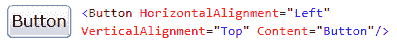
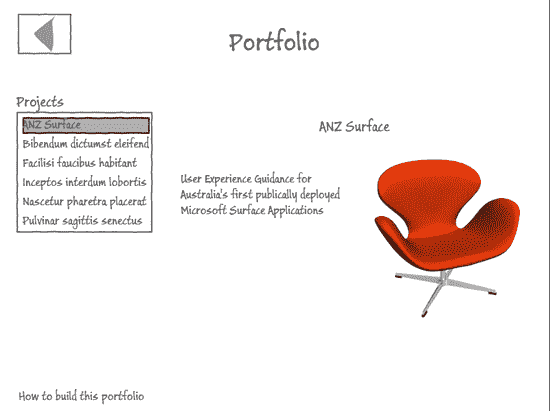
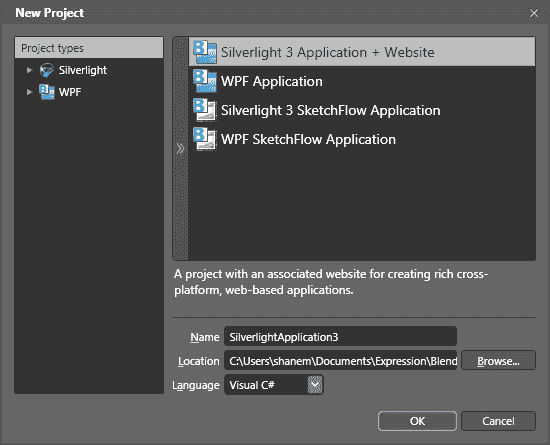
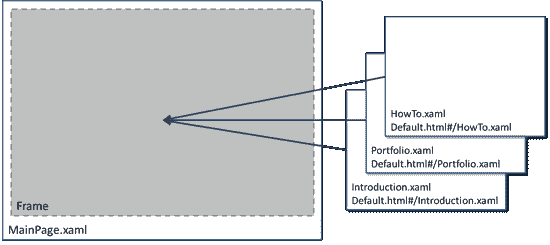
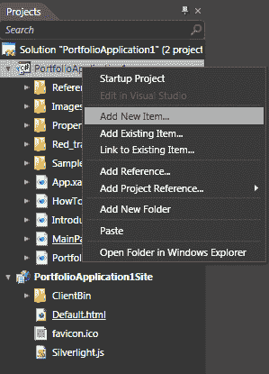
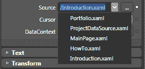

# 使用 Microsoft Expression Blend 进行设计

> 原文：<https://www.sitepoint.com/microsoft-expression-blend/>

在我之前的文章中，我们讨论了 SketchFlow，这是微软 Expression Studio 套件的原型工具。我们看到了如何快速构建一个简单的投资组合查看应用程序的线框原型，以及如何使用 SketchFlow 的反馈功能来收集利益相关者和用户的反馈。

如果你错过了第一篇文章，我强烈推荐你去看看:[使用 SketchFlow 的快速原型制作](https://www.sitepoint.com/article/rapid-prototyping-sketchflow)。它将向您介绍混合界面，并解释该工具的一些核心概念。

在本文中，我们将深入研究 Expression Blend，并看看如何使用 Microsoft Silverlight 将我们的组合原型投入生产。我们将介绍导航、布局和示例数据——所有这些都无需编写一行代码！

请注意，因为最后有一个测验来测试你所学的内容！

## 银光与表情交融

到目前为止，你可能已经在网上的某个地方遇到了微软的 Silverlight 技术。简而言之，Silverlight 是微软提供的提供丰富的在线互动体验的产品。

Silverlight 为视觉设计、动画、媒体集成、布局和数据可视化提供了丰富的功能。它具有大量可设置皮肤的控件和用于定义复杂用户体验的强大机制。Silverlight 也是为了与 web 平台互操作而构建的。Silverlight 应用程序可以轻松地与底层浏览器和 HTML 页面进行互操作，包括操作 DOM 和调用(以及被调用)JavaScript。

Silverlight 插件运行到大约 4MB，支持 Internet Explorer、Safari、Firefox、Opera 和 Google Chrome。Silverlight 可以在 Windows 和 Mac OSX、Linux(通过 Mono 项目)上运行，很快也会在 Windows Phone 上运行。

### 面向开发者的 Silverlight

对于开发人员来说，Silverlight 的一个主要吸引力在于它是. NET 的子集。NET 开发人员在为 Web 开发富应用程序时可以利用他们现有的技能，并且所有开发人员都可以利用。NET 由微软和其他公司提供。基于。NET 中，Silverlight 应用程序通常用 C#或 Visual Basic 编写。NET，但是它们可以在一系列。NET 支持的语言，包括 IronRuby、IronPython 和 JavaScript。

### 设计师的 Silverlight

对于设计人员来说，使用 Silverlight 的主要好处是该平台提供的设计与开发的清晰分离，以及复杂设计工具的可用性。Silverlight 允许设计人员自然地工作，并且非常高效，同时只需要很少或者不需要编码。

这就把我们带到了表达融合。

### 表情交融

Expression Blend 是微软 Expression Studio 设计工具套件的一部分。它是为 Silverlight 在 Web 和 Windows Phone 上，以及为 WPF(Windows Presentation Foundation)在 Windows 和 Microsoft Surface 上设计和构建用户界面的生产工具。Expression Blend 还支持 SketchFlow，这是我们在上一篇文章中介绍的快速原型制作工具。

Blend 的强大之处在于，它允许设计人员自己构建丰富的用户界面，而不是用线框、站点地图和组件来描述界面，让其他人来构建(并可能曲解)。Blend 允许设计人员自己创建产品界面，同时仍然使用熟悉的工具和概念。这不仅让设计人员更有效率，而且可以更长时间地积极工作，因为不太需要正式移交给开发团队。

### 设计师-开发人员工作流程:秘方

当我在微软工作时，我们的关键信息之一是使用 Blend 的设计人员和使用 Visual Studio 的开发人员所享受的改进的设计人员-开发人员工作流。设计人员和开发人员能够分别在 Blend 和 Visual Studio 中同时处理同一个项目。设计师喜欢这一点，因为这使他们成为项目团队的正式成员，使他们能够平等地为项目做出贡献，而不是被视为局外人，必须依赖开发人员的善意才能看到他们的工作得以实现。

### XAML 的声明式用户界面

支撑 Silverlight 和 WPF 的是 XAML 用户界面定义语言。XAML 是一种基于 XML 的语言，用于定义用户界面的内容、布局和行为。[图 1，“基于 XML 的 XAML 语言是您 Silverlight 体验的基础”](#fig_button_xaml "Figure 1. Underlying your Silverlight experience is the XML-based XAML language")显示了一个按钮界面元素和创建该按钮的相应 XAML 代码。虽然这种语言的语法和机制与 HTML 有很大不同，但它的意图是相似的。正是 XAML 让 Blend 这样的用户界面设计工具成为可能。作为一名设计师，有必要了解 XAML 的基本工作原理。虽然通常不需要能够在 XAML 编码(我还没有发现它的必要性)，但是能够阅读 XAML 来帮助调试你的项目中任何无法解释的行为是有帮助的。

**图一。基于 XML 的 XAML 语言**是 Silverlight 体验的基础

## 从草图流到混合

在第一篇文章中，我们了解到 SketchFlow 允许我们在 Blend 的“顶部”创建原型。这种方法的一个优点是，您可以将最初粗略的原型发展到非常接近 SketchFlow 中最终体验的程度。你甚至可以将你的原型连接到真实的后端代码。我们在上一篇文章中构建的原型显示在[图 2 中，“我们的 SketchFlow 原型”](#fig_sketchflow_prototype "Figure 2. Our SketchFlow prototype")。

**图二。我们的 SketchFlow 原型**

在这一点上，自然要问的问题是，当你准备好了，你是否可以将你的 SketchFlow 原型转换成生产项目。答案是肯定的，算是吧…

SketchFlow 原型与任何其他项目一样，是一个混合项目。除了您自己定义的元素之外，SketchFlow 还提供了幕后机制来连接一切，实现 SketchFlow 地图，提供 SketchFlow 样式，当然还有创建 SketchFlow 播放器所需的代码。要将 SketchFlow 原型转换为生产项目，您基本上有两种选择:

1.  去掉项目中所有的 SketchFlow 部分。Blend 帮助文件中有相关说明。

2.  收获您想要保留的资产，并有效地将它们复制并粘贴到新项目中。

除了最简单的项目，我会推荐选项 2。首先，它确保在你的项目中没有任何 SketchFlow 的碎片。其次，作为原型的一部分，按照生产标准，你的屏幕可能相当粗糙。快速原型的全部意义在于，你可能没有真正考虑布局、包容、调整大小、命名或良好的架构实践等问题。出于这个原因，您可能更好地浏览您的原型，并复制出您想要用作生产项目起点的元素(屏幕、组件、动画等)。

在我们的例子中，原型非常简单，我们只要重新开始就可以了。

## 让我们开始吧

正如我们上次学到的，当我们开始 Expression Blend 时，我们有机会开始一个新项目。这一次，我们不是选择 Silverlight 3 SketchFlow 应用，而是制作一个真正的 Silverlight 3 应用+网站，如图[图 3，“选择合适的项目类型”](#fig_project_type "Figure 3. Selecting the appropriate project type")。

**图 3。选择合适的项目类型**

### 你的新项目

快速浏览 Blend 中的项目面板可以看到，我们的新 Silverlight 项目目前只有一个页面:`MainPage.xaml`。这是我们构建用户界面的地方。

### 但是我们想要三页纸，不是一页！

在我们的 SketchFlow 原型中，我们构建了三个独立的页面，SketchFlow 通过导航将它们链接在一起。对于我们的生产应用程序，我们的方法略有不同。我们将制作三个独立的页面，它们将使用一个`Frame`显示在`MainPage.xaml`中，如图[图 4 所示，“MainPage.xaml 中的一个框架将容纳我们三个应用程序页面中的每一个”](#fig_frames "Figure 4. A Frame in MainPage.xaml will hold each of our three application pages")。Silverlight 的`Frame`元素允许我们在页面间导航(很像在浏览器中的页面间导航)，但也给了我们额外的好处。使用一个`Frame`元素将我们的 Silverlight 应用程序与浏览器导航集成在一起。这意味着浏览器的后退和前进按钮将在我们的 Silverlight 应用程序中前后导航。这也意味着我们的应用程序中的每个页面都有自己的 URL，这对书签非常有用。

**图 4。MainPage.xaml 中的一个框架将包含我们三个应用程序页面中的每一个页面**

因此，在我们将`Frame`插入`MainPage.xaml`之前，让我们制作三页。

要创建新页面，我们进入项目面板，右键单击 Silverlight 项目(不是 Web 项目)，然后选择添加新项目… ，如图[图 5 所示，“添加新项目…”](#fig_new_item "Figure 5. Add New Item…")。添加一个新的页面，并将其命名为`Introduction.xaml`。当你在做的时候，再做一个叫做`Portfolio.xaml`的。

**图 5。添加新项目……**

在`MainPage.xaml`中创建`Frame`元素(你可以在控件下的资产选项卡中找到它)，并设置它的源属性指向我们希望它首先加载的 XAML 页面——`Introduction.xaml`——如图[图 6 所示，“源属性决定了框架在运行时最初将显示哪个 XAML 文件”](#fig_source_prop "Figure 6. The Source property determines which XAML file the Frame will initially display at run time")。

**图 6。 Source 属性决定了框架在运行时最初会显示哪个 XAML 文件**

## 分享这篇文章