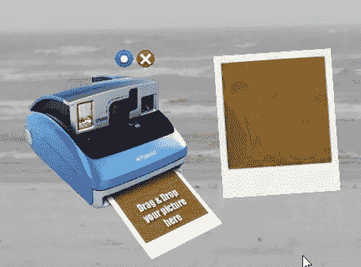
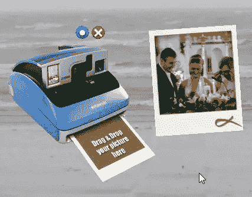
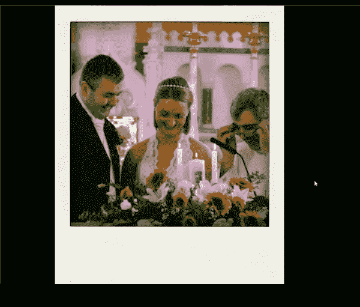
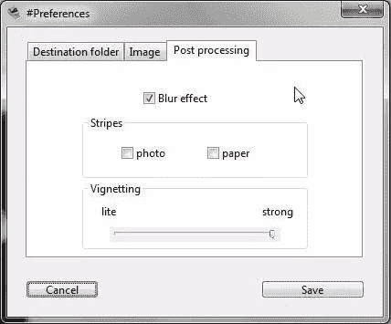

# 让你的照片看起来像宝丽来与波兰德

> 原文：<https://www.sitepoint.com/make-your-pictures-look-like-polaroid-with-poladroid/>

Poladroid 是一个免费的桌面应用程序，可以让你用电脑上的照片制作宝丽来风格的图像。为什么你想让你昂贵的相机拍出的照片看起来像是来自老式的快速胶片相机呢？这要由每个人来回答，但是这个应用程序很傻但是很有趣，我真的很喜欢最终的结果。

在你[下载并安装 Poladroid](http://www.poladroid.net/download.html) 到你的电脑后(它可以在 pc 和 Mac 上使用)，你的桌面上会出现一个小小的宝丽来相机图标。你把你的一张照片拖到图标上，你就会听到一架老式宝丽来相机的声音效果。

一个小版本的图像弹出在你的桌面上，看起来像一个迷你宝丽来，但在这个阶段，图像仍然没有被开发。你会看到它在你眼前慢慢发展，如果你想加速这个过程，你可以像真正的宝丽来照片一样摇动它。

当它完全“发育”后，你会得到一个小的响声，底部有一个红色的涂鸦。这只是一个缩略图预览。全尺寸图像保存在您的硬盘上。您可以在应用程序设置中声明您希望它保存在哪里。

我拖到图标上的原始图像是一张 3872 x 2592 像素的高分辨率照片。最终图像的分辨率为 1392 x 1692 像素，包括纸张边框。您的原始图片将被裁剪成正方形。

(注:我在这里加了黑色背景是为了突出。)

由此产生的全尺寸图像看起来“不错”，或者也许我应该说看起来的一部分，在纸上有很好的纹理，饱和的颜色和模糊的图像。在程序设置中，你可以选择你想要图像旋转多少，晕影多少，以及你是否想要在纸上或照片上有条纹。

这是一个有趣的应用程序，它可能对怀旧相关的设计有用。皇家宝丽来相机迷可能会讨厌它(或者也许喜欢它？)但是作为一个免费的应用程序，你不能通过下载它和玩一些图片来犯太多的错误。

## 分享这篇文章