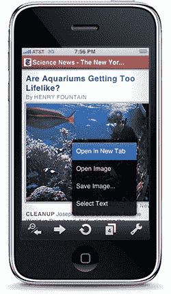

# Opera 将其 iPhone 网络浏览器提交给苹果的应用商店

> 原文：<https://www.sitepoint.com/opera-apple-iphone-app-store/>

这可能会很有趣。Opera 已经为苹果 iPhone 完成了新版本的 Opera Mini(以及即将推出的 [iPad](https://www.sitepoint.com/apple-ipad-transitional-or-trashy/) )。它已经被提交给苹果公司，以纳入他们的应用商店，并可能在几天内可用。或许不是。iPhone 版 Opera Mini 5 看起来与 Android、Symbian 和诺基亚平台上的浏览器几乎一模一样。它提供了桌面浏览器中常见的一系列功能，如标签、搜索、快速拨号和书签同步。浏览器也快。或许对 iPhone 用户来说最好的消息是[Opera Turbo](https://www.sitepoint.com/opera-10-turbo-performance/)；一种使用 Opera 代理服务器来传送高度压缩的页面和图像并提高下载速度的工具。在下面 Opera 的宣传视频中，他们演示了在 iPhone 的原生 Safari 浏览器下载一个页面所需的时间内加载 5 个页面。不幸的是，新的浏览器仍然不能在苹果的设备上提供 Flash，但如果我是 Adobe，我会匆忙安排与 Opera 开发团队的几次试探性会议。最大的问题是:*苹果会允许 Opera 浏览器出现在它的应用商店吗？Opera 直接与 Safari 浏览器竞争，苹果可能会争辩说它没有提供一个无缝的类似 iPhone 的界面。他们出于更神秘的原因拒绝了申请。希望苹果不要妨碍良性竞争，接受他们设备上的浏览器。他们当然不想招致[Opera 用户](https://www.sitepoint.com/the-problem-with-opera#comments)的愤怒！*

<object width="480" height="295"><param name="movie" value="https://www.youtube.com/v/OpTCS3g-cBY&amp;hl=en_GB&amp;fs=1&amp;rel=0&amp;color1=0x2b405b&amp;color2=0x6b8ab6"><param name="allowFullScreen" value="true"><param name="allowscriptaccess" value="always"><embed src="https://www.youtube.com/v/OpTCS3g-cBY&amp;hl=en_GB&amp;fs=1&amp;rel=0&amp;color1=0x2b405b&amp;color2=0x6b8ab6" type="application/x-shockwave-flash" allowscriptaccess="always" allowfullscreen="" width="480" height="295"></object>

你会在 iPhone 上使用 Opera 吗？Safari 够好吗？苹果会接受浏览器吗？还是 Opera 的开发努力白费了？现在就下注吧…

## 分享这篇文章