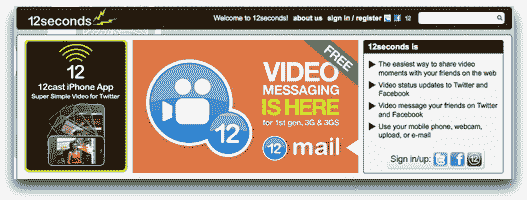
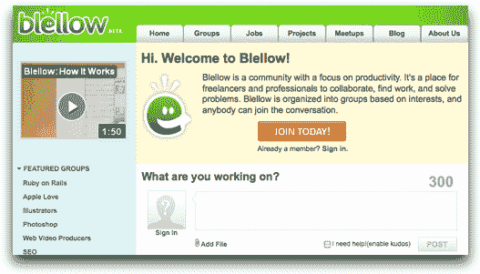
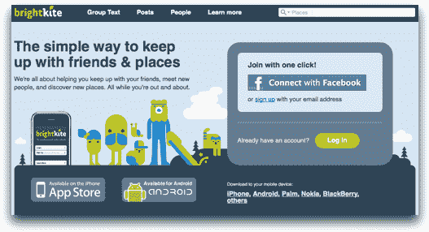
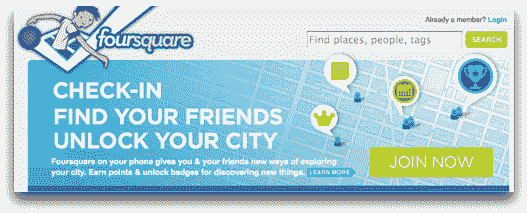
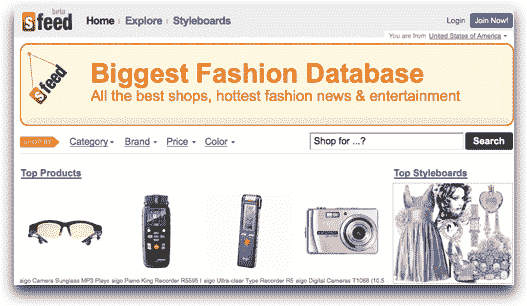
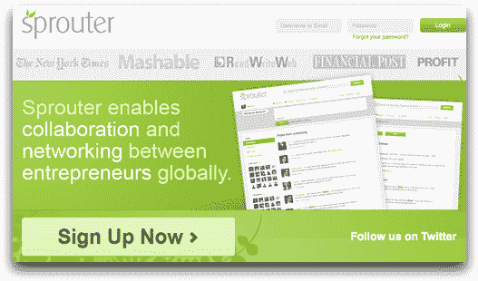
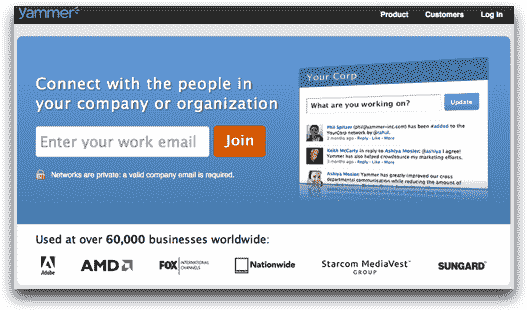

# 7 个专注于小众的微博网站

> 原文：<https://www.sitepoint.com/7-niche-focused-microblogging-sites/>

无论你是否是 Twitter 用户，很难否认 Twitter 已经迅速主导了微博市场，几乎没有给其他微博网站留下任何空间来宣称自己的权利。但是 Twitter 不可能满足每一个用户的每一个需求，所以有空间让其他微博继续 Twitter 的未竟事业；即通过专注于特定的利基市场。

这里有 7 个针对目标用户的微博网站。

## [12 秒](http://12seconds.tv/)

一条仅关注视频状态更新的微博，时长 12 秒。你可以用任何适合你的方式记录(浏览器、网络摄像头、手机等。)并使用 12seconds 网站直接分享您的视频或在 Twitter、脸书和您的博客上发布。

## [b 流](http://www.blellow.com/)

Blellow 是一个面向自由职业者和专业人士的生产力微博。总的任务是鼓励开放协作和知识共享。该网站具有线索回复、按主题分组、工作和项目板、聚会等功能。更多信息请见去年发表在 SitePoint.com 上的[评论](https://www.sitepoint.com/blellow-for-freelancers/)。

## 亮斑岩

基于位置的微博，帮助您与朋友和地点保持联系。Brightkite 可以让你选择朋友，评价更新，搜索帖子，并在 Twitter 和脸书等其他网络上分享。

## [方方正正](http://foursquare.com/)

另一个非常受欢迎的基于位置的网站，可以让你“签到”,这样你就可以分享你的行踪并被找到。该网站帮助你记录你做过的事情，创建待办事项列表，甚至建议新的体验。使用 foursquare，您可以赢取积分、获得徽章和解锁免费赠品。

## [sFeed](http://sfeed.com/)

一个专注于购物的微博，允许你为你喜欢的商品添加书签，交换关于商品的想法和评论，并创建商品的视觉集合。

## [Sprouter](http://sprouter.com/)

一个促进全球企业家之间联网和合作的微博。Sprouter 是一个平台，让用户通过回答“你在做什么？”这个问题，与其他有相似兴趣和目标的企业家联系起来不超过 140 个字符。

## [Yammer](https://www.yammer.com/)

Yammer 是一个面向组织的微博工具，允许人们在工作中联系和分享。这是一个允许组织内部联网和协作的平台。

这些都不适合你吗？查看 [Yonkly](http://www.yonkly.com/) 并创建你自己的专注于小众的微博。有了 Yonkly，你可以将微博整合到自己的博客中，为公司内部交流提供一个平台，或者为客户和潜在客户提供有针对性的交流。

你有喜欢的小众微博吗，Twitter 符合你的需求还是你只是觉得微博是浪费时间？

## 分享这篇文章