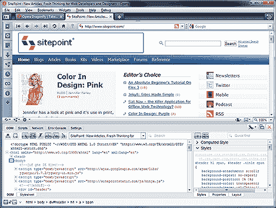

# Opera 的蜻蜓开发者控制台起飞

> 原文：<https://www.sitepoint.com/opera-dragonfly-open-source/>

 [【蜻蜓】](http://www.opera.com/dragonfly/)是歌剧中[萤火虫](http://www.getfirebug.com/)的翻版。我确信浏览器厂商已经厌倦了这种比较，但是 Firebug 是第一个高使用率的开发者控制台，在我看来，它仍然是最好的。

也就是说，蜻蜓很好。它提供了一组熟悉的功能，例如:

*   分步 JavaScript 调试
*   DOM 检查、编辑和变更监控
*   CSS 和布局检查器
*   显示所有 HTTP 请求和响应的文件下载分析

此外，它还可以在 Opera Mobile 的某些版本上运行，这对手机开发者来说可能很有用。最后，每当发布新版本时，小部件都会立即更新；你不需要同意下载，更新或重启浏览器。

如果您正在使用 Opera 查看此页面，您可以选择“工具”>“高级”>“开发者工具”来尝试蜻蜓。你也可以[安装一个调试菜单](http://dragonfly.opera.com/app/debugmenu/DebugMenu.ini)以便更加方便。

Opera 现在发布了蜻蜓作为他们的第一个开源项目。代码基于 JavaScript、CSS 和一点 XML 大多数知识渊博的 web 开发人员应该能够一头扎进去。

源代码被托管为 BitBucket 上的 [Mercurial 库，但是你也可以](http://bitbucket.org/scope/dragonfly-stp-1/)[在线浏览代码](http://bitbucket.org/scope/dragonfly-stp-1/src/)或者阅读[维基文档](http://bitbucket.org/scope/dragonfly-stp-1/wiki/)。

蜻蜓是一个伟大的工具，现在越来越多的人关注这个代码，它很可能会改进。

你使用蜻蜓吗？你最喜欢的功能是什么？比起 Firebug，webkit 的 inspector，还是 IE 的开发者工具，你更喜欢它？

相关链接:

*   [Opera.com](http://www.opera.com/)
*   [蜻蜓歌剧院](http://www.opera.com/dragonfly/)
*   [bitbucket.org 的源代码和维基百科](http://bitbucket.org/scope/dragonfly-stp-1/)

## 分享这篇文章