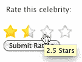

# 使用 jQuery 的星级控制

> 原文：<https://www.sitepoint.com/jquery-star-rating/>

我们最新发布的《jQuery:新手到忍者 T3》一书包含了大量现成的解决方案，并随着您的进步向您传授 jQuery 的基本概念和更高级的概念。作为一名品酒师，Craig Sharkie 向我们展示了如何使用 jQuery 构建一个健壮、复杂的星级小部件。它可以通过键盘访问，并允许半星评级。

如果您以前从未使用过 jQuery，[获取免费的示例 PDF 文件](https://www.sitepoint.com/books/jquery1/samplechapters.php),快速阅读第 2 章的介绍。本文摘自第 7 章，也包含在下载中，所以如果你想离线阅读本教程，可以在空闲时阅读。

您可以在这里获得本文[的示例代码档案。](http://sitepoint-examples.s3.amazonaws.com/jquery/11_star_ratings.zip)

## 星级控制

我们的客户希望提高用户参与度，并帮助他的用户感受到自己的重要性。我们对此进行了思考，并向他提出了一个星级评定的想法——毕竟，人们最喜欢通过分配金色星星来表达他们的感受。我们闪亮的新控件将出现在[图 1 中，“星级控件”](#fig_star_rating "Figure 1. Star rating control")。

**图一。星级控制**



我们星级控制的基础是一个单选按钮组；这是完美的，因为浏览器强制从组中选择一个。只需添加正确数量的按钮，您就可以选择希望用户选择的范围:

**例 1。`chapter_07/11_star_ratings/index.html`(节选)**

```
<div class="stars">  <label><input id="rating-1" name="rating" type="radio" value="1"/>1 Star</label>  <label><input id="rating-2" name="rating" type="radio" value="2"/>2 Stars</label>  <label><input id="rating-3" name="rating" type="radio" value="3"/>3 Stars</label>  <label><input id="rating-4" name="rating" type="radio" value="4"/>4 Stars</label>  ⋮</div>
```

当然，困难的部分是用我们的星形控件替换这些单选按钮。您可以尝试只使用 CSS 来处理 HTML 控件的样式，但是如果您将控件分成两部分，将会更加容易和灵活:存储数据的底层模型和带有星星的闪亮视图。在本例中，模型是最初的 [HTML 单选按钮](https://www.sitepoint.com/html-checkbox-radio-button-defaults/)组。我们的攻击计划是隐藏单选按钮，并显示我们通过 jQuery 添加的链接列表，样式看起来像星星。与链接交互将会切换所选的单选按钮。没有 JavaScript 的用户只会看到单选按钮本身，这对我们来说没问题。

对于明星，我们将依靠 CSS 精灵。这样，我们的控件将只依赖于单个图像(如[图 2 所示，“Star CSS sprite image”](#fig_star_sprite "Figure 2. Star CSS sprite image"))，这节省了 HTTP 请求，并使我们的图形设计人员更容易编辑。

**图二。星形 CSS 精灵图像**


我们的 CSS 将把 CSS sprite 图像应用到我们创建的表示半星形的链接上。为了在不同的图像状态之间移动，我们只需要更新背景位置属性:

**例二。`chapter_07/11_star_ratings/stars.css`(节选)**

```
.stars div a {  background: transparent url(sprite_rate.png) 0 0 no-repeat;  display: inline-block;  height: 23px;  width: 12px;  text-indent: -999em;  overflow: hidden;}.stars a.rating-right {  background-position: 0 -23px;  padding-right: 6px;}.stars a.rating-over { background-position: 0 -46px; }.stars a.rating-over.rating-right { background-position: 0 -69px; }.stars a.rating { background-position: 0 -92px; }.stars a.rating.rating-right { background-position: 0 -115px; }
```

我们决定让用户选择四颗星，而不是通常的五颗星。为什么？用户心理！给一个人一条中间道路，他会接受；由于没有中间地带，我们让用户更多地考虑他们的选择。我们取得了更好的结果，我们将能够更好地为用户提供最好的内容(由他们选择)！

但是四级是有限的——这就是为什么我们要允许半星评级。这是通过视错觉实现的——你可能注意到我们的恒星图像被切成了两半。我们的 HTML 将包含八个单选按钮，每个按钮值半颗星。将八个单选按钮转换成四颗星的代码有两部分。首先，`createStars`函数将接受一个带有单选按钮的容器，并将其替换为星形链接。每个星号都将被适当的事件处理程序补充(在`addHandlers`方法中),让用户与控件交互。这里是我们的`starRating`物体的骨架:

**例 3。`chapter_07/11_star_ratings/script.js`(节选)**

```
var starRating = {  create: function(selector) {    $(selector).each(function() {      // Hide radio buttons and add star links    });  },  addHandlers: function(item) {    $(item).click(function(e) {      // Handle star click    })    .hover(function() {      // Handle star hover over    },function() {      // Handle star hover out    });  }}
```

`create`方法 遍历匹配我们传入的选择器的每个容器，并创建一个链接列表，作为单选按钮的代理。这些链接是我们将样式看起来像明星。它还会隐藏原始的表单元素，因此用户只能看到我们可爱的星星:

**例 4。`chapter_07/11_star_ratings/script.js`(节选)**

```
$(selector).each(function() {  var $list = $('<div></div>');  // loop over every radio button in each container  $(this)    .find('input:radio')    .each(function(i) {      var rating = $(this).parent().text();      var $item = $('<a href="#"></a>')        .attr('title', rating)        *.addClass(i % 2 == 1 ? 'rating-right' : '')*        .text(rating);            starRating.addHandlers($item);      $list.append($item);            if ($(this).is(':checked')) {        $item.prevAll().andSelf().addClass('rating');      }    });
```

我们首先为新链接创建一个容器(一个`div`元素)；我们将为要替换的每个单选按钮创建一个新链接。使用`:radio`选择器过滤器选择所有单选按钮后，我们获取每个项目的评级，并使用它来创建一个超链接元素。

**note:** Conditional Assignment with Modulus

对于`addClass`动作，我们基于一点数学知识，用三元运算符有条件地指定类名。正如我们在本书前面所做的，我们使用模数(`%`)运算符来确定索引是偶数还是奇数。如果指数是奇数，我们就加上`rating-right``class`；这使得链接看起来像一个明星的右侧。

一旦我们的链接准备好了，我们就把它传递给`addHandlers`方法——这是我们附加它需要工作的事件的地方。然后，我们将它添加到列表容器中。一旦它在容器中，我们看到当前单选按钮是否被选中(我们使用`:checked`表单过滤器)。如果选中，我们要将`rating` `class`添加到这个半星，以及它之前的所有半星。任何带有`rating` `class`的链接将被分配金星图像(这将允许用户看到当前的评级)。

为了选择我们需要变成金子的所有元素，我们将借助几个新的 jQuery 动作:`prevAll`和`andSelf`。`prevAll`动作选择当前选择之前的每个 兄弟节点的 *(与`prev`动作不同，它只选择前一个兄弟节点)。对于我们的例子，我们想要将`class`添加到先前的兄弟 *和当前选择的* 中。为此，我们应用了`andSelf`动作，它只是将原始选择包含在当前选择中。现在我们已经有了所有的黄金链接，所以我们可以添加`class`。*

**tip:** Other Traversal Methods

您可能已经猜到，除了`prevAll`之外，jQuery 还为我们提供了一个`nextAll`方法、 ，该方法获取在同一个容器中出现在 之后的 *元素的所有兄弟元素。jQuery 1.4 还引入了两个新的伴随方法:`prevUntil` 和`nextUntil` 。这些是用选择器调用的，将扫描一个元素的兄弟元素(向前或向后，取决于你用的是哪一个)，直到它们找到一个匹配选择器的元素。*

因此，举例来说，`$('h2:first').nextUntil('h2');`将给出页面上第一个`h2`和同一个容器元素中随后的`h2`之间的所有元素。

如果您向`prevUntil`或`nextUntil`传递第二个参数，它将被用作一个选择器来过滤返回的元素。例如，如果我们写了`nextUntil('h2', 'div')`，它只会返回当前选择和下一个`h2`之间的`div`元素。

完成所有这些艰苦的工作后，我们现在可以将新的链接列表添加到控件中，并去掉原来的按钮。现在用户将只与星星互动:

**例 5。`chapter_07/11_star_ratings/script.js`(节选)**

```
// Hide the original radio buttons$(this).append($list).find('input:radio').hide();
```

该控件看起来正在成形，但它还没有做任何事情。我们需要附加一些事件处理程序并添加一些行为。我们对三个事件感兴趣。当用户悬停在一颗星星上时，我们希望更新 CSS sprite 来显示悬停状态；当它们离开时，我们希望将 CSS sprite 恢复到原始状态；当他们点击时，我们希望选择黄金:

**例 6。`chapter_07/11_star_ratings/script.js`(节选)**

```
$(item).click(function(e) {  // React to star click}).hover(function() {  $(this).prevAll().andSelf().addClass('rating-over');},function() {  $(this).siblings().andSelf().removeClass('rating-over');});
```

`hover`功能 是最简单的:当悬停在上方时，我们选择所有之前的半星——包括当前的半星——并使用`prevAll`和`andSelf`给它们赋予`rating-over` `class`,就像我们在设置中所做的一样。当悬停时，我们覆盖我们的基地，并从所有链接中删除`rating-over`类。已经处理好了。

现在点击:

**例 7。`chapter_07/11_star_ratings/script.js`(节选)**

```
// Handle Star clickvar $star = $(this);var $allLinks = $(this).parent();// Set the radio button value*$allLinks  .parent()  .find('input:radio[value=' + $star.text() + ']')  .attr('checked', true);*  // Set the ratings$allLinks.children().removeClass('rating');$star.prevAll().andSelf().addClass('rating');// prevent default link clicke.preventDefault();
```

处理`click`事件的重要部分是更新底层单选按钮模型。我们通过使用`:radio`过滤器和属性选择器选择正确的单选按钮来实现这一点，属性选择器搜索其值与当前链接的文本相匹配的单选按钮。

随着模型的更新，我们可以继续摆弄 CSS 精灵了。首先，我们从当前拥有它的所有链接中清除`rating` `class`，然后将它添加到用户选择的链接之前的所有链接中。最后一步是取消链接的默认动作，所以点击星星不会导致它触发位置改变。

## 结论

我希望你已经享受了《jQuery:忍者新手 中包含的所有 jQuery 优点。记得去拿你的[免费样本 PDF](https://www.sitepoint.com/books/jquery1/samplechapters.php) ，里面有这个例子以及 150 页的更好的学习材料。如果你已经被出售了，你可以直接从 SitePoint 购买这本书。

## 分享这篇文章