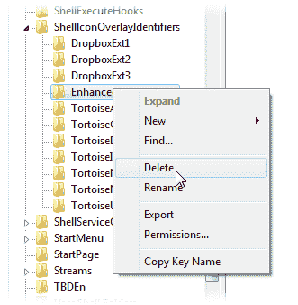

# 如何修复 Windows 中丢失的文件状态图标

> 原文：<https://www.sitepoint.com/missing-tortoisesvn-file-status-overlay-icons/>

对于许多基于 Windows 的开发者来说， [Subversion](http://subversion.tigris.org/) 和 [TortoiseSVN](http://tortoisesvn.tigris.org/) 是一个很棒的源代码控制解决方案。它是免费的，定期更新，可以在大多数版本的 Windows 上运行，并且可以很好地集成到操作系统中。TortoiseSVN 将是开发者升级到 Windows 7 后安装的首批系统之一。

Tortoise 通常会在每个受版本控制的文件上显示一个覆盖图标，以表明它是否已经被添加到 SVN 库中，是否是新的，是否被修改过等等。虽然这可能不是绝对必要的，但是叠加提供了当前项目状态的快速视图。

不幸的是，Windows Tortoise 用户可能会遇到文件覆盖消失的问题。这不是乌龟特有的问题，它会影响任何添加了图标覆盖的应用程序。该问题是由不同版本的 Windows 中允许的覆盖数量引起的。Vista 32 位似乎支持 15 种覆盖类型，而 Windows 7 64 位支持 11 种。因此，安装一个添加图标覆盖的程序可以在另一个应用程序中禁用它们。

Windows 注册 3 个图标覆盖(这可能因版本而异)。乌龟又注册了一个 9。Dropbox 注册了 3 个，如果应用程序重启时它们丢失了，它会重新安装。因此，如果从系统中删除了至少 4 种(非 Dropbox)覆盖类型，Windows 7 64 位用户将只能查看乌龟图标。

这里有龙！
我将要描述的修复包括篡改 Windows 注册表。这很危险，一个错误的举动就可能毁掉你的 Windows 安装！

如果你愿意冒这个险，启动 Windows 注册表编辑器(regedit.exe)并导航到:HKEY _ 本地 _ 机器软件微软视窗微软版本 explorershelliconverlayidentifiers

将分支导出为. reg 文件—这将允许您在出现任何问题时恢复旧设置。

您将看到乌龟和其他图标覆盖标识符作为子分支。您可以通过右击分支并选择删除来删除不必要的图标覆盖类型:

选择哪些覆盖是不必要的是你的决定，将取决于你的要求。您不使用或已卸载的应用程序可能会被覆盖。我去掉了 **TortoiseLocked** 和 **TortoiseReadOnly** 型，因为我很少使用 SVN 的那些设施。你也可以删除不常用的 Windows **离线文件**和**共享私有文件**。

完成后，重新启动 Windows 并检查乌龟图标是否再次出现。

您运行的 Windows 版本将决定您需要删除多少个分支。如果有疑问，请一次移除一个，重新启动并检查。

我希望这能帮助到某处的某个人。欢迎所有评论…让来自 Mac 和 Linux 用户的嘲笑开始吧！

## 分享这篇文章