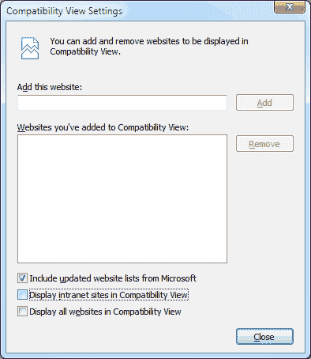

# 你确定你在测试 IE8 吗？如何避免触发兼容性视图

> 原文：<https://www.sitepoint.com/ie8-compatibility-view-intranet/>

在我最近关于 IE CSS 漏洞的文章中，我注意到这个问题出现在运行于本地服务器的 IE8 中，而不是当文件上传到互联网时。幸运的是，[弗洛伦特 V](https://www.sitepoint.com/fix-disappearing-absolute-position-element-ie#comment-940318) 解决了这个谜:IE8 自动切换到兼容性视图。但是为什么会这样呢？

## 什么是兼容性视图？

在从 IE6 升级到 IE7 时遇到许多问题之后，微软在 IE8 中引入了兼容性视图。如果用户在 IE8 中查看页面时遇到问题，该功能会将浏览器切换到类似 IE7 的渲染引擎。理论上，利用了 IE7 的错误和怪癖的页面仍然可以在新的浏览器中显示。

*(注意 IE7 和 IE8 兼容性视图相似但不是 100%相同……感谢微软！)*

## IE8 什么时候切换到兼容性视图？

有几种方法可以切换到兼容性视图:

**1。手动切换**
如果模式尚未激活，您可以点击地址栏末端的图标切换到兼容性视图。


**2。所有网站**
在工具>兼容性视图设置对话框中，有一个在兼容性视图中显示所有网站的选项。默认情况下，这是关闭的。

**3。微软网站列表**
微软编制了需要兼容性视图的网站列表。该列表由用户点击兼容性视图图标的频率和人工验证生成——你可以在[RES://iecompat . dll/iecompatdata . XML](res://iecompat.dll/iecompatdata.xml)查看(仅限 IE)。

该文件被分发给所有 IE8 用户，并且列表上的站点被自动显示在类似 IE7 的视图中。该设置通常处于启用状态。

**4。内部网站点**
默认情况下，IE8 在兼容性视图中显示所有内部网站点。可以理解微软为什么要实现这个功能:几年前，许多公司内部的网络应用程序是专门为 IE 的旧版本开发的。

不幸的是，当在本地服务器上测试时，这个选项可能会触发您的最新和最好的 web 应用程序不正确地工作。

## IE8 如何识别内部网页面？

确定 IE8 如何以及何时识别一个页面属于内部网有点困难。从我自己的调查来看，好像一个没有句号(。)被假定在内部网中。通常，在有域服务器的公司网络上，或者在 PC 的 hosts 文件中指定了域解析时，可以使用非句点名称，例如

```
mydomain 127.0.0.1
```

但是，浏览到 localhost、127.0.0.1 或任何网络 IP 地址(通常是 192.168.x.x)会被假定为一个 **internet** 区域，不会触发兼容模式。

## 如何禁用兼容性视图

当你在 IE8 中测试一个 web 应用时，知道使用的是哪一个渲染引擎是至关重要的。因此，我建议在本地电脑或服务器上测试网站时禁用兼容性视图。在 IE 中，选择工具>兼容性视图设置，然后取消勾选**在兼容性视图中显示内部网站点**框。



我希望那有帮助。兼容性观点曾经让你困惑过吗？

## 分享这篇文章