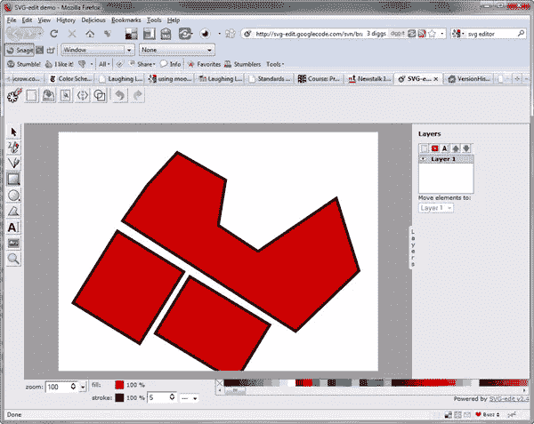
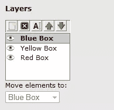
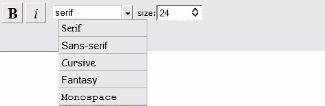
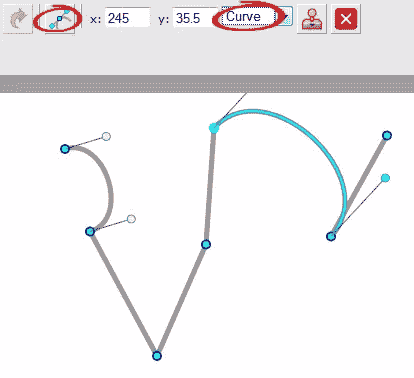

# SVG-Edit 在线矢量图形编辑器

> 原文：<https://www.sitepoint.com/svg-edit-online-vector-graphics-editor/>

 SVG-edit 是一款免费的基于网络的可缩放矢量图形(SVG)编辑器。该编辑器有一个稳定的版本 2.4，名为 Arbelos，还有一个更新的版本 2.5，名为 Bicorn。然而，出于本文的目的，我使用的是 2.4 版本。

SVG 是一种开放的、基于行业标准 XML 的矢量图形格式，由 W3C 开发。它的接受度正在快速增长。如今大多数矢量编辑器都可以导入和导出 SVG，现代浏览器(如 Firefox 和 Opera)可以直接显示它，不需要任何插件。如果你是一个铁杆 ie 用户，注意 SVG-edit 只有在你安装了[谷歌 Chrome 框架插件](http://code.google.com/chrome/chromeframe/)的情况下才有效。

当谈到绘图工具时，这个编辑器显然比不上 Illustrator(也没有试图这样做)，但它仍然提供了有用的工具和许多功能，包括手绘、形状、颜色和渐变选择器。绘图很容易，移动和变换对象也很容易。您可以更改填充和描边颜色以及不透明度和描边粗细。

菜单和工具栏图标看起来有点笨拙，但是它们做了它们应该做的事情。

同样，图层“调色板”是一个简单的盒子，你可以从屏幕的一侧拉出。当你习惯于用调色板填充你的半个屏幕的其他程序时，它看起来有点孤独，但它再次做到了它在 tin 上所说的，你可以轻松地添加、删除、重命名和改变层的堆叠顺序。

当涉及到排版时，如果你习惯于使用更高级的编辑器，可用的工具看起来会很简单。字体选择仅限于类别，即衬线，无衬线，草书，幻想和等宽字体，风格仅限于粗体和斜体。你可以设置任何你喜欢的尺寸。

虽然绘制形状很容易，但我发现改变对象上的锚点有点棘手，而且不是特别直观。我认为这是最需要改进的地方，以使它更加方便用户。

以下是当前版本的完整功能列表:

*   手绘
*   线条、折线
*   长方形/正方形
*   椭圆形/圆形
*   多边形/弯曲路径
*   可样式化的文本
*   光栅图像
*   选择/移动/调整大小/旋转
*   退回/重做
*   颜色/渐变选择器
*   组合/取消组合
*   排列
*   一款云视频会议软件
*   层
*   将形状转换为路径
*   线框模式
*   将图形保存到 SVG
*   线性梯度拾取
*   查看和编辑 SVG 源
*   UI 本地化
*   可调整大小的画布
*   更改背景
*   可拖动对话框
*   可调整大小的用户界面(SVG 图标)

即将推出的 2.5 版本将具有以下附加功能。

*   炙单
*   打开本地文件(仅限 Firefox 3.6)
*   箭头
*   插件架构
*   更平滑的手绘路径
*   增加了对 SVG 元素的支持

文件可以保存为 SVG 格式，可以在多种浏览器中查看，并在支持该格式的图形编辑器中打开。

在这个阶段，我不认为 Adobe 会战战兢兢，但似乎有一个专门的团队正在努力改进和推进这个编辑器。它确实需要一点调整，但如果能看到每个版本都有所改进，那就太好了。你可以在这里阅读更多关于它的[，在这里](http://code.google.com/p/svg-edit/)下载一个 [Firefox 插件。](https://addons.mozilla.org/en-US/firefox/addon/14186)

**你用过 SVG Edit 吗？你觉得它怎么样？你用过其他好的自由矢量编辑器吗？**

## 分享这篇文章