# 截至 2010 年 7 月 2 日的一周设计推文

> 原文：<https://www.sitepoint.com/design-tweets-of-the-week-ending-070210/>

以下是本周 Twitter 上出现的一些有趣的设计相关链接。

澳大利亚平面设计档案[1960-1980](http://www.recollection.com.au/)。这里的大量工作不仅经受住了时间的考验，而且随着复古风格变得流行，看起来又时髦了。
T3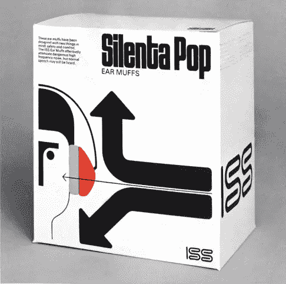

如果你正在考虑是否应该迁移到 Chrome，但又担心会错过 Firefox 扩展，这篇来自第一网页设计师的文章可能会说服你做出改变: [30 个不可替代的 Chrome 扩展](http://www.1stwebdesigner.com/development/transfer-chrome-irreplaceable-chrome-extensions/)。
T3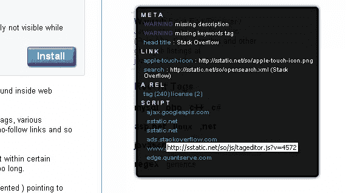

仅使用 CSS3 创建深度和 3D 丝带的良好效果。

[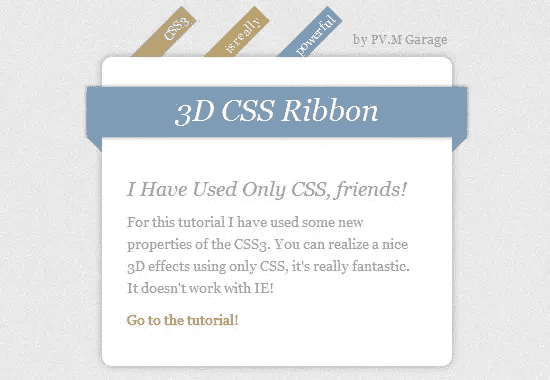](https://www.sitepoint.com/wp-content/uploads/2010/02/image36.png)

关于修改后的字体堆栈的有趣想法。

[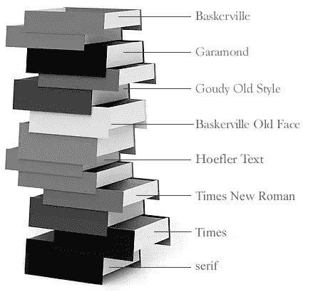](https://www.sitepoint.com/wp-content/uploads/2010/02/image37.png)

来自 Wacom 的新款[无线插管平板电脑的创意专业版评测。我有一个带电线的，但是现在我想要这个！](http://www.creativepro.com/article/new-wireless-wacom-tablet)

[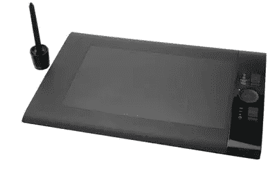](https://www.sitepoint.com/wp-content/uploads/2010/02/image38.png)

纽约公共图书馆在 Flickr 上有完整的图片来源和版权信息。巨大的资源。

[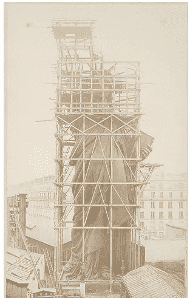](https://www.sitepoint.com/wp-content/uploads/2010/02/image39.png)

为什么最好[假装自己对电脑一无所知](http://theoatmeal.com/comics/computers)。【T2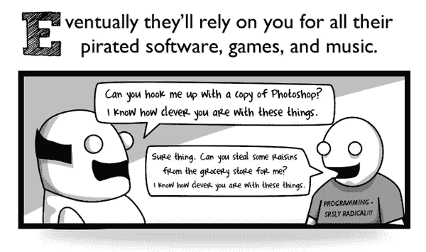

[网页设计速写本](http://webdesign-sketchbook.com/)是一本 52 页的书，具有不同画布大小的页面，配有网格和浏览器 chrome，以及用于记笔记、添加描述和给你的概念评级的区域。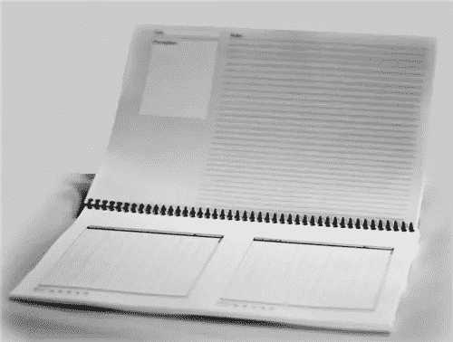

也许对这个来说有点晚了，但是 HongKiat 有一个很好的免费可打印的 2010 年日历和桌面壁纸的收藏。 [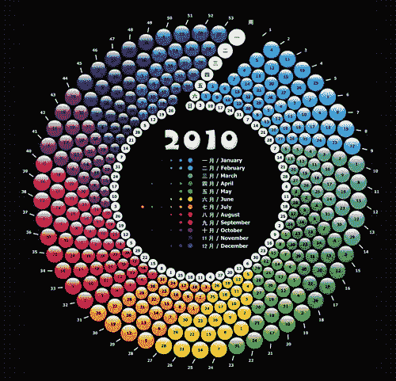](https://www.sitepoint.com/wp-content/uploads/2010/02/image42.png)

如何变得有条理，并为你的设计事业建立所需的联系。Vandelay Design 为忙碌的设计师提供的社交技巧。

UXBooth 有一篇关于眼球追踪历史的文章，这对网页设计师来说是一个非常重要的话题。

我认为本周与设计相关的笑点应该是这张库拉拉航空公司巧妙喷漆的照片。(via[【gadling.com】](http://www.gadling.com/2010/01/30/kulula-air-tries-not-to-take-itself-too-seriously/)[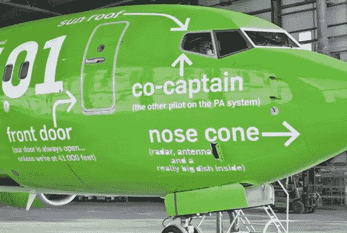](https://www.sitepoint.com/wp-content/uploads/2010/02/image43.png)

[没有折页](http://www.thereisnopagefold.com/) [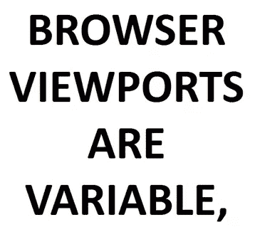](https://www.sitepoint.com/wp-content/uploads/2010/02/image45.png)

一篇关于网页设计未来的文章。“要超越今天的网络限制，我们需要做的就是看到需要什么。”

## 分享这篇文章