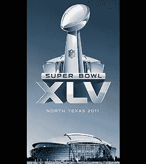
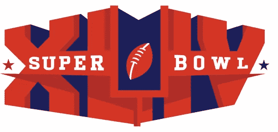

# 橄榄球联盟揭开超级碗 XLV 标志

> 原文：<https://www.sitepoint.com/super-bowl-xliv-logo/>

美国橄榄球联盟今天公布了美国超级碗 XLV 的新标准标志，Twitter 和一些设计博客对此议论纷纷，尽管没有太多图片。超级碗每年都会有一个新的标志，但从 2011 年超级碗开始，标志将基本保持不变。唯一的区别是罗马数字和体育场的背景，以后每年都会改变。

*图片来自[ESPN](https://sports.espn.go.com/dallas/nfl/news/story?id=4886793)*

银色 XLV 标志上有隆巴迪奖杯、罗马数字和牛仔体育场。美国橄榄球联盟的首席营销官马克·沃勒表示，这个标志将成为超级碗的永久设计，每个主办城市都可以将这个标志区域化。沃勒说，将有一个标志的风格指南，可以根据城市的颜色进行定制。如果你不符合你的罗马数字 XLV 是 45。

去年的 logo 是由 Attik 设计的，看起来像一个呼啸而过的足球，两边各有一个罗马数字 XLIV。

下面你可以看到 Attik 发布的示意图，概述了他们的标志是如何建立的。

对新标志有什么想法吗？你认为闪亮的银色外观与去年多彩的、更时髦的标志相比如何？

****更新:抱歉，在我对新 logo 兴奋不已的时候，我在贴出新 logo 的图片之前按下了发布键！****

## 分享这篇文章