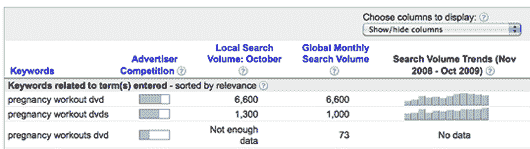
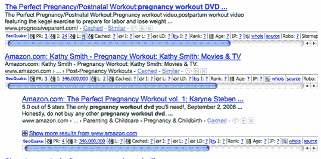
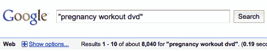
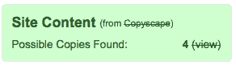

# 购买你的第一个网站:案例研究

> 原文：<https://www.sitepoint.com/buying-your-first-website/>

作为 Flippa.com 公司的新任营销经理，我的第一周尽可能多地了解我们的市场和用户。然而，没有什么可以替代[吃自己的狗粮](http://en.wikipedia.org/wiki/Eating_one%27s_own_dog_food)；因此，一个周末，我从 Flippa.com 市场购买了我的第一个网站。以下是我进行市场介绍的内容、原因和方式。

## 选择拍卖

引起我注意的网站是 pregnancyworkoutdvd.com。为什么这引起了我的注意？事实上很简单:我妻子怀孕了，所以我有怀孕的想法(如果你正在读这篇文章，亲爱的，不，你看起来很好，你不需要锻炼！).就价格而言，该网站处于市场的低端，所以这是我尝试一下的好方法。

用股票来类比，这种类型的购买是一种投机性投资。该网站很年轻，不赚钱，需要花时间创造更多的内容，但它有一个坚实的基础，并勾选了一些重要的框。

接下来是我做的尽职调查和域名分析，这让我第一次购买网站。

## 关键词研究

这个网站显然是针对在谷歌搜索关键词短语“怀孕锻炼 dvd”的人；所以第一步是找出这个短语被搜索了多少次。有一堆关键词研究工具可供购买或免费获得，但是[谷歌的关键词工具](https://adwords.google.com/select/KeywordToolExternal)将会解决问题(它是免费的！)，给我一个这个关键词短语被执行的搜索次数的粗略指示。

**图一。谷歌的关键词工具**

上图可以看到，谷歌的关键词工具提示“怀孕锻炼 dvd”每月收到 6600 次搜索。这相当于每天 220 次搜索，对于这样一个目标明确的细分市场来说，这是相当健康的。谷歌的搜索结果一般都比较乐观，所以我们把它四舍五入到 200。如果我在这个关键词上排名第一，我可能会得到大约 56%的搜索流量(根据康奈尔大学的一项研究)。每天大约有 120 名访客。

## 竞争分析

接下来，我们想知道这个利基市场的竞争有多激烈。竞争分析是一个深入的话题，所以值得查看一下[sitepoint.com](https://www.sitepoint.com/)上的一些帖子以了解更多细节。对于基本指标，我使用 [Firefox](http://www.getfirefox.com/) 和 [SEO Quake 扩展](https://addons.mozilla.org/en-US/firefox/addon/3036)来显示竞争信息，这将表明该网站实现排名第一的难度。目前在谷歌搜索结果中排名第一的网站在标题中有关键词，PR(页面排名)为 3，但关键词短语被排除在域名之外，这是影响搜索排名的另一个因素。

**图二。SEO 雷神之锤火狐扩展**

我用来建立竞争的另一个简单指标是找出在谷歌中有多少其他页面出现了一个短语搜索。在这种情况下，谷歌的索引中有 8040 个其他页面:

**图 3。竞争研究**

8，040 的结果很低。任何低于 100，000 的结果都意味着这个利基市场没有过饱和。试试其他的搜索，你就会明白我的意思了。

我对这个利基市场很满意；这个关键词有合理的流量，我很满意，尽管有竞争，我仍然能够很好地为这个搜索短语排名。那么我应该为这个网站支付多少钱呢？

## 网站估价

在这个特殊的例子中，网站没有产生收入。拍卖右边的 Flippa.com 统计数据，或者通过快速搜索“谁是谁”来获得的数据告诉我，它还不到一个月。在 SEMrush.com 的(另一个方便的关键词研究工具)上没有该域名的数据，但是在谷歌上搜索核心关键词显示该网站已经排在第八位。对于一个不到一个月的网站来说，这已经相当不错了；表明开发者了解他们的东西。

### 其他需要检查的重要项目

*   确保网站不仅仅是复制另一个网站的内容。这个特殊的网站列出了出售的 DVD，并引用了亚马逊的广告词，所以我对一点重复的内容感到很舒服。

    
*   谷歌流量分析(Google Analytics Traffic)——如果 Flippa.com 上还没有列出流量统计，你可以申请。在这种情况下，我可能应该这样做，但我对其他指标感到满意。

*   卖家资料——确保卖家在 Flippa.com 上有良好的信任评级。

作为一个 WordPress 的粉丝，我也很高兴发现这个网站使用 WordPress，这让我很容易更新和添加内容。

尽管我能熟练使用 WordPress 并能拼凑出一个网站，但如果我想从头开始建立这个网站并做一些基本的搜索引擎优化，我知道这将花费我大约 10 个小时的工作。那是决定性的。经过所有的研究，397 美元似乎是一个合理的价格来支付一个网站，我要花 10 个小时来建立和获得排名。

如果你想了解更多关于选择利基、开发网站和获得排名的信息，请查看[三十天挑战](http://www.thirtydaychallenge.com/)；这是一个很好的(免费的)学习细节的资源。

## 下一步是什么？

在接下来的帖子中，我将分享一些你的出价被接受后需要采取的步骤，你已经准备好拥有一个网站。

## 分享这篇文章