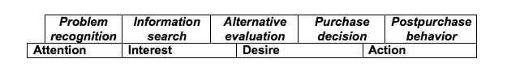

# 使用决策理论推动潜在客户购买

> 原文：<https://www.sitepoint.com/move-prospects-to-purchase-using-decision-theory/>

向人们推销你的服务似乎是一件碰运气的事情，但是如果你了解购买决策过程，你就会更好地掌握影响你销售能力的因素。

更重要的是，如果你了解购买决策过程，你就能有针对性地进行沟通和销售，帮助潜在客户购买。首先，让我们看看决策过程。

购买决策过程

这个简单的过程不言自明:

1.  问题识别
2.  信息搜索
3.  替代评估
4.  购买决策
5.  购买后行为

它与动机的各个阶段(注意力、兴趣、欲望、行动)密切相关，正如你在这里看到的:

 **购买决策在行动**

为了清楚起见，这里有一个简单的例子来说明这个过程是如何工作的。我的 RSS 阅读器刚刚被它的开发者废弃了，所以我需要找到一种新的方法来管理我的 RSS 提要(问题识别)。我做了一些研究(信息搜索),发现了一些替代方案——桌面应用、在线应用、免费服务、广告支持的服务。我知道我不想要另一个桌面应用程序。我还想选择一个不会很快被开发人员废弃的选项(替代评估)。

我选了一个 app(购买决策)，注册了，开始了。我在设置和适应新服务(购买后行为)方面的体验很顺利，产生了满意度，这增加了我向他人推荐这项服务的机会。

**在你的销售工作中应用这一概念**

当然，在向客户销售服务时，你可以意识到决策理论。您可以使用它作为路线图，在正确的时间为每个客户提供正确的信息，更快速、更容易(或更频繁)地购买这些信息。

假设你是一名专门从事品牌开发的自由设计师。你的首要任务是引起人们的注意。也许你的潜在客户已经知道他们需要重新开发他们的品牌；或许不会。

***获得关注:认识问题** **建立兴趣***

对于门外汉来说，品牌发展是一个相当模糊的领域，所以在高速公路上购买广告牌空间可能不是在你的目标受众中创造问题识别的最佳方式。

也许为特定行业的杂志撰写关于品牌的文章，接受商业意见领袖的采访，并在采访者网站上的博客帖子或播客中展示这些采访会有所帮助。也许你会考虑一个直接的方法，联系那些你认为可以改进品牌的公司。策略可能会有所不同，但这里的要点是，如果你的目标客户不知道他们有问题，你需要告诉他们。

***利用兴趣直接进行信息搜索和评价***

一旦你引起了目标的注意和兴趣，他们就会进入信息搜索阶段。在这一点上，你会想进一步培养他们对你的品牌开发服务的兴趣，因此，与其只是给他们发一个你的 folio 的链接，并希望他们喜欢，你可以尝试一些其他产生兴趣的策略来激发你的潜在客户，并在他们身上萌发欲望的种子。

你可以考虑亲自向他们展示(在他们的会议室？午餐时？这取决于您)来说明您可以交付什么，并确定他们将从中受益的方式。也许你会邀请他们在 twitter 上关注你，或者订阅你的博客，这样他们就可以定期收到关于品牌发展的高质量信息(从你的角度来看，还可以不断收到你的知识和专业技能的例子，有时是个人指导的例子)。

这些策略应该设计成在你的目标客户中建立欲望，同时也给他们在评估阶段有利地评估你的产品所需要的信息。为此，当你开始了解你的目标时，试着找出他们的动机:他们是一个寻找便宜货的精明商人吗？质量是他们的重中之重吗？他们是否完全专注于客户，而损害了其他业务领域？

这些知识将让你以更成功的方式与个人进行沟通。例如，如果你的潜在客户是以客户为中心的首席执行官，他的网站仍然显示“正在建设”的页面，你需要向这个人说明强大的品牌将如何帮助这些客户记住企业，传达企业的专业精神，暗示公司的优秀服务和客户满意度，并鼓励产生新客户的个人推荐。

因此，你可以给首席执行官发一篇文章的链接，解释品牌如何沟通，或者亲自做一个关于这个主题的演示。也许你会给他们看一项关于品牌认知度和客户满意度的研究。这种策略可能与以利润为中心的首席执行官不太相关，他最终希望在他购买的任何东西上获得便宜，包括品牌。有了这些知识，当目标处于信息搜索和评估阶段时，你就可以有针对性地进行沟通以建立欲望。

***从评估到行动:购买决策***

做好你的功课，你也可能能够在决策阶段预测潜在客户的信息需求，这将使你在竞争中获得巨大优势。潜在客户对你的技能的认知，以及你与他们的理想和目标一致的感觉，可能会让你建立更融洽、更牢固、更亲密的关系，这可能会让你成为考虑的主要候选人。这也可能意味着你可以在最合适的时间提供信息或保证，这是真正推动客户购买的“决定性因素”。

***响应行动，创造积极的购后体验***

你对客户的了解当然会帮助你生产他们想要的产品或结果，但也会在购买后阶段帮助你。在这一点上，你要确保客户对你的工作感到满意，并且在理想情况下，成为你的服务的倡导者。

所以，也许你会做一些调查，准备一份报告给你的以客户为中心的客户，报告他们的客户的满意度(希望有所提高)。也许你会为以利润为中心的客户做一个成本效益比较，以展示你的品牌重塑实际带来的价值。

如果你在项目开发阶段就计划这些活动，你可能会得到客户的认可，他们会很高兴你像他们一样热情，确保品牌重塑带来对他们来说很重要的好处。

这些只是几个例子，说明你如何运用你对购买决策过程的了解，来完善你的沟通和销售工作，以促使单个客户购买。你如何在销售和沟通过程中运用决策理论？

## 分享这篇文章