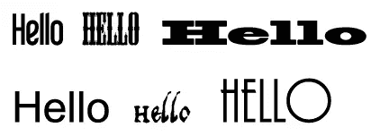
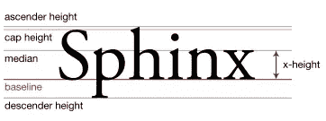
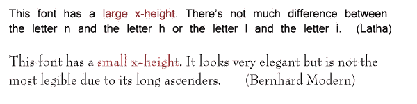

# 排版:可读性和易读性(第二部分)

> 原文：<https://www.sitepoint.com/typography-readability-legibility-part-2/>

上周我们看了影响文本可读性的主要因素。本周我们来看看易读性。快速回顾一下两者之间的区别:

*   可读性是指大量文本——比如一篇文章、一本书、一个网页——是否易于阅读。
*   易读性是指一小段文字(如标志或标题)是否能被立即识别。

除非文本非常清晰，否则阅读它需要更长的时间。对于文本来说，最重要的是让读者快速浏览或浏览信息。我们都知道大多数人浏览网页，浏览标志和标题，浏览目录。因此，如果你在设计类似的东西，你需要确保文字清晰易读，否则信息会被遗漏或完全忽略。如果你从着火的大楼里跑出来，或者试图用路标找到路，那么它们能被立即认出来是至关重要的。下面左边的标志不理想。  **单词识别**影响易读性的一个主要因素是单词或单词本身。有些词适合几乎任何字体，人们会理解，而不常用或不常用的词需要清晰易读。  **避免 x 高度过小或过大**字体的 x 高度过大会降低可读性。x 高度定义为字体基线和中线之间的距离。这一般被认为是任何字体中字母 *x* 的高度(也包括字母 *u* 、 *v* 、 *w* 、 *z* )。)  *图片来源:维基百科*例如，在一些字体中，如果 x 高度太大，那么字母 I 几乎无法与字母 l 区分开来，非常小的 x 高度也会降低易读性。当字母的主体相对于上升部分和大写字母的高度来说太小时，我们的眼睛会感到分心。  **小写字母**正如在关于可读性的帖子中提到的，**全部大写的文本是最不易读的，因为我们的眼睛通过它们的形状以及它们包含的字母来识别单词。全部大写意味着每个单词都是相同的形状**。你可能会发现，你读最后两句话的速度比这篇文章的其余部分稍微慢了一点。所有的大写字母都适用于非常短的句子或标题。当你在句子中使用标题格时，会出现另一个问题。标题大小写混合在一起，只适合标题，因为它太难读了。**避免使用过重或浓缩的字体**在下面的段落中，左边的段落易于阅读，用 Myriad Pro Regular 字体设置。右边的段落也是 Myriad Pro，但风格是浓缩的粗体，要看完整个段落要困难得多。总而言之，文本需要在快速浏览的地方最清晰。让字体更易读的一些准则:

*   使用平均 x 高度的字体
*   在适当的地方使用大写的小写字母
*   避免浓缩或倾斜字体
*   在非常小的字体中增加额外的字母间距，在较大的字体中减少字母间距

这些当然只是指导方针。即使你打破了这些规则，选择了不寻常的字体，这种字体仍然是可读的，只是可能需要更长的时间来阅读。这真的取决于你正在做的项目，但是如果你意识到一些问题，它可以帮助你选择你的字体。你还有什么要补充的吗？

## 分享这篇文章