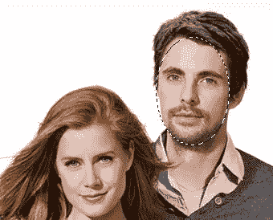
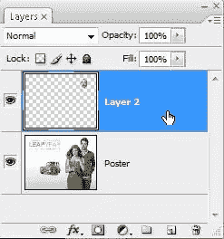
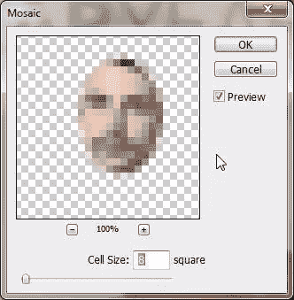
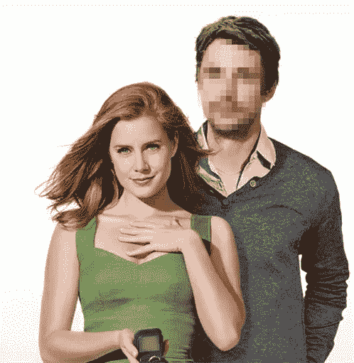
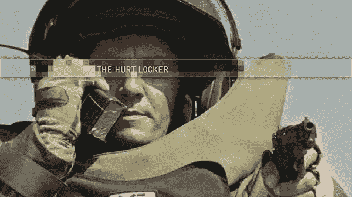

# 在 Photoshop 中用马赛克审查你的图像

> 原文：<https://www.sitepoint.com/censor-your-images-with-a-mosaic-in-photoshop/>

你经常在报纸、杂志和电视上看到被审查的图像。像素化最常用于模糊人的特征以保护他们的隐私。无论是为了保护名人的孩子，汽车牌照还是一个人的隐私部位，都有一个 Photoshop 滤镜来帮助审查这些图像。这里有一个非常快速的方法，使用 Photoshop 中的像素化滤镜来给你的图像添加删改后的效果。

1.打开您想要审查的图像。我用的是从 MovieWallpaper.net 下载的闰年电影海报的壁纸。我对这部电影一无所知，我只是在寻找一张有几张脸的照片。

2.使用椭圆选框工具(M)在男人的脸上画一个圆形选区。

3.按 Ctrl + J (win)或 Cmd + J (Mac)复制选区并将其复制到新图层上。

4.选中新图层，选择**滤镜>像素化>马赛克。**这将打开镶嵌对话框。确保选中“预览”复选框，这样您就可以看到图像会受到怎样的影响。

为像元大小选择一个较低的数值会产生一个较小但明显的像素化级别。将滑块拖动到更大的单元格尺寸会产生大量的“像素”。对于这张图片，我选择的单元格大小为 8。最终的图像是这样的。那个人到底是谁？

像素化滤镜玩起来很有趣。这里有另一个例子，这一次使用的是电影《拆弹部队》(2009 年对我来说最好的电影)中的一部电影。使用与上面相同的方法，我选择了一个横跨主要人物的脸，并复制它在一个新的层，并应用了大约 20 个单元大小的马赛克。然后，我添加了阴影和内部发光，使马赛克带更加突出，最后添加了一些文字。

现在你知道了。你用过像素化滤镜吗？

如果你喜欢读这篇文章，你会爱上[可学的](https://learnable.com/)；向大师们学习新技能和技术的地方。会员可以即时访问 SitePoint 的所有电子书和互动在线课程，如[Photoshop](https://learnable.com/courses/foundations-of-photoshop-2712)基础。

对本文的评论已经关闭。对 Photoshop 有疑问？为什么不在我们的[论坛](https://www.sitepoint.com/forums/forumdisplay.php?8-Graphics?utm_source=sitepoint&utm_medium=link&utm_campaign=forumlink)上问呢？

## 分享这篇文章