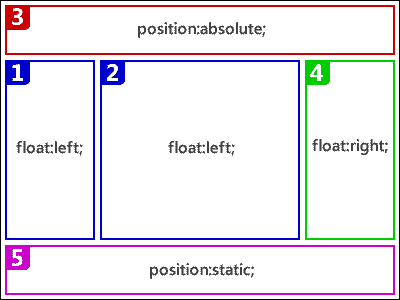

# 如何修复 IE 中随机消失的绝对定位元素

> 原文：<https://www.sitepoint.com/fix-disappearing-absolute-position-element-ie/>

8 年后，你可能会认为 IE6 的所有错误都会被很好地记录和理解。实际上，在那之后，你会希望大部分问题都在 IE7 或 IE8 中得到解决！

最近一个沮丧的开发者联系了我，他经历了 IE 中绝对定位元素的消失。这个 bug 很奇怪，你不会经常遇到，而且网上关于它的信息也很少。希望这篇文章能够纠正这种情况。

## 问题是

考虑这种布局:

HTML 元素按照指定的顺序编码，即内容块 1 和 2、标题 3、右侧块 4 和页脚 5。外部容器被设置为 position: relative，所有的项目都有指定的宽度，即 hasLayout。这可能不是最有效的布局，但它是有效的，可以在所有浏览器中工作。除了 IE6，IE7，可能还有 IE8 … *有时候*。

第一次访问页面，IE 可以拒绝显示页眉。但是，当访问同一网站上类似编码的页面时，标题可能会重新出现。它还可以在你返回第一页时重新出现？

这个问题是由一个 IE 错误引起的，该错误隐藏了一个绝对定位的元素，当它紧接在一个浮动元素之前或之后编码时(它紧挨着一个浮动的兄弟)。不幸的是，这种情况不一定会触发 bug——它依赖于时间！文件下载的时间和渲染速度会影响它是否发生。根据我的经验，如果缓存了一些文件，这个错误似乎不太可能发生。

所以，这里有一个 [**页面**](https://blogs.sitepointstatic.com/examples/tech/missing-ap/index.html) 的例子。

不幸的是，这个 bug 是如此的不一致，以至于不可能创建一个保证工作(或者失败)的 bug。)

在我本地电脑的服务器上，标题在 IE6、7 和 8 中消失了。在 SitePoint 服务器上，它只在 IE6 和 ie7 中消失。你可能会有不一样的体验。

另外，*假*ie 如 [IETester](http://www.my-debugbar.com/wiki/IETester/HomePage) 不一定表现出同样的问题。我建议使用一个真正的*版本的 IE，比如一个 VM 中的版本(参见[在同一台机器上使用 Windows 7 XP 模式运行 IE6、IE7 和 IE8](https://www.sitepoint.com/article/ie6-ie7-ie8-win7-xp-mode)或者[如何在 Windows 7 HOME 上运行 IE6、IE7 和 IE8](https://www.sitepoint.com/ie6-ie7-ie8-windows-7-home/))。*

## 解决方案

幸运的是，有一个快速而简单的解决方案:简单地在绝对定位的元素之前和/或之后放置一个空的未定位的静态

。在[固定示例](https://blogs.sitepointstatic.com/examples/tech/missing-ap/fixed.html)中，标头后的空< div > < /div >防止了问题的发生。

语义 HTML 的爱好者可能会感到震惊，但是恐怕没有一个只针对 CSS 的解决方案……除非有人知道其他方法。

一个更好的解决方案是没有绝对定位标题的更有效的布局。不幸的是，如果你没有尽早和经常测试 IE，这可能需要大量的代码重构。

你以前遇到过这种奇怪的 bug 吗？还是已经完全放弃 IE 了？

## 分享这篇文章