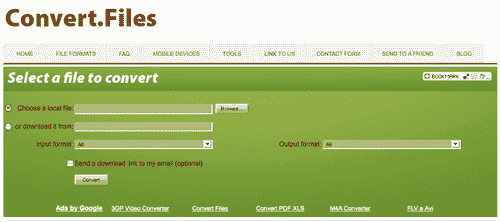
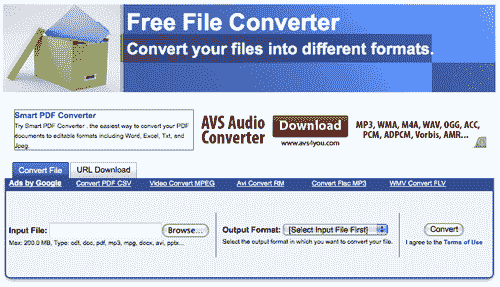
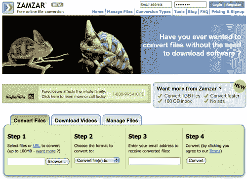
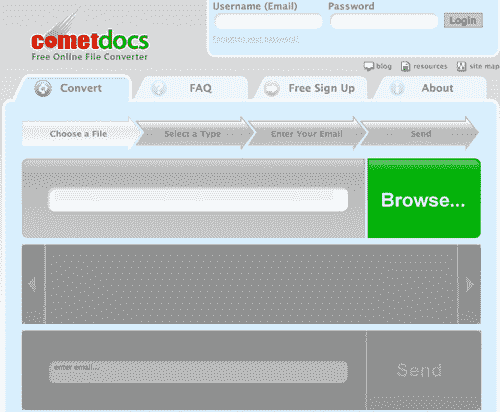
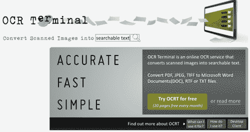
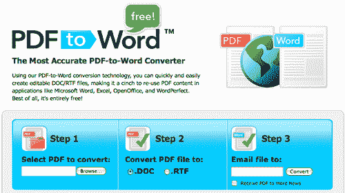
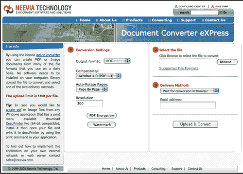
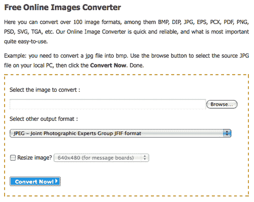
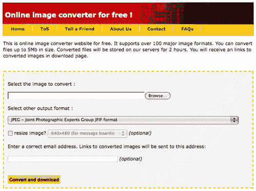
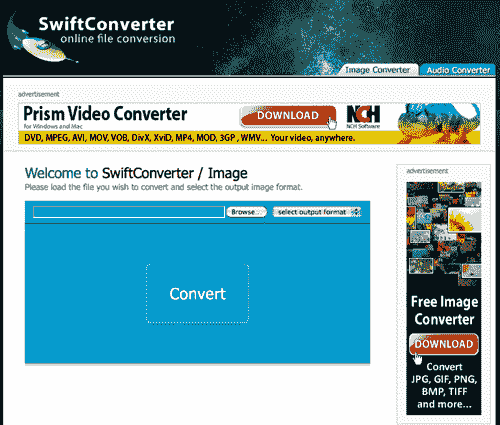

# 免费在线文件转换服务

> 原文：<https://www.sitepoint.com/free-online-file-conversion-services/>

即使你的电脑里有最新最好的软件，你也有可能在某个时候需要转换一个文件，却没有你需要的东西。在线转换工具很棒——免费的甚至更好——所以，这里有一个集合供你随时使用，满足你所有的文件转换需求。

## 多用途转换

**[转换文件](http://www.convertfiles.com/) :** 一项免费转换高达 150MB 的文档、档案、电子表格、音频和视频文件的服务，包括将文件发送到移动设备的能力。

**[免费文件转换器](http://www.freefileconvert.com) :** 免费转换文档、图像、音频、视频和档案文件，每个文件最大 200MB。

**[Zamzar](http://zamzar.com/) :** 一项免费服务，可转换文档、图像、音频、视频、压缩和 CAD 格式。这项免费服务允许多达 100MB 的文件和多达五个并发转换。

## 文档转换

**[Cometdocs](http://www.cometdocs.com/) :** 免费的在线文档转换服务，提供实时 OCR 转换和 50 多种不同的转换选项。

**OCR 终端:**将扫描图像转换成 DOC、RTF 或 TXT 文件的在线服务。这项免费服务允许每月转换 20 页。

**[PDF 转 Word 转换器](http://www.pdftoword.com/) :** 将 PDF 转换成可编辑 DOC 或 RTF 文件的免费服务。

***奖金文档转换资源:*** 还有很多 PDF 创建工具可以将文档转换成 PDF。这里有几个要保留在你的列表上: [ExpressPDF](http://www.expresspdf.com/) 、 [PDF Converter](http://www.freepdfconvert.com/) 、 [PDF Online](http://www.pdfonline.com/convert-pdf/) 和 [PrimoOnline](http://www.primopdf.com/online.aspx) 。

## 图像转换

**[Document Converter eXPress](http://convert.neevia.com/):**一项免费服务，允许您从各种文件类型中创建图像文件和 pdf。最大上传大小为 100MB。

**[免费在线图像转换器](http://www.pictureresize.org/online-images-converter.html) :** 转换超过 100 种图像格式，并允许你调整图形大小。

**[Go2Convert](http://www.go2convert.com/) :** 一款免费的在线图像转换器，支持 100 多种主要图像格式，可以转换最大 5MB 的文件。该服务将转换后的文件存储在服务器上长达两个小时。

**[SwiftConverter](http://www.swiftconverter.com/images) :** 免费将各种各样的图像文件从一种格式转换成另一种格式。

你最喜欢的在线文件转换工具是什么？

## 分享这篇文章