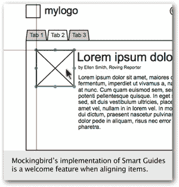

# 用知更鸟模仿

> 原文：<https://www.sitepoint.com/mocking-up-with-mockingbird/>

模仿鸟是一个为你的网站或网络应用程序创建线框的工具，就像 T2 Axure 或 T4 Balsamiq 一样。然而，在我看来，有几个特性让 Mockingbird 真正成为创建线框的优秀工具:

*   它是免费的(至少目前是免费的):虽然一旦知更鸟退出测试版，这种情况可能会改变，但目前使用这款应用程序是免费的。总是一个很好的卖点！

*   在线和跨浏览器: Mockingbird 由 [Cappuccino web 框架](http://cappuccino.org/)支持，这意味着它可以在 Mac、Windows 或 Linux 上的任何现代浏览器中正常工作。不需要安装软件或配置。

*   在我看来，这是让《知更鸟》与众不同的真正杀手级功能。交给客户一个包含连续页面的 PDF，或者在 Fireworks 中一次加载一个相关文件，这都很好。但是，让他们点击和探索，就像他们在导航一个真正的应用程序，是非常有用的。

*   低摩擦注册:如果你使用知更鸟，在你开始使用它之前，你不需要注册 T2 的任何东西。当然，一旦你想保存一个线框供将来参考，那么你需要提供一个电子邮件地址——但仅此而已。管理交互保持在最低限度，允许应用程序本身发光。

*   **分享:**一旦你准备好与他人分享你的线框图，你就可以生成一个 URL 发送给你的同事、你的客户或者可用性测试的参与者。

*   **撤消。**这是我们在桌面应用程序中期待的一个功能，但除了浏览器内置的基本文本撤销之外，我经常认为点击 Ctrl-Z (Windows)或 Cmd-Z (Mac)是 web 应用程序中不会有*的功能之一。Mockingbird 就不是这样了——它似乎有无限多种撤销状态，所以如果需要的话，您可以回滚您的操作。很好。*

*   智能指南:这看起来像是无法用 JavaScript 实现的功能，但值得称赞的是——《知更鸟》的创作者们做到了。当你在 Mockingbird 中对齐对象时，你会看到有用的水平和垂直参考线，以指示一个对象何时与页面上的另一个对象对齐。

当然，没有一个工具是完美的——有几个方面需要改进。让我们来看看其中的一些。

## 如果可以的话…

虽然 Mockingbird 确实是一款令人印象深刻的网络应用，但我希望开发者在发布 1.0 版本之前能够解决以下一些缺点。

*   一旦你玩过《知更鸟》，你会发现它的目标非常远大。有相当多的处理正在进行，以确保您的下一件大事的原型体验尽可能像使用桌面应用程序一样。

    因此，并不是每台机器都能轻松运行《模仿鸟》。如果你运行的是一台旧机器，你的浏览器很可能会定期向你抛出错误信息:“这个页面上的脚本需要很长时间来执行。你是要等，还是要我终止剧本？”这个性能问题可能源于 Cappuccino 框架本身。

*   与许多图形应用程序一样，Mockingbird 将你的小部件放在屏幕上的一个层次中，最近的项目被放在最上面。然而，对这些层的管理几乎是不存在的——有**前**和**后**按钮，但没有办法知道哪些对象在哪些之上。同样，如果你想把一个物体从底部移到顶部，你必须反复点击前面的按钮，直到你的物体升到顶部。添加**前置**或**后置**按钮会在一定程度上解决这个问题。

*   屏幕外错误:在视口中调整或拖动项目在 Mockingbird 中非常好用。但是如果你的线框的尺寸大于视口，那么事情就不那么顺利了——在没有实际看到它的情况下，试图猜测在哪里完成将对象拖离屏幕可能会有点令人沮丧。也就是说，目前的实现并没有停止，我相信团队正在努力解决这个问题。

    注意:虽然并不完美，但是开发团队已经更新了 Mockingbird 的用户界面，使得在屏幕外拖动项目或调整项目大小的功能得到了极大的改进。太棒了。

*   <ins datetime="2010-01-21T11:58:24+00:00">Mockingbird now offers the ability to export to either PDF or PNG format.</ins>

    ~~**缺少导出:**目前你从 Mockingbird 中获取线框的唯一方法是做一个屏幕截图。我敢打赌，一旦推出，这将是付费订阅服务的关键特征之一。~~

*   测试时它可能会碍事:我们对用 Mockingbird 创建的线框进行了一些可用性测试，在很大程度上它适合这个目的。然而，我们的几个主题混淆了页面顶部的 Mockingbird 横幅(推广该工具并提供一些简单的线框之间的导航)和线框本身。此外，页面可点击部分的链接区域非常小，这让一些用户感到困惑。

总而言之，Mockingbird 是一个优秀的工具，它提高了 web 应用程序的可能性。事实上，它是免费的，这意味着你现在没有借口不包括在你的网页设计过程中的线框！

*这篇博文转载自第 67 期《设计视图》时事通讯。如果您喜欢，请订阅，通过电子邮件接收最新的网页设计智慧。*

## 分享这篇文章