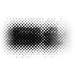
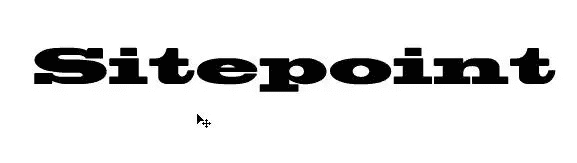
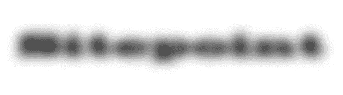
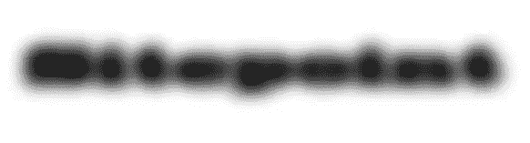
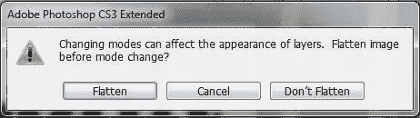
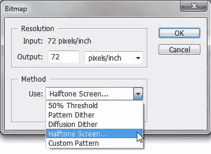
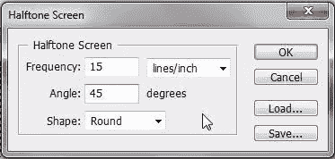
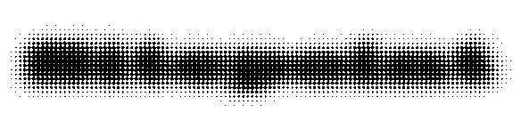
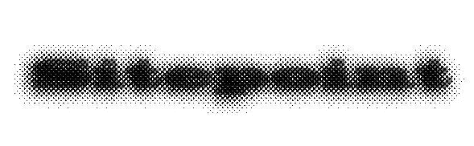
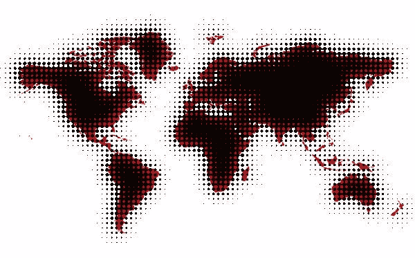

# 如何在 Photoshop 中用文本和图像创建酷的半色调效果

> 原文：<https://www.sitepoint.com/how-to-create-a-cool-halftone-effect-with-text-images-in-photoshop/>

 半色调效果可以给网页图形带来很好的触觉效果，给人以印刷作品的印象。我将向您展示如何在 Photoshop 中使用位图图像模式创建这种效果。

1.创建一个新的 Photoshop 文档，白色背景，宽 600 x 200 像素。选择文字工具(T)并在文档中添加一些文本。我用了一种叫做 Blackoak Std 的字体，但是任何大而粗的字体在创造这种效果的时候都非常好。

2.我们需要模糊，使它看起来更像一个斑点，而不是可读的文本。选择「滤镜>模糊>高斯模糊」。将半径设置为大约 10 像素，或者直到文本看起来像这样:

我希望效果更暗一点，所以，通过按 Ctrl + J (win)或 Cmd + J (mac)复制图层。它看起来应该有点像这样。

3.我们要从 RGB 模式转换到位图模式，但是我们不能一步到位。我们需要首先改变到灰度模式。为此，请选择“图像”>“模式”>“灰度”。您将看到以下消息。

单击展平。您可能会得到另一条关于丢弃颜色信息的消息，请单击“丢弃”。

4.现在选择图像>模式>位图。在位图对话框中，网页图形的输出为 72，从使用下拉框中选择半色调网屏。

单击确定。

5.在下一个打开的对话框中，您可以设置半色调点的外观。这里有一点反复试验，所以你可能喜欢摆弄这些数字。频率越高，出现的点就越多。我把这个数字保持在相当低的 15。您还可以选择半色调网屏的角度和点的形状。

当您单击“确定”时，以前的模糊斑点会变成半色调斑点，如下所示。

6.这就是产生的效果。尽管它本身看起来相当酷，但我还是想在其中加入一些可读的文本。为了添加更多的文本，我们将回到 RGB 模式。首先选择“图像”>“模式”>“灰度”，然后选择“图像”>“模式”>“RGB”。

7.现在我们回到 RGB 模式，再次选择文字工具，使用和之前一样的设置，输入同样的黑色文字。将文本的不透明度降低到 50-60%，瞧！

**处理图像**

如果你想用图像创造这种效果，这个过程是完全一样的。这里有一张世界地图，我用和上面一样的步骤创建的。

我在这里采取的唯一不同的步骤是在最后阶段。当我把复制的世界地图放在我的模糊半色调图像上时，我将混合模式设置为**乘**，这样就可以在一些点上看到地图原来的红色。

这就是如何创建半色调图像。我喜欢这种效果给设计带来的肮脏、复古的外观。你怎么想呢?这是你用过的或者有兴趣使用的效果吗？

## 分享这篇文章