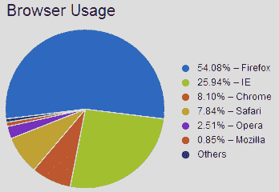
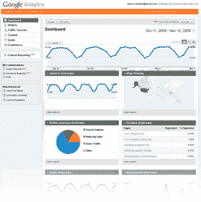

# 没有闪光的闪光图形

> 原文：<https://www.sitepoint.com/graphael-javascript-graphs/>

最近，Alex 在*设计视图*时事通讯中向我们详细介绍了 graph al JavaScript 图形库。我们认为那些没有订阅时事通讯的人可能会喜欢这篇文章，所以我们把它发表在这里。如果你碰巧从中得到乐趣，为什么不去 sitepoint.com 的[时事通讯区，为自己订阅一份每月免费的 designery good。事不宜迟，下面是 Alex 的文章。](https://www.sitepoint.com/newsletter/)

## 为什么是图？

快速浏览下面的浏览器使用统计数据。你花了多长时间来为数据所表达的内容建立一个心理模型？

**表 1。浏览器使用统计**

<colgroup><col> <col></colgroup>
| 浏览器 | 游客 |
| :-: | :-: |
| 火狐浏览器 | One million one hundred and forty-nine thousand four hundred and twenty-two |
| 工业管理学(Industrial Engineering) | Five hundred and fifty-one thousand three hundred and fifteen |
| 铬 | One hundred and seventy-two thousand and ninety-five |
| 旅行队 | One hundred and sixty-six thousand five hundred and sixty-five |
| 歌剧 | Fifty-three thousand three hundred and twenty-nine |
| 浏览器名 | Eighteen thousand and sixty |

五秒钟？十个？也许你失去了兴趣，恍恍惚惚。

现在将它与[图 1“浏览器使用饼状图”](#fig_browser_usage "Figure 1. Browser usage pie chart")中相同信息的饼状图进行比较

**图一。浏览器使用饼状图**

虽然理解这个表格并不是不可能的，但是我们大多数人可以通过粗略地看一下饼状图来获得更好的理解。

## 玩耍的状态

好吧，我们都同意图表很棒，但是我们如何在网络上使用它们呢？让我们来分解一下你目前的选择。

### 图片

最明显的方法是我在上面的例子中使用的方法:在第三方应用程序(例如，Photoshop、Illustrator、Fireworks 或其他)中创建图形，然后导出一个图像文件嵌入到您的页面中。

虽然这很简单，但缺点是相当明显的。

首先，任何新的或更改的数据都需要编辑和重新上传您的图像。然而，如果你精通技术，服务器端代码库，比如 PHP 的 GDLibrary 允许你创建动态 JPEGs。

其次，您的数据被“烘焙”到图像文件中，这意味着没有简单的方法将您的信息转换回数字。图像也永久锁定在一个尺寸和分辨率。算不上灾难性，但也不够理想。

### Adobe Flash

交互式图形和图表是 Flash 最成功的故事之一，尤其是它们与标准 HTML 网页内容无缝融合的能力。

**图二。谷歌分析充分利用了 Flash**

[Google Analytics](http://www.google.com/analytics/) 可以说是当前世界动态 Flash 信息图的典型代表。现在有几十个库( [Inchoo](http://inchoo.net/tools/free-flash-graphs-tool/) 、 [FusionCharts](http://www.fusioncharts.com/) 和 [Flash 图形应用](http://komirad.com/doc/7/grapher)，对于初学者来说)让用 Flash 呈现你的数据变得相对容易。

尽管我认为数据可视化是 Flash 最棒的应用之一，但它仍然继承了一些与 Flash 相关的包袱。对我来说，最大的问题是糟糕的移动浏览器支持，特别是 Safari。然而，苹果对 Flash 的立场似乎不太可能在近期做出改变。

### SVG/画布

可以说，2009 年最令人兴奋的新网络技术是涌现出来的为数不多的新矢量图形系统。事实上，在 *设计视图* 中，我们已经介绍了 Cufon 文本替换系统和 RaphaelJS 绘图库。

这些技术都使用 JavaScript 来定位页面中的标准元素——分别是文本和图像——并用新的更强大的基于矢量的等效元素来替换它们。很酷的东西。

让我来介绍一下拉斐尔的弟弟。虽然“Raph”是一个全面的矢量绘图专家，但 gRaphaë坚持做他最擅长的事情:在不需要 Flash 的情况下绘制流畅、动画、基于网络的图形。

## 分享这篇文章