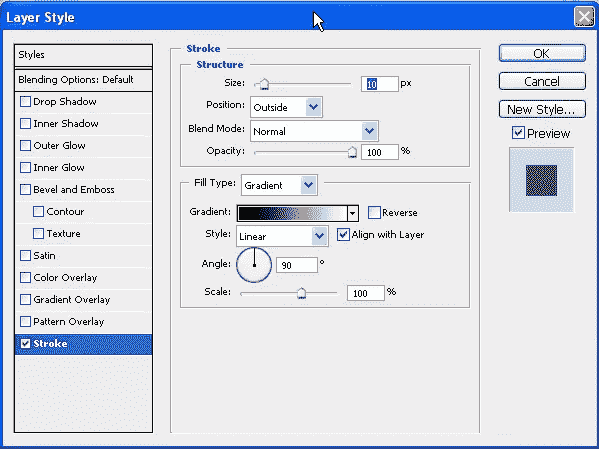
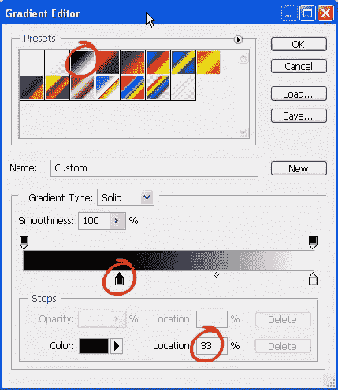
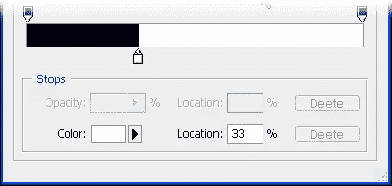
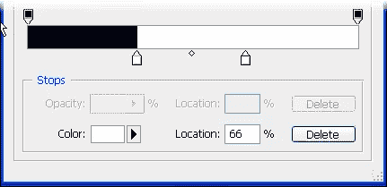
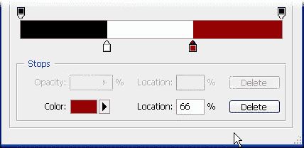
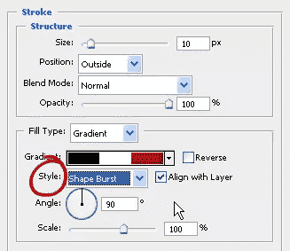
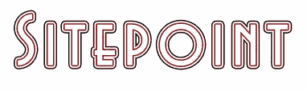
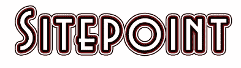

# Photoshop 中的三重描边文本

> 原文：<https://www.sitepoint.com/triple-stroked-text-in-photoshop/>

这里有一个相当简单的方法来创建三重笔画的文本效果。与 Adobe Illustrator 不同，在 Adobe Illustrator 中，您 ***实际上*** 可以应用多种笔触，而 Photoshop 只允许您在任何特定图层上添加一种笔触。在这种情况下，我们将使用渐变技巧来应用这种效果。这里的好处是，在应用效果后，文本仍然是完全可编辑的。

1.用白色背景创建一个新的 Photoshop 文档。

2.从工具栏中选择文字工具，并添加一些文本。这里用的字体叫布莱尔。

3.双击文字图层打开图层样式对话框。点击左下方的“中风”一词。设置大小为 10 px，设置填充类型为渐变。先不要单击确定。

4.点击渐变下拉框，选择黑色，白色渐变。

5.仍然在渐变编辑器中点击黑色停止，然后在位置字段中输入 33%。

6.单击白色色标，并在位置字段中输入 33%。

7.单击白色色标的右侧，添加一个新的色标。默认情况下，新的色标应为白色。如果不是白色，只需双击它，打开拾色器选择白色。

在位置框中输入 66%。

8.再次单击第二个白色色标的右侧。双击新的色标，设置颜色为深红色#990000。将位置设置为 66%。

好了，这就是创建的特殊渐变。您已经移除了从一种颜色到另一种颜色的平滑过渡，产生了三个实心色块，它们将构成笔画。

单击确定。

9.现在回到图层样式对话框，设置样式为形状爆发。您将能够在您的初始文本上看到所有这些更改。

当您对文本的外观感到满意时，请点按“好”。

正如我前面提到的，文本是完全可编辑的，所以你可以添加更多的类型，它将保持图层样式。此外，通过改变你的原始文本的颜色，你可以得到一些不错的效果。举个例子，我的原文是黑色的，如果我回去把它改成白色的，就变成这样了。

您也可以通过返回“描边”样式并更改描边的粗细来获得很酷的效果。

这里的笔画是 18 像素。

这里的笔画是 35 像素。

最后，你可以随时回到渐变编辑器，改变或**添加**颜色停止，如步骤 5-8。下面你可以看到四个不均匀笔画的文字。

## 分享这篇文章