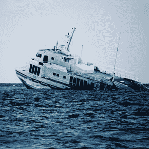

# 如何扭转一个失败的企业

> 原文：<https://www.sitepoint.com/how-to-turn-around-a-failing-business/>

你已经为新的一年做好了准备，你已经准备好了从[年终评估](https://www.sitepoint.com/business-year-end-review)中收集的数据，但是……嗯，这些数据并不乐观。事实上，这一年的结束远没有达到你的预期。现在你开始 2010 年感到焦虑，沮丧和有点动摇。哪里出了问题，你如何挽回你所剩的？

## 对自己诚实

我们都知道，并非所有的企业都会成功，但这并不能改变一个事实，那就是你永远都不希望自己的企业成为失败的企业之一。但是骄傲和自负不能成为发起救援行动的唯一理由。现在是时候进行一些艰难的自我反省了。

你需要问自己一些困难的问题，以确保你是出于正确的原因，并且你真的愿意做些什么来扭转业务。问自己这些问题，诚实回答:

*   你对你正在做的事情有激情吗？
*   你有资格做你所提供的吗？
*   你愿意为成功做出牺牲吗？
*   你正在走出你的舒适区吗？
*   你是否投入了必要的时间、精力和资金？
*   你想继续做企业主吗？

## 负责任

如果你以开放的心态仔细审视你的企业历史，你可能会发现导致衰退的错误。虽然现在肯定不是为错误和糟糕的决定自责的时候，但你需要承认你所扮演的角色。找出你本可以做得不同的地方，并从中吸取教训。

你甚至可能想与一个负责任的伙伴或导师合作，帮助你保持正确的方向，充分利用你的新视角。

## 尝试新的东西

许多企业失败是因为它们变得一成不变。让我们面对现实吧——当你无聊透顶时，很难全身心地投入某件事。

有时候，需要一些新的东西来给一个陈旧的行业注入新鲜空气。它可以是任何事情:发起一个新的营销活动，提供新的服务，写一本书，教一个班，加入一个新的组织，任何让你再次投入和兴奋的事情。

## 注意数字

为了扭转局面，你需要能够调整你的经营方式，为此，你需要对你的企业财务状况了如指掌。严格监控你的开支，这样你就知道每一美元都花在了哪里，如果有必要，立即做出改变。

同样重要的是，你要关注你的未结项目，准确及时地开出账单，并跟进应收账款。让你的企业重回正轨的关键一步是了解数字，并在需要改变时迅速采取行动。

## 改善你的态度

归根结底，企业的成功取决于数百万个因素，其中一些是你无法控制的。但是你确实可以控制你的态度，当事情没有按照你想要的方式发展时你如何反应，以及你如何克服挑战。积极的态度和开放的心态能带来积极的变化。一旦你重新致力于你的事业，你就迈出了转变态度的第一步。

不管你的生意是否继续，积极的态度会让你从整个旅程的学习经历中受益，而不仅仅是最终的结果。

你有转机的故事可以分享吗？

*图片来源:[notsogoodphotography](http://www.flickr.com/photos/notsogoodphotography/)*

## 分享这篇文章