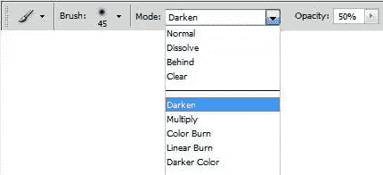
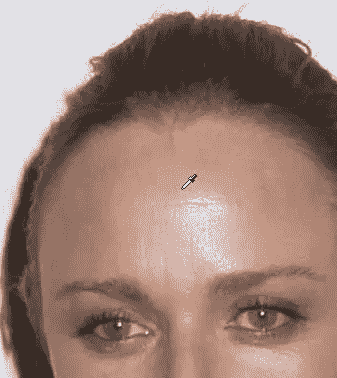
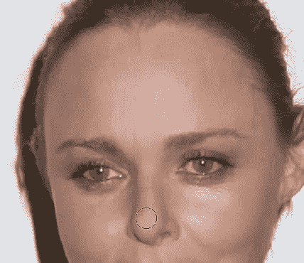
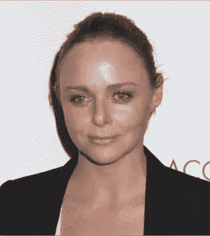

# 照片修饰:移除 Photoshop 中的热点

> 原文：<https://www.sitepoint.com/photo-retouching-removing-hot-spots-in-photoshop/>

热点是被摄对象脸上发亮的区域，是由闪光从发亮的表面反射或不均匀的光照造成的。这往往会让拍摄对象看起来好像在流汗，这不是一个好的外观。在 Photoshop 中几乎总是有不止一种方法来解决这样的问题，但在这里我将向你展示如何使用克隆工具和一些混合模式。

1.打开带有您想要修复的闪亮热点的照片。我用了一张斯特拉·麦卡特尼的照片，看起来像是在红毯上拍的，她的额头和鼻子看起来有点发亮。

2.从工具箱中选择克隆图章工具。在屏幕顶部的选项栏中，选择一个大的软边笔刷，并将模式设置为变暗，并将不透明度降低到 50%左右。

将模式设置为变暗的想法是，唯一会改变的像素是比我们的样本区域亮的像素。热点本质上是浅色像素。

3.在你的拍摄对象的脸上，选择一个“干净”或者非热点皮肤的区域。这将是参考点，Photoshop 现在将只更改比这更亮的像素。按住 Alt (Windows)或 Option (Mac)键并单击以设置参考点。光标将变成滴管。

4.开始用克隆图章工具在热点上绘画。热点会消退，但看起来仍然像自然皮肤。你会发现，为了正确匹配肤色，你需要重新采样几次。只要 Alt/Option 点击每一次你想重新取样，并开始再次绘画。

如果效果太过，你也可以将仿制图章工具的不透明度降低到 45-40%。对眼睛下面的皮肤要特别小心。你不会想把热点换成黑眼圈吧！围绕你的图像工作，直到你去除了所有的热点。下面你可以看到前面，左边，和后面。

 

因此，用克隆图章工具和正确的混合模式进行几秒钟的修饰，你就可以快速轻松地进行改头换面，去除汗流浃背、闪闪发光的外观。

## 分享这篇文章