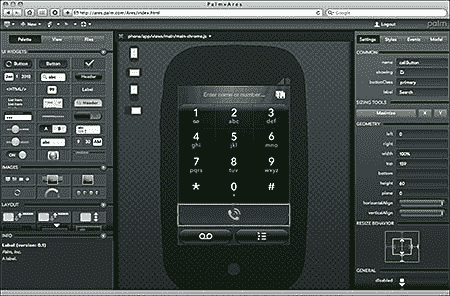

# Palm 的免费 Pre IDE

> 原文：<https://www.sitepoint.com/palm-pre-ares-online-ide/>

Palm Pre 可能被苹果的 iPhone 和谷歌的 Android 操作系统盖过了风头，但在过去的一年里，Palm 开发了一些有趣的项目。

Pre 和 Pixi 都使用 webOS，允许开发人员使用标准 HTML5、CSS 和 JavaScript 创建应用程序。Palm 也发布了他们的 Mojo SDK，可以在 Windows、Linux 和 Mac OS 上免费获得。SDK 包括一个基于 VirtualBox 的 Palm 模拟器和用于快速开发的 Eclipse 插件。

然而，也许最有趣的项目之一是[Ares](http://ares.palm.com/Ares/about.html)——一个完整的在线集成开发环境，其特点是:

*   拖放式界面生成器
*   一个代码编辑器(我怀疑是 Mozilla 的 Bespin 或非常相似的)
*   可视化调试器和日志查看器，以及
*   源代码管理集成。

IDE 可以在 Firefox、Chrome 或 Safari 上运行。

我的第一印象？太惊艳了。即使你无意编写 webOS 应用程序，我也建议你试试 Ares。你需要在[https://developer.palm.com/](https://developer.palm.com/)注册一个开发者账户，然后[登录 Ares](http://ares.palm.com/Ares/login.html) 。

[点击查看大图……](http://ares.palm.com/Ares/docsteimg/ares_full.png)

我曾经怀疑过基于云的开发，但是 Ares 展示了这种可能性。您仍然需要 VirtualBox 模拟器或 Palm Pre 来运行和测试您的 webOS 应用程序，但是系统的其余部分看起来和感觉起来都像一个坚固的 IDE。它吸引人、快速、可移植、可用，是 Eclipse 的轻量级替代品。

Palm 竭尽全力吸引开发者使用 Pre 和 webOS。像 Ares 这样的工具肯定会有助于他们的事业。苹果——我希望你注意到了！

链接:

*   [Palm webOS 开发者中心](http://developer.palm.com/)
*   [战神登陆](http://ares.palm.com/Ares/login.html)
*   [关于战神](http://ares.palm.com/Ares/about.html)
*   [战神用户指南](http://ares.palm.com/Ares/docstemp/userguide.html)

你试过阿瑞斯吗？它会吸引你尝试 webOS 开发吗？它是桌面 ide 的可行替代品吗？

## 分享这篇文章