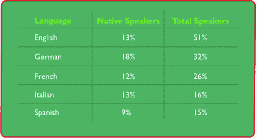
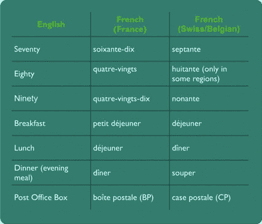
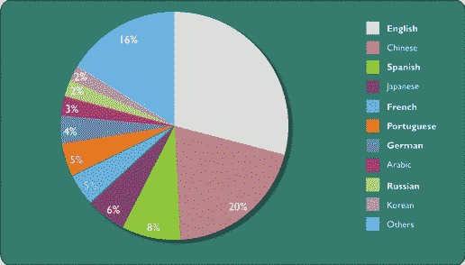
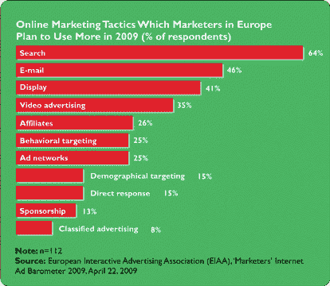

# 多语言营销搜索引擎优化

> 原文：<https://www.sitepoint.com/multilingual-marketing-seo/>

英语可能是万维网上所谓的*通用语，但想想这个:世界上四分之三的人口根本不会说英语。在网上，超过 4.6 亿互联网用户用英语交流。然而，全球有超过 15 亿互联网用户，这意味着超过 10 亿的网络用户声称英语以外的语言是他们的母语。那是很多人。网络是一个语言迷宫，企业用自己的语言与客户交流的需求怎么强调都不为过。*

 *在为国际市场本地化网站内容之前，必须考虑文化复杂性的不和谐因素。考虑到这一点，想要走向全球的企业需要考虑当地的情况。

## 世界语言

全球有 6000 多种语言。然而，其中许多只在局部地区的小范围内使用。事实上，世界上 96%的语言只被 4%的世界人口使用，而 90%的语言在互联网上没有任何真正的代表性。

因此，从网络营销者的角度来看，没有必要拥有一个接近 6000 种语言的网站。

然而，如果我们单看欧洲联盟(欧盟)，27 个成员国中有 23 种官方语言。英语是使用最广泛的语言，超过一半的欧盟人口在某种程度上说英语。从母语的角度来看，近五分之一的欧洲人声称德语是他们的母语。英语、意大利语和法语的母语人数大致相同，紧随其后的是西班牙语。

**图一。欧洲五大语言**

从全球来看，亚洲占全球互联网用户的 40%以上，而中国的互联网用户比美国多 30%。研究还显示，超过一半的消费者只从他们自己语言的网站上购物。

## 特色鲜明的方言

当在网上瞄准国际市场时，警惕语言之间的差异也很重要，也就是方言。比方说，法语和德语之间的差异是相当明显的，即使对那些不讲这两种语言的人来说也是如此。但是在法国说的法语和在加拿大说的法语，或者在瑞士和比利时说的法语之间的区别并不明显。然而，还是有一些关键的区别。

例如，加拿大法语(Québécois)倾向于将英语术语逐字翻译成法语，而不是直接将英语术语作为英语术语导入。例如，“周末”这个词就是 *fin de semaine* (字面意思是“一周的结束”)。但在标准法语中，这个词简单来说就是 *le 周末* 。

在讲法语的欧洲有许多例子可以证明方言之间的一些细微差别，其中一些在[图 2“法语方言之间的一些差异”](#fig-french-diffs "Figure 2. Some differences across French dialects")中有所概述。

**图二。法语方言之间的一些差异**

其他语言方言也是如此。以西班牙语为例。在西班牙，单词 *carro* 是你推或拉的运送物品的大车；在拉丁美洲，它是一辆可以到处开的车。或者，一辆汽车在西班牙被称为 *coche* ，而在拉丁美洲 *coche* 则是一辆婴儿车。

除英语之外，互联网上的主要欧洲语言是德语、法语、西班牙语和葡萄牙语，尽管后两种语言由于在美洲的大量使用而得到了极大的发展。

虽然从内容的角度来看，英语是网络的主导语言，但超过一半的谷歌搜索是其他语言的。随着俄罗斯和中国等新兴市场的互联网人口比西方市场增长更快，这一数字看起来还会增长。[图 3，“全球网民使用的前 10 种语言”](#fig_internet_langs "Figure 3. Top 10 languages spoken by global internet users")展示了全球网民使用的前 10 种语言的分布情况。

**图 3。全球互联网用户使用的十大语言**

## 搜索引擎优化、本地化和网络

在线营销是现代商业中最有效的工具之一。它将公司与客户联系起来，并有助于在全球买家和卖家之间建立互惠互利的业务关系。

搜索引擎优化(SEO)是许多企业在线营销策略的关键部分。欧洲互动广告协会(EIAA)的一项研究表明，欧洲三分之二的营销人员今年增加了他们的 SEO 资源。此外，94%的欧洲营销人员计划在 2010 年增加他们的网络广告总支出。

**图 4。网络营销方法(2009)**

然而，国内市场只是等式的一部分。启动完全本地化和优化的外语网站完全是另一个问题。不言而喻，当你为国际市场转换你的英文文本时，你应该总是使用专业的翻译，但是重要的是，你要避免从英语翻译你的关键词。原因如下:一个关键词的正确词典翻译可能与人们在网上搜索产品或服务时所用的大相径庭。他们可能会使用俗语、缩写或一个意思相似的不同的词。所以，就像你识别特定行业的关键词来优化你的英文网站一样，你必须研究人们在你的目标国外市场中搜索时使用的术语。

为了帮助演示这一点，请考虑以下情况。一家向英语国家市场销售汽车保险的公司投入了大量资源，以确保其在谷歌搜索“汽车保险”时排名靠前。然后它决定进军法国市场。

“汽车保险”在法语中的准确翻译是*l ' assurance automobile*。然而，[谷歌的法语关键词工具](https://adwords.google.fr/select/KeywordToolExternal)显示这个词很少被点击。相反，人们倾向于使用 *保证汽车* 或 *保证汽车* 。正如你所看到的，一个主要的搜索引擎优化嘲弄可以通过进行一些研究来避免。

在某些市场，可以在外语网站上使用英文关键词。例如，在德国，经常使用英语短语，尤其是基于网络的术语。因此，一家在英国或澳大利亚“网页设计”排名很高的网页设计公司可以将其直接整合到其德语网站中。

## 外语搜索引擎排名

值得注意的是，非英语网站上的关键词饱和度远不及英语网站。因此，你的企业很有可能在非英语搜索引擎上比你的母语搜索引擎更快地获得高排名。以我们之前的例子为例，一家汽车保险公司在 [google.fr、](http://www.google.fr/)上为 *assurance auto* 优化其法国网站所需的资源比在美国、英国或澳大利亚谷歌上为“汽车保险”优化所需的资源要少。

## 总结

多语言营销策略应该是任何国际举措的基石。各种规模的企业只需要一个网站、一台联网的计算机和一套企业家技能就可以走向全球。但要这样做， *认为* 当地至关重要。使用不恰当的风格、语法、语气和术语会阻碍新市场的发展，这就是为什么本地化是任何全球战略的关键基础。

搜索引擎优化是网站本地化的核心，任何未能正确本地化网站的组织都缺少技巧。

[*人物形象由*](http://www.flickr.com/photos/eiratansey/2369815976/) 塑造而成。

## 分享这篇文章*