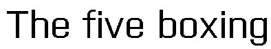
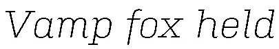
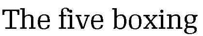
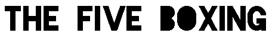
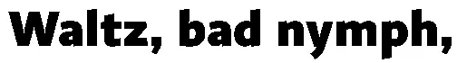
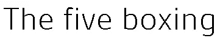
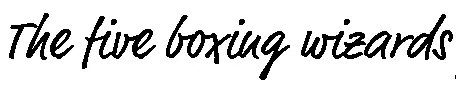

# 随着新的代工厂加入 Typekit，网页排版技术得到提高

> 原文：<https://www.sitepoint.com/web-typography-bar-raised-as-new-foundries-join-typekit/>

从 Typekit 传来了许多好消息，本周他们宣布几家新的字体代工厂已经签约，允许在网络上使用他们的字体。每一级服务都增加了新的字体。

[手提箱式铸造厂](http://typekit.com/foundries/suitcase-type-foundry)是一家捷克式铸造厂。Typekit 用户可以开始使用像[普瑞斯塔](http://typekit.com/fonts/606)、[文化旅游塔](http://typekit.com/fonts/602)和[共和国](http://typekit.com/fonts/607)这样的字体。

*普瑞斯塔培养基*

*崇拜光意大利语*

*共和国常规* 

[活字联盟](http://typekit.com/foundries/the-league-of-movable-type)是第一家免费开源的活字代工厂。[活字联盟的所有字体](http://typekit.com/foundries/the-league-of-movable-type)在试用库中都有，任何人都可以使用。

*联盟哥特*

*午夜停电* 

p type 是一家位于加州的独立数字类型实验室。他们的字体[比率](http://typekit.com/fonts/569)现在包含在 Typekit 库中。

*比重*

[Rui Abreu](http://typekit.com/foundries/rui-areba) 是一名葡萄牙字体和平面设计师。他正在将 [Gesta](http://typekit.com/fonts/583) 添加到 Typekit 库中。

*格式塔光*

上个月 [FontFont](http://fontfont.com) 也加入了 Typekit，推出了 20 多种新字体。FontFont 是一家大型铅字铸造厂，在该行业已有 20 多年的历史，所以很高兴看到像这样的大公司参与进来。

*FF 市场网*

很高兴看到现在可以在网站上使用的各种字体。看到网页排版在未来几年如何发展，以及我们将如何回顾过去，那时你被限制只能使用少数几种字体来设计网站，这将是很有趣的。

Typekit 有许多不同的价格方案:

*   免费(免费)并允许每月 5GB 的带宽和使用试用库。
*   个人每年 24.99 美元，允许使用个人图书馆
*   投资组合每年 49.99 美元，允许使用整个图书馆
*   性能每年 249.99 美元，允许使用整个图书馆。

从[类型套件](http://typekit.com)中了解更多信息。

你是 Typekit 用户吗？你觉得这项服务怎么样？

## 分享这篇文章