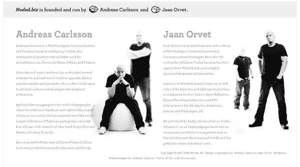
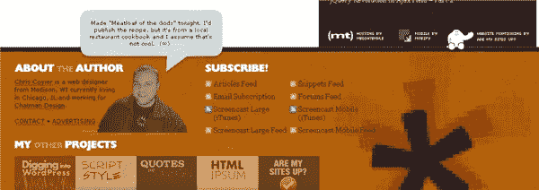
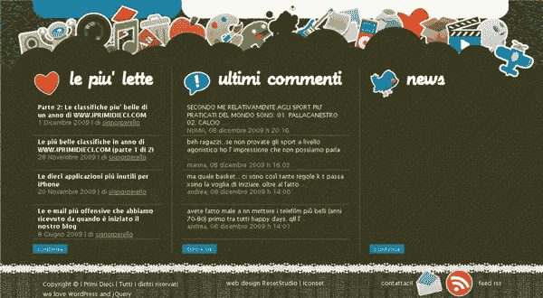
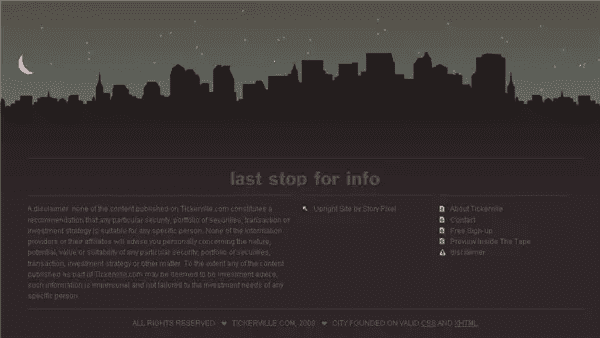
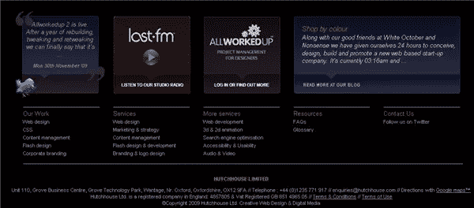
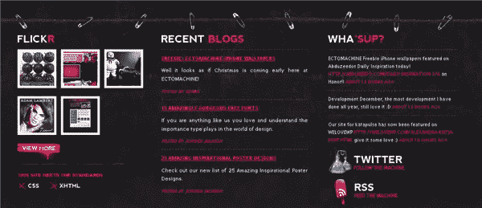
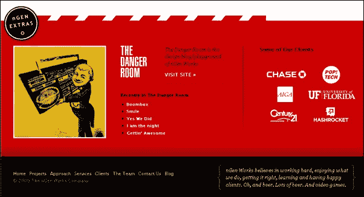
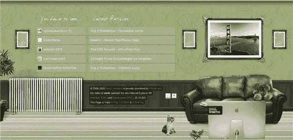

# 十个厚页脚:如何充分利用页面末尾的空间

> 原文：<https://www.sitepoint.com/ten-fat-footers-web-design/>

不久前，人们还担心网站上所有重要的东西都应该出现在“文件夹上方”从报纸和平面设计的世界中跨越过来，“折叠之上”的概念是，一篇重要的文章或照片应该总是出现在报纸头版的上半部分，或者在网站的情况下，出现在不用滚动就可以看到的页面部分。推而广之，这意味着你应该只把不太重要(或不太有趣)的东西放在页面底部，放在需要滚动的地方。这就是为什么在很多网站上你会看到像隐私政策、条款和条件以及免责声明这样的微小文本链接。

然而，许多专家现在认为“折叠之上”在网页设计中是不相关的，因为许多网络用户习惯了滚动，甚至没有想到它。把你的重要故事或文章放在页面顶部仍然是有意义的，但是由于用户经常向下滚动到底部，为什么不把一些酷的、有用的和有趣的东西也放在下面呢？

许多博客主题都提供了 widget 化的页脚部分，这使得人们在他们的网站页脚中放置的内容变得越来越多。一些最受欢迎的商品包括:

*   网站地图
*   推特推文
*   Flickr 缩略图
*   最近的新闻/博客文章
*   广告
*   RSS 源
*   联系方式
*   搜索
*   关于我
*   作者照片

似乎什么都有可能发生，所以也许是时候重新评估页面底部的空间了。因此，为了激发你的设计灵感，这里有十个网站很好地利用了它们的页脚，这些页脚具有引人注目的设计和有用的功能。

Noded 的页脚提供了大量关于创始人的信息以及一些不错的照片。

[CSS 技巧](http://css-tricks.com/)展示了作者克里斯·科伊尔和他的项目的一些情况，以及他的最新推文。

丰富多彩和纹理，ipremidieci 有一个巨大的胖脚。

Tickerville 让你知道你已经到了终点。

Hutchhouse 的页脚是干净的，充满了与网站相关的信息。他们还加入了链接到博客、twitter 和 last fm 的语音气泡。

Ectomachine 有点脏的外观一直延续到页脚，看起来像是用安全别针固定在一起的。

名人网站地图/名人列表

NGen Works 页脚大而醒目，链接到他们有趣的东西，同时展示他们的一些客户..

SquareFactor 网站建立在一个页面上，当你点击底部时，你可以看到完整的导航，他们的联系方式，更重要的是，还有一个画着怪物脸的联系方式。

有了美丽的背景插图和一个清晰，干净的页脚布局，新鲜的色彩很容易在眼睛上。

大卫·赫尔曼在他的网站底部有一个小客厅。

除了版权信息，你还会在网站上使用页脚区吗？你还喜欢过哪些有大页脚的网站？

## 分享这篇文章