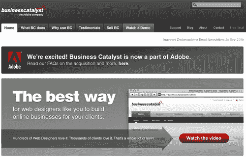
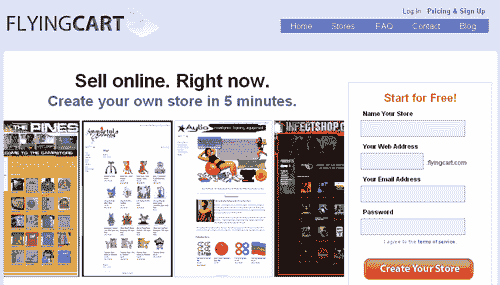
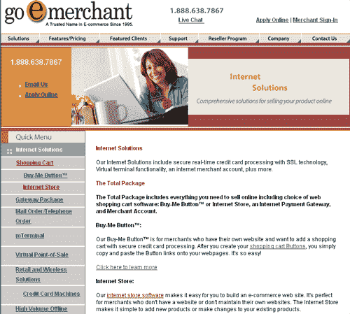
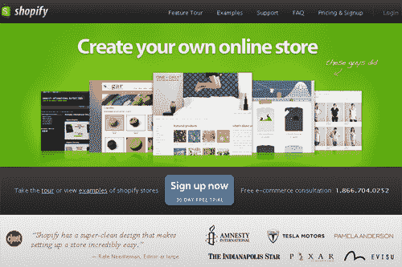
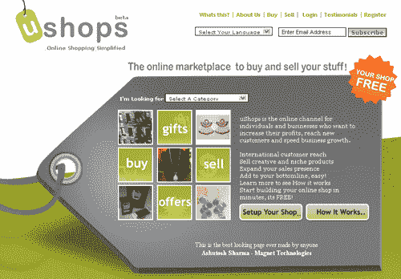
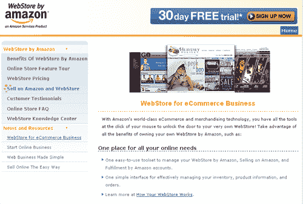
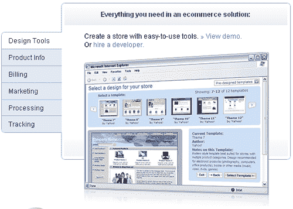
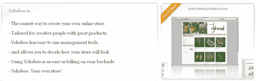

# 10 种托管购物车解决方案，让您立即开始销售

> 原文：<https://www.sitepoint.com/hosted-shopping-cart-solutions/>

电子商务似乎在不断发展壮大，几乎要求所有商家都有某种形式的在线存在。我们已经介绍了您自己主持的[购物车](https://www.sitepoint.com/shopping-cart-solutions/)，但有时走进某个准备就绪的地方也不错，如果您处理得当，只需要几分钟就可以设置好。

这就是托管购物车派上用场的地方，因为它们允许您消除维护服务器、处理软件问题等令人头疼的问题。这些解决方案可能会多花一点钱，但你几乎可以把它视为比雇佣 it 人员省钱。

我们已经收集了 10 个最佳解决方案，可以让你很快上手，看看哪一个最能满足你的需求。

**[Business Catalyst](http://businesscatalyst.com/)**:Adobe 的 Business Catalyst，原名 GoodBarry，旨在允许开发人员为客户完全定制在线商店，几乎不需要编码。这项服务是完全白色的标签，以便您可以插入您的公司标志，或您的客户，使他们只能看到您选择的信息。具有分析、Dreamweaver 扩展、易于管理等功能。

:飞行车允许你建立电子商务网站，大小从 50 个产品到 1000 个不等，取决于你的需求。只有月费，没有交易费，所以根据你卖的东西，这可能比其他一些解决方案更适合你。您可以使用自己的域名，接受所有主要的信用卡，通过 SSL 处理等等。

**[GoE merchant](http://www.goemerchant.com/)**:GoE merchant 为您提供建立完整电子商务商店的解决方案，如果您愿意，您可以简单地在您现有的网站上添加购买按钮。该公司还有一个可以在 iPhone 上使用的商户网关，这样你几乎可以在任何时间任何地点进行信用卡支付。

:ProStores 由易贝提供支持，是一个完整的电子商务解决方案，让你使用他们提供的模板建立一个在线商店，或者你可以聘请设计师给你的商店一个独特的设计。虽然这不是必需的，但如果你愿意，你也可以选择在易贝上列出你的物品。

**[Shopify](http://www.shopify.com/)** : Shopify 是一个基于模板的在线商店解决方案，它为您提供了一个针对任何类型商店的简单设置，然后为您提供了众多模板供您选择。幸运的是，你也可以自定义你认为合适的网站，因为大多数模板看起来像非常基本的 WordPress 模板，但是一旦自定义后，网站看起来很棒。

**[store front](http://www.storefront.net/)**:store front 专门为各种规模的公司量身定制解决方案。他们的系统集成了许多第三方软件包、多个商家网关、提供定制商店设计等等。

前六个月，你可以在 uShops 上免费出售任何你想要的东西，之后会收取象征性的费用。这给了你一个机会让你的网站加速，在你开始付费之前看看你的想法是否可行。

亚马逊网上商店 :世界领先的在线零售商已经提出了一个托管购物车解决方案，允许任何人在自己的品牌网站上使用亚马逊购物技术的力量。你还可以选择不仅在你自己的定制网店上销售商品，还可以像许多第三方卖家一样在亚马逊网站上销售商品。

**[雅虎！](http://smallbusiness.yahoo.com/ecommerce/)** 商户解决方案:雅虎！购物网站已经存在多年了，它有一个非常强大的购物车，允许交叉销售、打折销售、创建礼券、愿望清单等等。该网站提供了几个模板供您选择，或者您可以定制您的商店。但是请注意，雅虎！使用一种不寻常的语言，通常需要专业设计师来完成，因此定制您的商店可能会很昂贵。

:一个简化的商店系统，只允许你接受 PayPal，但可以让你快速建立一个商店，并有你选择的外观。非常适合小型商家，如小型唱片公司、艺术家、珠宝制造商等。

## 分享这篇文章