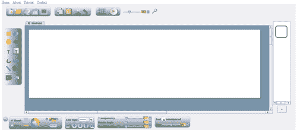
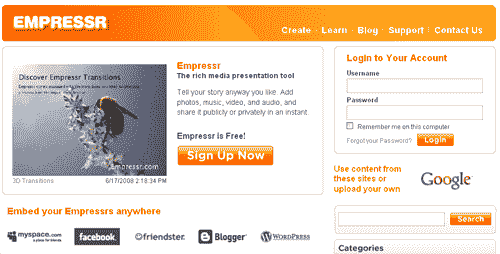
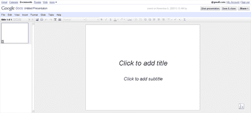
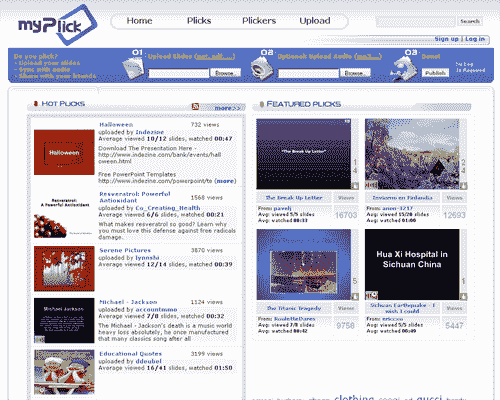
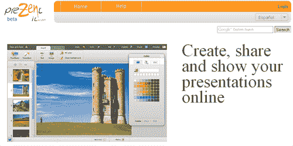
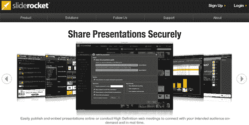
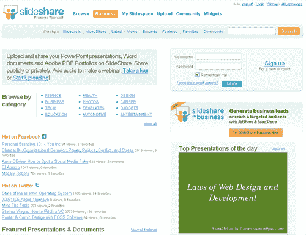
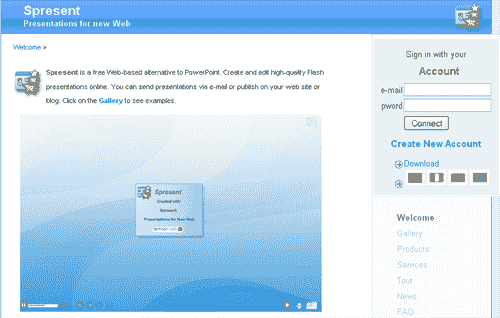
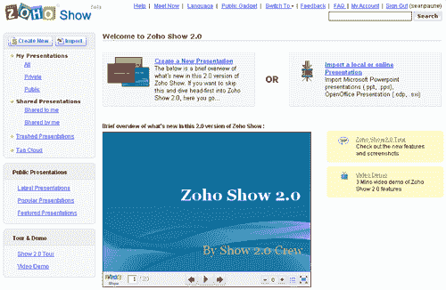

# 12 款顶级在线演示工具

> 原文：<https://www.sitepoint.com/online-presentation-tools/>

随着越来越多的长途会议的进行，由于旅行成本的增加和费用账户的减少，你需要能够向客户和同事展示你的工作，这样他们就可以很容易地理解你的观点。这 12 个工具将帮助您创建您需要的所有在线演示文稿，将它们设置为音乐，添加链接和视频，然后在您认为合适的时候嵌入或共享它们。

**[authorSTREAM](http://www.authorstream.com/)**:authorSTREAM 允许你把你的 PowerPoint 演示上传到唯一的 URL，可以和其他人分享。您还可以将它们下载为视频，放在 YouTube 上或刻录到 DVD 上，在网站中嵌入您的演示文稿，创建频道来展示您的作品等等。他们提供一个免费帐户和两个级别的高级帐户，以增加您可以上传的演示文稿的数量。

**[brink pad](http://www.brinkpad.com)**:brink pad 是一个基于 Java 的演示文稿创建器，允许你将完成的作品保存到网络、保存到磁盘、保存为 jpg 等等。这个界面看起来有点简单，但是在它提供的工具数量上非常健壮。

Empressr : Empressr 自称制作富媒体演示。您可以上传自己的内容(如视频、图像和音频)来制作演示文稿，使用 Photobucket 和 Flickr 等网站上的内容，然后分享您的作品链接或将其嵌入博客和社交媒体网站。如果您想将该服务用于商业演示，它们还包括图表和表格工具。

**[谷歌文档展示](http://docs.google.com)** :谷歌文档办公产品套件包括一个展示工具，可以让你和其他人合作，就像你和其他产品合作一样。完成后，您可以下载 pdf、PowerPoint 或文本文档形式的完成项目。

**[Imageloop](http://www.imageloop.com)** :上传 PPT、ODP、PPS 和 PDF 文件，创建您的在线演示文稿，然后在脸书、Orkut、Blogger、Hi5 等网站上分享。

**[myPlick](http://www.myplick.com/)** :使用 myPlick，您可以从上传的 PowerPoint、PDF、OpenOffice 文档、Word、Excel、JPEG、GIF、纯文本文档、MP3、WAV、WMA 和 AU 格式创建演示文稿。演示文稿目前限制为 150 张幻灯片，文件上传限制为 50 MB。

**[PreZentit](http://prezentit.com/)** :你可以用 PreZentit 创建任意多的演示文稿；你唯一的限制是 250 MB 的图像存储空间。即使没有互联网连接，您也可以下载您完成的演示文稿，以便随时播放。演示文稿是以网页的形式创建的，因此如果需要的话，您也可以手动编辑它们。

slide rocket:slide rocket 是最著名的在线演示解决方案之一，但这并不是它能力的极限。您可以上传您的 PowerPoint 作品，下载完成的演示文稿，以便您可以在任何地方展示它们，与团队成员协作，测量效率，集成动态数据等等。

**[slide share](http://www.slideshare.net/)**:slide share 更多的是针对商业市场，它允许上传所有常用的文件格式，然后允许你在社交网络、博客和其他网站上分享完成的作品。你也可以下载完整的文件来做你想做的事情。

:spre sent 允许您创建基于 Flash 的演示文稿，能够从 Flickr 和 YouTube 导入内容，发布到 Web，提供演示文稿的链接，嵌入到博客中等等。他们还提供了一个桌面应用程序，售价 29.95 美元，这样你就可以随时处理你的演示文稿。

**[VCASMO](http://www.vcasmo.com/)** : VCASMO 可以让你上传创建演示文稿所需的所有常用文件格式，并允许你在演示文稿中添加字幕、网站链接等内容，甚至可以在加载视频之前跳转到视频的某些部分，以及许多其他用户友好的功能。

**[Zoho Show](https://show.zoho.com)**:Zoho Show 允许您导入 PPT、PPS、ODP、SXI 文件，创建可设置为公开或私人的新演示文稿，引导观众通过具有聊天功能的演示文稿，将新创建的作品导出到 PowerPoint 等。

***你最喜欢的演示工具有哪些？***

## 分享这篇文章