# 皮条客我的文字:用 Photoshop 珠光宝气

> 原文：<https://www.sitepoint.com/pimp-my-text-bling-bling-with-photoshop/>

上周，我在看《我是个名人，带我离开这里》的片头字幕，我注意到片头的文字是被丢进丛林里的闪闪发光的东西。我还注意到，随着圣诞节的临近，电视上有不少广告使用了金光闪闪的文字。所以今天我们将看看如何在 Photoshop 中使用图层效果、混合模式和滤镜制作一些闪闪发光的银色和钻石(或人造钻石)文本。

1.从一个新的画布(本例中尺寸为 600 x 300 像素)开始，背景为深灰色。我在这里沿着 gangsta 路线，用一种叫做“白色套装”的黑色字体制作 SitePoint。闪亮效果最适合相当粗的字体。

2.我们现在将使用图层样式，使我们的文字看起来像是由银制成的。点击图层面板底部的图层效果按钮，选择内阴影，使用和下面相同(或相似)的设置。请注意，不透明度相当低。**先不要**点击确定。

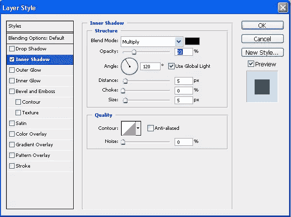

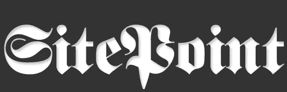

3.点击文字斜面和浮雕在左手边，并使用以下设置。**先不要**点击确定。

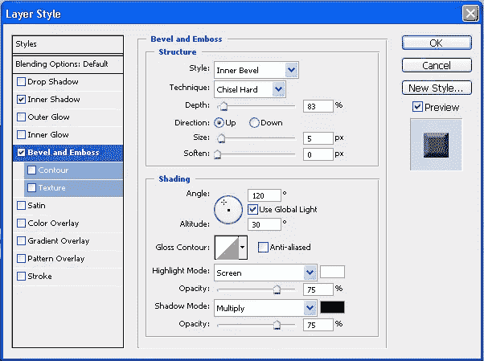

4.现在点击单词 Stroke，使用下面的设置。将描边位置设置为居中，并将填充类型从实心改为渐变。

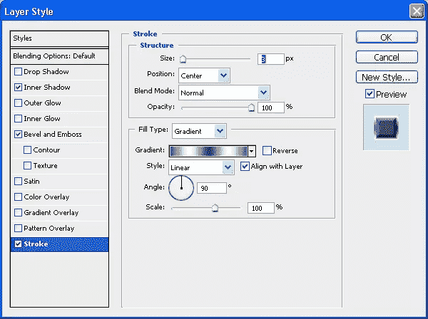

双击渐变打开渐变编辑器，然后从渐变列表中选择银色。如果你看不到银色，那么点击右上角的箭头，加载 Photoshop 附带的额外渐变，并从下拉菜单中选择金属。

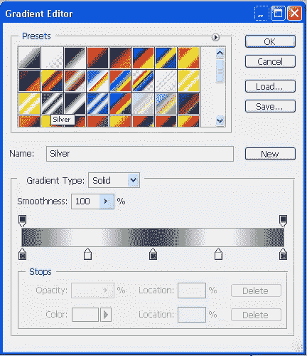

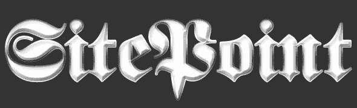

这就是我们的银色文本。现在，我们想添加大量的钻石，以显示我们是额外的经典！

5.Ctrl +单击(Win)或 Cmd +单击(Mac)图层面板中的文本缩略图，以选择图层的内容。

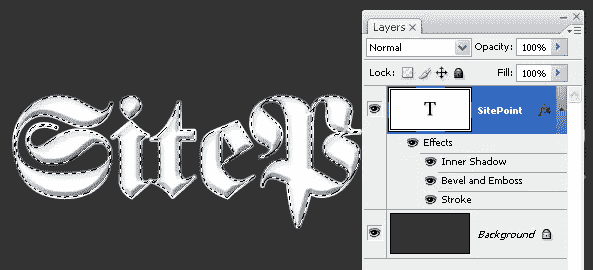

6.选择“选择”>“修改”>“缩小 2 像素”。

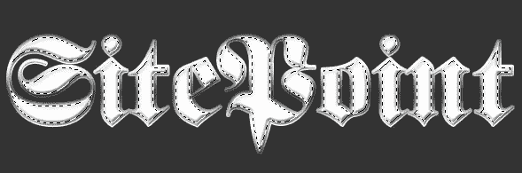

7.不要取消选择，但添加一个新的层。将图层命名为钻石。

8.确保您的默认颜色是黑色和白色(按下 D 键重置它们)，然后选取“滤镜”>“渲染”>“云”。这将为所选区域添加一个暗云纹理。

9.云有点太暗，所以选择“图像”>“调整”>“亮度/对比度”,然后向右拖动亮度滑块以使选区变亮。单击确定。

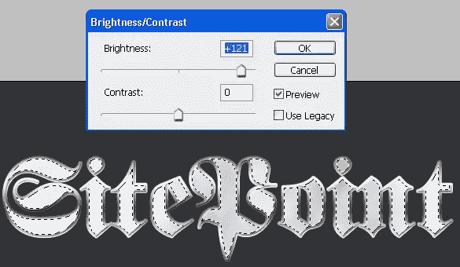

10.现在是为了钻石。选择「滤镜>扭曲>玻璃」。过滤器对话框现在打开，你会在左侧看到你的图层预览。对于纹理选择微小的镜头，并使用如下的扭曲，缩放和平滑度设置。实际上很难看到预览，因为它位于棋盘图案上，所以当你玩设置时，可能会有一点试错。

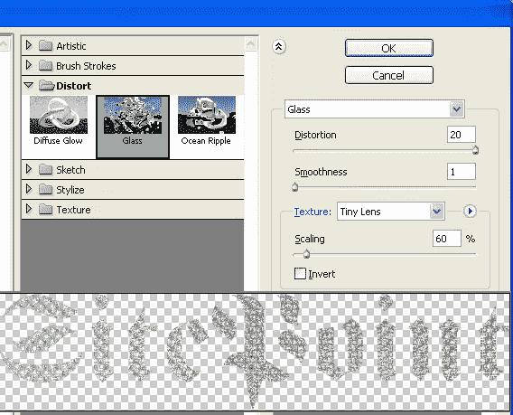

点击确定，你的新彩钻将被添加到层。您现在可以通过按 Ctrl + D 或 Cmd + D 来取消选择。您的文字现在应该看起来有点像这样:

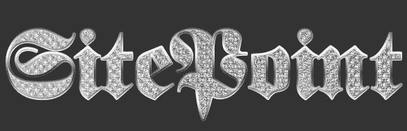

11.最后一步是添加一点点火花。添加一个新层，名称是火花。选择画笔工具，并在选项栏中选择大火花刷。如果你看不到这个笔刷，点击右上角的箭头，从下拉菜单中选择混合笔刷。设置前景色为白色，并在文本上画一些火花。绘画时改变画笔的大小。

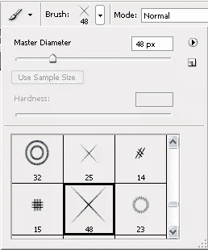

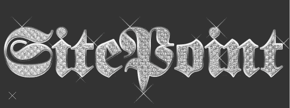

12.最后，用一个非常软的小圆刷在每个火花上画一个淡淡的模糊。瞧啊。

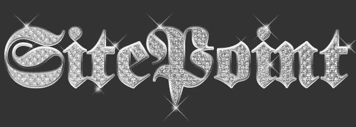

(可选)。如果您想将背景更改为较浅的颜色，您可以添加可见的投影。

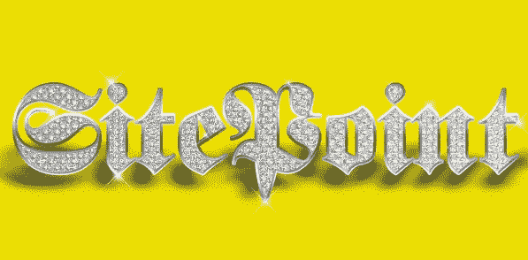

这是产生闪亮效果的一种方式。Photoshop 就是 Photoshop，我相信有很多其他方法可以达到这个目的，但最重要的是享受尝试的乐趣。

## 分享这篇文章