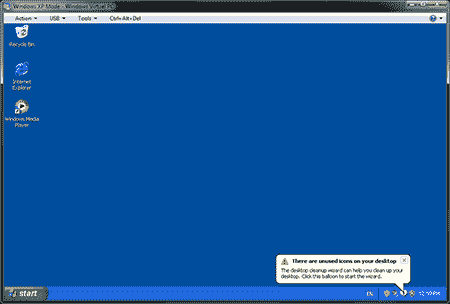
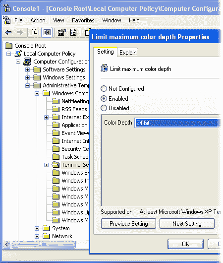

# 使用 Windows 7 XP 模式在同一台计算机上运行 IE6、IE7 和 IE8

> 原文：<https://www.sitepoint.com/ie6-ie7-ie8-win7-xp-mode/>

在 Internet Explorer 中测试您精心制作的 web 应用程序要比想象中困难得多。IE6、IE7 和 IE8 都有相当大的市场份额，但是不可能在一个 Windows 操作系统上测试所有三个版本。有一些聪明的黑客和漂亮的软件，但都有缺陷，很少能在 Windows Vista 或 7 上运行良好。最可靠的测试方法是使用三台独立的电脑。

我们中很少有人有空间或耐心来维护三台电脑，所以我们求助于虚拟机软件，如 [VMware](http://www.vmware.com/) 或 [VirtualBox](http://www.virtualbox.org/) 。VM 软件在真实的 PC(主机)上模拟 PC(来宾)。假设虚拟机软件可用于您的主机操作系统，您可以在虚拟机中运行任何其他操作系统。大多数情况下，虚拟机只是一个包含硬盘映像的文件。因此，虚拟机的备份、克隆或移动比真正的 PC 要容易得多。

## 微软 Windows 虚拟 PC 和 XP 模式

虚拟 PC 是微软对 VMware 和 VirtualBox 的替代。大多数版本的 Windows 都可以免费下载。作为一个独立的产品，它很实用，但提供的功能比竞争对手少。然而，XP 模式是虚拟 PC 的杀手锏。它提供:

*   一个完全许可的，精简的，虚拟的 Windows XP SP3 版本。

*   一个聪明的工具，将客户 Windows XP 操作系统与您的 Windows 7 主机集成在一起。实际上，您可以像运行原生 Windows 7 程序一样运行 XP 应用程序。虽然 XP 应用程序是隔离的，但它仍然可以访问主机的文件和系统。

这对 web 开发者的好处是显而易见的:你可以在同一个桌面上同时运行真正的*版本的 IE6、IE7 和 IE8，而不会有任何冲突。*

 *## 安装虚拟 PC 和 XP 模式

在继续之前，您应该检查您运行的是哪个版本的 Windows:

*   Windows 7 专业版、企业版和旗舰版用户可以安装虚拟 PC 和 XP 模式。

*   Windows 7 家庭用户可以安装 Virtual PC，但你需要自己的 XP 安装盘，并且你将没有 XP 模式集成的好处。

*   Windows Vista 和 XP 用户可以安装较旧的 [Virtual PC 2007。](http://www.microsoft.com/windows/virtual-pc/support/virtual-pc-2007.aspx)

如果你的系统缺乏对 XP 模式的支持，我会推荐 [VirtualBox](http://www.virtualbox.org/) 而不是 Virtual PC。它是免费的(开源的)，更快，提供更多的设施。假设您还在这里(并且没有停止安装 VirtualBox)，请按照以下步骤安装 Virtual PC 和 XP 模式:

1.  首先，检查你的电脑的兼容性。为了有效地运行 XP 模式，我建议至少 2GB 的内存。它可能用得更少，但使用起来会更麻烦。XP 模式需要硬件辅助虚拟化(HAV)。大多数现代处理器都支持这一功能，但可能需要在 BIOS 中启用。开机后立即按**【Del】****F2**或 **Esc** 即可进入 BIOS 菜单。微软还提供了一个有用的 [HAV 检测工具](http://go.microsoft.com/fwlink/?LinkId=163321)，可以帮助你进行 BIOS 配置。

2.  接下来，下载 XP 模式和虚拟 PC。下载可从[微软虚拟个人电脑页面获得。](http://www.microsoft.com/windows/virtual-pc/download.aspx)选择 Windows 7 操作系统版本和语言后，您将看到两个下载链接:

    *   Windows XP 模式

    *   Windows 虚拟 PC

    在继续下一步之前，下载这两个文件并进行病毒扫描。

3.  *必须先安装 XP 模式！* 我意识到这似乎有点奇怪，但这是你需要做的。完成后，安装虚拟 PC 并重启电脑。

## 首次运行 XP 模式

您的新 XP 虚拟机现在可以启动和配置了。

1.  首先，启动 XP 模式。要启动 XP 模式，选择开始 > 所有程序 > Windows 虚拟 PC > Windows XP 模式。你会得到提示，如图[图 1 所示，“XP muser account—记住你的密码！”](#fig_xmpuser "Figure 1. XPMUser account—remember your password!")，输入虚拟机文件位置和`XPMUser`账户密码— *请保管好密码！*

    **图一。XPMUser 帐户—记住您的密码！**

    

    点击下一步，系统会询问您是否应该启用或禁用自动更新。我建议禁用更新——你还不需要自动升级 IE6。再次点击下一步，XP 模式客户操作系统将会安装。几分钟后，你会看到全新的 Windows XP 屏幕，如图[图 2，“全新的 Windows XP 桌面”](#fig_winxo_desktop "Figure 2. A Fresh Windows XP Desktop")。

    **图二。全新的 Windows XP 桌面**

    
2.  你现在应该安装最新的更新，但是 *要非常小心，避免安装 IE7 或 IE8！* 你也可以从添加或删除程序控制面板的添加/删除 Windows 组件面板中删除任何不必要的 Windows 组件，比如游戏、媒体播放器、MSN Messenger 等等。

3.  接下来，您需要配置虚拟机分辨率。XP 模式虚拟机以不寻常的 960×600 分辨率和 16 位颜色运行。除非有所改变，否则 IE6 和 IE7 也将在 16 位颜色模式下运行，你的微妙阴影 web 应用程序看起来会有点奇怪。更改分辨率和颜色深度有点不寻常，因为 XP 模式使用 Windows 远程桌面。从 VM 菜单中，选择工具 > 禁用集成功能。这将使您从 XP 中注销，您需要重新输入密码。然后，按照以下步骤操作:

    1.  从 XP 开始菜单，点击运行，进入 **`mmc`** ，点击确定。

    2.  从控制台中，选择文件 > 添加/删除管理单元。从列表中选择组策略对象编辑器，点击添加按钮。

    3.  显示一个对话框，并且`Local Computer`应该列在组策略对象字段中。保持原样并点击结束，然后关闭，最后确定。

    4.  导航到本地计算机策略 > 计算机配置 > 管理模板 > Windows 组件 > 终端服务，然后双击限制最大色深设置。选择使能，设置色深为 24 位，如图[图 3，“使能 24 位颜色”](#fig_24bit "Figure 3. Enabling 24-bit color")。

    5.  点击 OK 几次，导航出去并关闭控制台。

    6.  在桌面上点击右键，选择属性；选择设置，应用合适的屏幕分辨率，如 32 位 1024×768。

    7.  最后，从 VM 菜单中，点击工具 > 启用集成特性。

    **图 3。启用 24 位颜色**

    

    颜色深度将降低到 24 位，但它明显优于 16 位。

4.  完成后，完全关闭来宾 XP 操作系统很重要——单击窗口关闭按钮，选择关闭，然后单击确定。

**Go to page:** [1](https://sitepoint.com/ie6-ie7-ie8-win7-xp-mode) | [2](https://sitepoint.com/ie6-ie7-ie8-win7-xp-mode-2/)*

## *分享这篇文章*