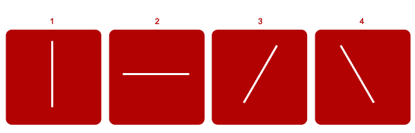
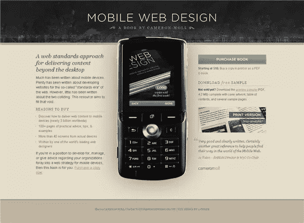
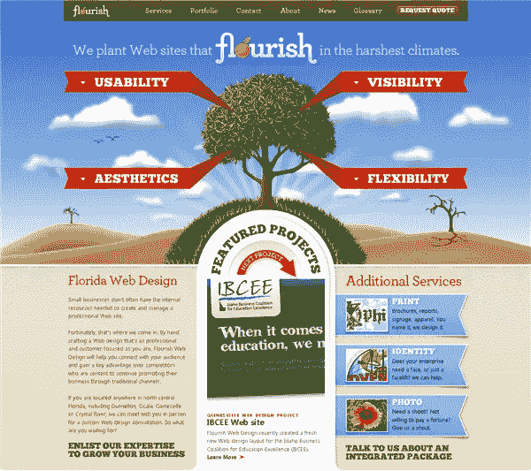
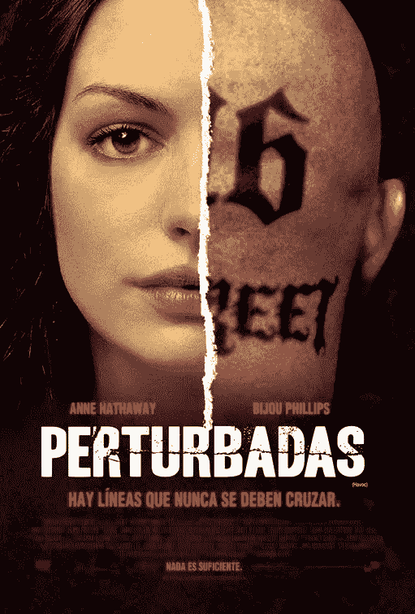
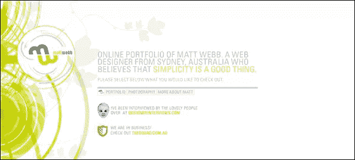
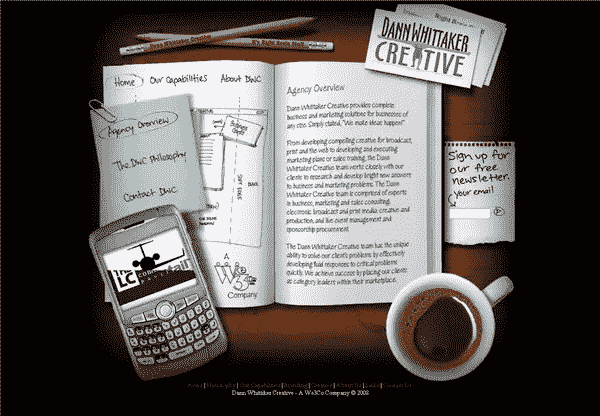

# 良好设计的原则:平衡

> 原文：<https://www.sitepoint.com/principles-of-good-design-balance/>

每种布局都以空白页或空白空间开始。当我们添加一个元素时，它的位置可以决定设计的成功程度。有效的设计会引发交流和观众的兴趣，无论是在印刷品上还是在网络上。

在一个典型的网页布局中，设计师需要放置一个标志、文本、照片或插图。通过有意识地努力处理这些元素之间的关系来产生一个引人注目的设计。

设计中的平衡很像生活中的平衡。这往往是一件好事。现实生活中平衡的一个常用例子是跷跷板(我相信在遥远的地方也被称为跷跷板)。只有一个人坐的时候，跷跷板就没什么意思了。当两个体重相等的人分别坐在两边时，就达到了平衡。当一个较重的人坐在一边，两个较轻的人站在另一边时，也可以达到平衡。如果一个较重的人滑近跷跷板的中心，而一个较轻的人坐在另一边的末端，就可以达到平衡。

作为人类，我们的身体是平衡的。我们在脊柱和头部的两侧各有一只胳膊和一条腿，以平衡脊柱的顶部中心。尽管体型和体重不同，我们还是能够站立和移动。在设计中，我们试图在各种元素之间取得平衡，因为这样看起来很赏心悦目。但是平衡并不总是通过对称来实现的。看看下面的方框。

框 1 和 2 中的白线是对称平衡的，而框 3 和 4 中的白线是非对称平衡的。

**对称性**

对称平衡是镜像平衡。如果你在页面中央画一条线，线的一边的元素会被镜像到另一边。我们可以通过在设计中相当均匀地放置元素来实现它。

*自然界中的对称性*

一个典型的例子发生在 web 上，文本块在桶或列中相互镜像。对称也可以通过颜色和排版来实现。

[移动网络图书](http://www.mobilewebbook.com/)——在这个网站上，手机图像将页面一分为二，两边的文本块相互抵消。

在电影《我成为女人的那一天》的海报上，右上角的大块白色文字在颜色和形状上都反映在左下角。

绚丽多彩的佛罗里达州 T2 繁华的 T3 景点几乎可以从中心被切成两半。它有非常强烈的对称平衡感。

下面的浩劫海报使用相似的形状(和身体部位)左右平衡。标题上下的红色文字在颜色和大小上与标题上下是平衡的。

**不对称**

不对称平衡布局的元素不会在中心线上相互镜像。这些布局可能更难设计，但可以吸引观众。我们可以通过在一边放置几个小物件，在另一边放置一个大物件来创建一个不对称的平衡布局。如果你有一个深色的东西在一边，你可以在另一边放几个浅色的东西。不对称的平衡设计可以产生张力，吸引观众。

MattWeb 有一个大图形填充了主页的左侧。通过使用匹配的颜色和与图形中的螺旋相一致的无衬线字体，实现了一种不对称的平衡感。

Dann Whitaker 的网站有几个元素并没有对称地相互反映，但在颜色、纹理和内容方面确实相互平衡。

**失衡**

好吧，如果你所有的设计工作都涉及到平衡，那可能会很无聊。如果你知道规则，那么你当然可以打破它们，缺乏平衡可以传达行动和运动。会让人觉得有点不安，甚至不安。一个失衡的设计能让人思考。只是不要让它偶然发生。

芭芭拉·克鲁格的海报

下周，我们将了解一下接近度。与此同时，你有没有遇到过任何显示强烈的对称或不对称平衡的网站？

## 分享这篇文章