# 为你的网上商店提供动力的 18 个大购物车

> 原文：<https://www.sitepoint.com/shopping-cart-solutions/>

电子商务的繁荣没有任何迹象表明会很快放缓，而且每年节日期间的消费金额都在继续增加。如果你有产品要卖，进入市场是一个相当简单的问题，但是你如何开始在这个空间中的数百个购物车选项中进行排序呢？

我们已经帮了你一点忙，收集了 18 个选项，代表了免费和收费选项的最佳选择。但是，请仔细阅读每一个，因为它们都有各自的优缺点。

## 免费购物车

AgoraCart : AgoraCart 提供免费版本的软件，拥有所有常见的功能，但如果你升级到黄金版本，你将获得更多的模块和支持。

Batavi : Batavi 是由 osCommerce 核心团队成员和 ICEshop 于 2007 年创立的，当时他们对 osCommerce 3.0 似乎毫无进展感到沮丧。这个购物车是基于 3.0 的未完成版本，但完全重写。它提供特定于客户和团体的定价、支付和运输模块、用于交叉销售和追加销售的相关产品、用于为大量产品定价的产品价格规则以及许多其他功能，使其非常适合企业对企业的销售。

[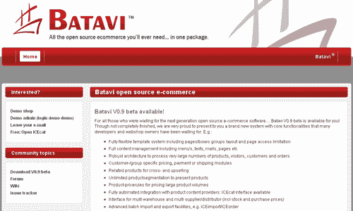](https://blogs.sitepointstatic.com.s3.amazonaws.cimg/lists/shoppingcarts/batavi.png)

Magento 最初被设想为 osCommerce 的一个分支，但随着开发的开始，他们决定从头开始编写一些原创的代码，这就是购物车的诞生。该系统建立在 Zend 框架上，基于 PHP，可以作为开源选项安装额外的模块，或者作为企业版收费，用于需要购物解决方案的大型公司。更多信息，[请查看 Magento 的罗伊·鲁宾的 SitePoint 播客](https://www.sitepoint.com/podcast-29-roy-rubin-magento/)。

[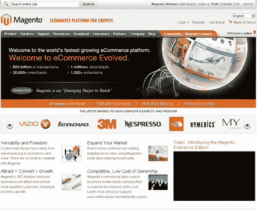](https://blogs.sitepointstatic.com.s3.amazonaws.cimg/lists/shoppingcarts/magentocommerce.png)

OFBiz**[:OFBiz 的 Apache 是一个针对众多企业业务需求的解决方案，但可以作为电子商务解决方案轻松部署到任何规模的企业。](http://ofbiz.apache.org/)**

[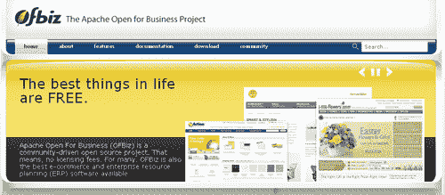](https://blogs.sitepointstatic.com.s3.amazonaws.cimg/lists/shoppingcarts/ofbiz.png)

OpenCart : OpenCart 是市场上一长串开源购物车中的另一个，但它似乎比大多数购物车提供了更多的选择。它支持一个完整的模板系统，支持超过 20 个支付网关，超过 8 个不同的支付网关，无限的类别和产品等等。

[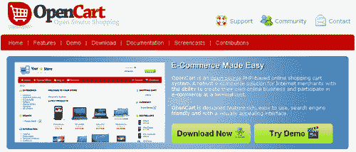](https://blogs.sitepointstatic.com.s3.amazonaws.cimg/lists/shoppingcarts/opencart.png)

osCommerce :可能是免费购物车解决方案中最著名的，osCommerce 已经存在了几年，其特点是不断增长的开发人员社区，他们继续开发新的插件，使购物车除了擦窗户之外什么都可以做。购物车的前端是高度可定制的，但它带有一个流体宽度的模板，这本身就相当不错。由于安装的数量，它已经变得非常普遍，一眼就能认出来。在这一点上，最大的缺点是 3.0 版本的开发时间过长。它基于 PHP，使用 MySQL 数据库。

[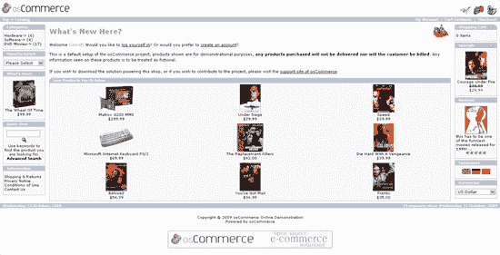](https://blogs.sitepointstatic.com.s3.amazonaws.cimg/lists/shoppingcarts/oscommerce.png)

**[PrestaShop](http://www.prestashop.com/)**:PrestaShop 运行在 PHP 和 MySQL 上，在管理面板中广泛使用。该系统允许您订购缺货商品、包裹跟踪、商品退货等等。很多扩展模块都是免费的，但是在 PrestaStore 里也有一些付费的和模板。

[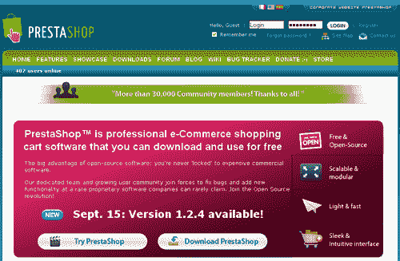](https://blogs.sitepointstatic.com.s3.amazonaws.cimg/lists/shoppingcarts/prestashop.png)

**[Satchmo](http://www.satchmoproject.com/)**:Satchmo 最初是用 Python 设计的，试图克服 PHP 的一些缺点，现在使用的是 Django web 应用框架。它包括许多功能，如 PDF 发票生成，自动缩略图生成，库存跟踪等。

[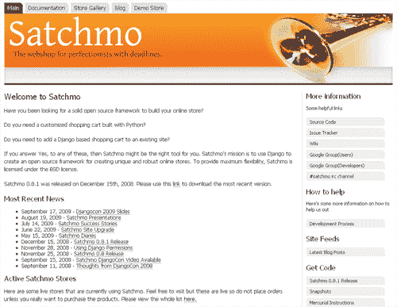](https://blogs.sitepointstatic.com.s3.amazonaws.cimg/lists/shoppingcarts/satchmo.png)

**[【Uber cart】](http://www.ubercart.org/)**:Uber cart 是为与 Drupal 协同工作而开发的，可以在任何可以运行 PHP 和 MySQL 的服务器上与你的站点和社区完全集成。它似乎最适合出售数量有限的商品的人或公司。

[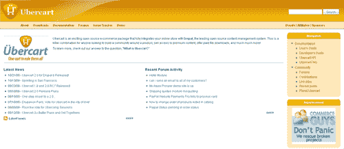](https://blogs.sitepointstatic.com.s3.amazonaws.cimg/lists/shoppingcarts/ubercart.png)

**[VirtueMart](http://virtuemart.net/)** :最初是一个名为 mambo-phpShop 的插件，当 mambo 变成 Joomla 时，VirtueMart 更改了名称，它仍然需要 Joomla 才能运行，因为它无法独立运行。它运行在 PHP 和 MySQL 上，能够支持无限数量的产品和类别，但是推荐用于轻流量到中等流量的站点。

[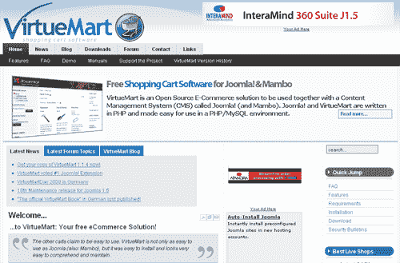](https://blogs.sitepointstatic.com.s3.amazonaws.cimg/lists/shoppingcarts/virtuemart.png)

**[Zen Cart](http://www.zen-cart.com/)** : Zen Cart 是 osCommerce 的一个分支，它增加了模板系统等功能，并在其核心代码中包括一些流行的 osCommerce 插件，如礼券模块。它基于 PHP，使用 MySQL 数据库。

[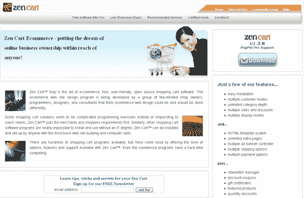](https://blogs.sitepointstatic.com.s3.amazonaws.cimg/lists/shoppingcarts/zen-cart.png)

## 收费购物车

Avactis : Avactis 提供了 PHP/MySQL 购物车的所有常用功能，比如实时运费计算、多种货币、销售报告、市场营销等等。该计划提供了一个基于标签的购物车系统，允许您将该系统添加到您选择的任何网站，无论它是不是一个静态网站。他们提供有限功能的免费试用，您可以安装和测试。

[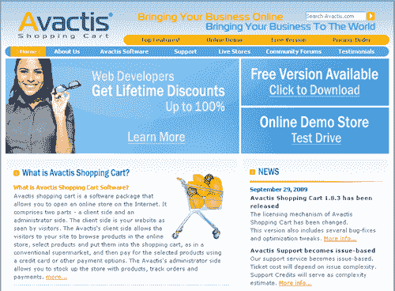](https://blogs.sitepointstatic.com.s3.amazonaws.cimg/lists/shoppingcarts/avactis.png)

**[cube cart](http://www.cubecart.com/)**:cube cart 运行在 PHP 和 MySQL 上，由模板驱动，提供按州/区或国家的税收、库存控制、礼券等。该公司还提供终身免费更新和更多的附加功能模块。

[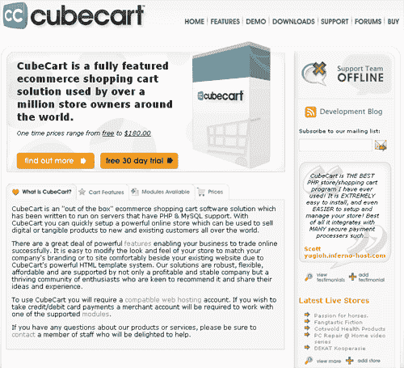](https://blogs.sitepointstatic.com.s3.amazonaws.cimg/lists/shoppingcarts/cubecart.png)

**[麦哲伦商业](http://www.magellancommerce.com/)** :麦哲伦的范围有点受限，但根据零售商的需求，还是很好用的。它提供了 30 多个模板，实时运输计算器，订单和库存跟踪等等。

[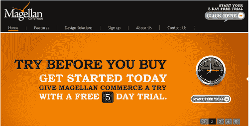](https://blogs.sitepointstatic.com.s3.amazonaws.cimg/lists/shoppingcarts/magellancommerce.png)

**[product cart](http://www.earlyimpact.com/)**:product cart 是用 ASP 编写的，很大程度上依赖 AJAX 来加速消费者对他们购物车的体验。如果你喜欢完全在购物车上建立一个，该系统也可以与你当前的网站集成。

[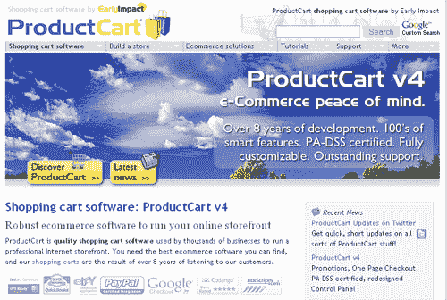](https://blogs.sitepointstatic.com.s3.amazonaws.cimg/lists/shoppingcarts/ProductCart.png)

:这个购物车解决方案允许你添加按钮到一个现有的网站，或者你可以用他们的向导建立一个完整的网站。对于那些想要完全控制自己的设计而不受完整购物车网站限制的人来说，这将是一个很好的解决方案。ShopSite 为其购物车系统提供三个级别的订阅，或者您可以一次性支付前两个服务级别的费用。

[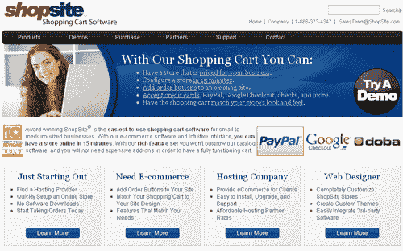](https://blogs.sitepointstatic.com.s3.amazonaws.cimg/lists/shoppingcarts/shopsite.png)

ViArt :一个基于 PHP 的购物车，提供多种口味，以便您可以选择最适合您需求的一种。有一个免费版本，但它是如此有限，它将只适合于最小的在线商店。ViArt 还为您提供完整的 CMS 和帮助台，可以集成到在线商店中。

[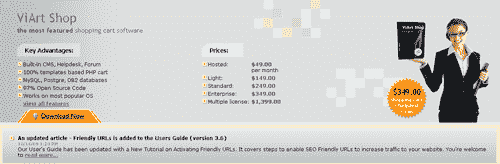](https://blogs.sitepointstatic.com.s3.amazonaws.cimg/lists/shoppingcarts/viart.png)

**[X-Cart](http://www.x-cart.com/)** : X-Cart 提供不同版本的软件，以匹配商家的不同需求。从最基本的版本开始，它具有基于 CSS 的定制布局，MySQL 数据库，搜索引擎友好等等。

[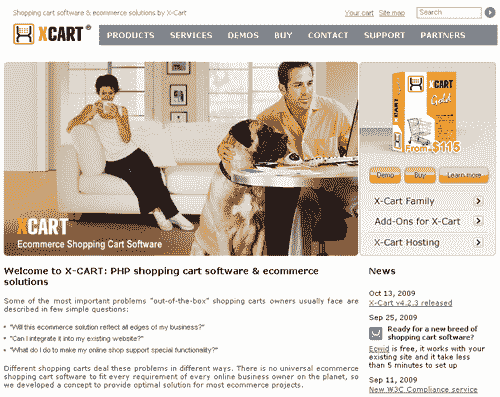](https://blogs.sitepointstatic.com.s3.amazonaws.cimg/lists/shoppingcarts/x-cart.png)

## 分享这篇文章