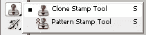
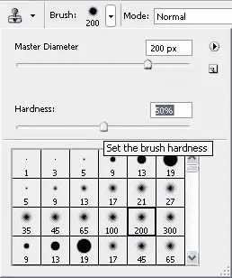
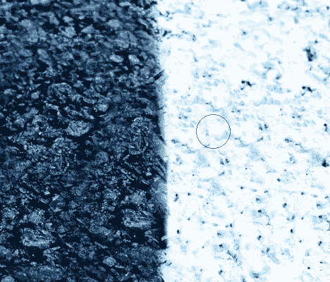
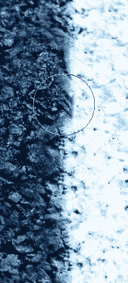

# 如何使用 Photoshop 克隆图章工具处理图像

> 原文：<https://www.sitepoint.com/photoshop-clone-stamp-tool/>

从过去几年教 Photoshop 的经验来看，我可以毫无疑问地说，克隆图章工具是初学者最喜欢使用的工具。为什么他们不会呢？从你的照片中删除人物，从其他照片中添加一些东西，并在损坏的照片上填补缺失的部分，这是一件非常有趣的事情。克隆工具是修图师工具箱中至关重要的元素。那么它是如何工作的呢？

克隆图章工具从图像的一个区域取样像素，并将它们复制到图像的另一部分。您实际上是在使用画笔将图像一部分的像素绘制到另一部分上。您可以将任何画笔笔尖或形状与克隆图章工具配合使用，这使您可以非常精确地控制要克隆的区域。您也可以从一个图像中取样，并将克隆应用到另一个图像中，只要这两个图像的颜色模式相同。

在这个简单的例子中，我将从柏油碎石背景中移除一只蝴蝶，但这个概念对你选择的任何图像都是一样的。

1.在 Photoshop 中打开你的图片。

2.选择克隆图章工具()。

3.在工具选项栏上，打开画笔弹出调板，选择一个中等大小的画笔，边缘中等柔软。对于这个例子，我设置笔刷直径为 200 像素，硬度为 50%。这是一个好主意，使用一个软边刷，否则你会看到一个非常硬的克隆发生线。

4.然后，确保选择了“对齐”选项。

现在，您需要在想要复制的区域中设置您的采样点，并克隆到另一个区域。当您在选项栏中选择对齐时，这意味着无论您停止和恢复绘画的频率有多高，您都将重复使用最近的**采样点。当取消选择“对齐”时，您将在每次绘画时重复使用相同的采样像素。**

5.将克隆图章工具指针移动到蝴蝶左侧的黑色区域。按住 Alt 键(Windows)或 Option 键(Mac ),指针会显示为目标十字光标。点按一次以将该点设定为采样点。释放 Alt 或 Option 键。

6.单击并拖动克隆图章工具到蝴蝶翅膀的一小块区域上。当您拖动时，机翼将开始消失，因为它被您从图像的另一部分采样的像素所取代。出现在“克隆图章”工具右侧的十字光标表示您在拖动时复制的图像的源区域。

7.释放鼠标按钮，将指针移动到蝴蝶翅膀的另一部分。十字线与克隆图章工具指针保持相同的空间关系，就像第一次描边时一样。这是因为在设置笔刷时设置了“对齐”选项。

8.通过按住 Alt (Windows)或 Option (Mac)键并单击一次，您可以随时重置您的样本区域。你将需要这样做几次，以完全消除蝴蝶，不要忘记调整你的画笔。继续克隆，直到你把蝴蝶在柏油碎石黑暗面的那一面去掉。

9.重置你的采样点，在白色的一边工作，直到你克隆出蝴蝶的另一边。为了完成蝴蝶栖息的区域，从上面和下面取样。

仅此而已。在克隆过程中，不要害怕不断进行重采样。如果你做了大量的克隆工作，你会发现使用快捷方式很快就会成为你的第二天性。

**仿制图章工具是您工作流程的重要组成部分吗？**

## 分享这篇文章