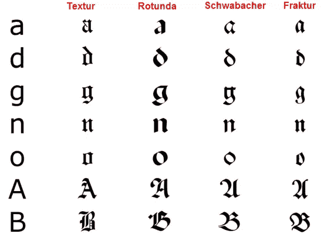
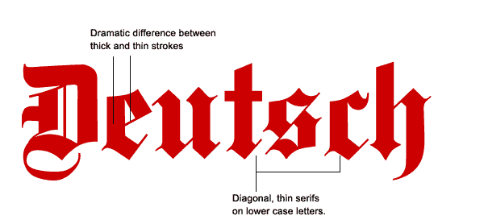
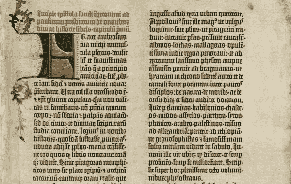
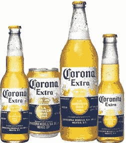
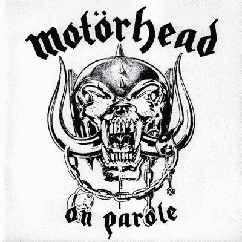
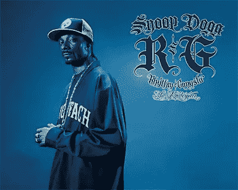
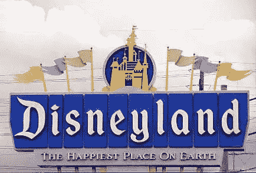

# 黑色字体:漫长而多彩的历史

> 原文：<https://www.sitepoint.com/the-blackletter-typeface-a-long-and-colored-history/>

《古森堡圣经》( Guthenburg Bible)中使用了黑色字体(有时也被称为哥特式、花体或古英语),这是欧洲印刷的第一批书籍之一。这种字体风格可以通过其引人注目的粗细笔画来识别，在某些字体中，衬线上有精心制作的漩涡。黑色字体是基于早期手稿字体。

它们从十二世纪中期开始在西欧演变。随着时间的推移，各种不同的黑色字母出现了，但四个主要的家族可以确定: **Textura，Rotunda，Schwabacher 和 Fraktur。**深入探讨每一个问题超出了本文的范围，但是如果你看看下面图表中的字母“o ”,你就会发现其中的区别。

*图片来源:维基百科(作者稍作改动)*

当古腾堡在他的圣经和书籍中使用黑色字体时，这标志着印刷字体的一个新时代。黑色字体很难阅读，因为正文和罗马和斜体的字体更容易用活字印刷。由于这些原因，在 16 世纪，blackletter 在除德国和德语国家以外的许多国家变得不那么流行了。

*【古腾堡圣经形象来源:* [*【维基百科】*](http://en.wikipedia.org/wiki/Gutenberg_Bible)

德国继续使用黑色字母，直到二十世纪初。在 20 世纪 20 年代，德国设计师和出版商认为它已经过时，不再受欢迎，取而代之的是无衬线字体的“新印刷术”。1933 年，希特勒宣布新的印刷术是非德国的，并宣布 Fraktur 为“Volk”，即人民的字体。纳粹继续广泛使用花体字，直到 1941 年被更易读的字体取代。有些人认为所有的黑色字体都是纳粹字体，但这显然是一种无知的观点，抹杀了几百年的字体历史。查看《眼》杂志关于[类型](http://www.eyemagazine.com/feature.php?id=98&fid=485)的含义的文章，了解更多关于这个话题的信息。

**Blackletter 在行动**

如前所述，这些字体在正文中不易阅读，因此它们最适合用于标题、标识、海报和标志。如果你收到了一份证书、文凭或学位，很有可能部分或全部内容是黑体字。其他常见的现象包括报纸铭牌，人们认为这种字体给出版物增添了庄严感。

黑色字母最近与啤酒标签、重金属乐队、黑帮说唱以及迪斯尼乐园联系在一起。

*电晕啤酒标签*

*摩托头乐队专辑封面*

**

*史努比狗狗专辑封面*

*迪斯尼乐园的标志*

**自由字体**

如果你想在你的设计中加入中世纪的风格，现在有大量免费的 blackletter 字体可供下载。

[修道院黑](http://www.dafont.com/cloister-black.font)

[德国装饰字体](http://www.dafont.com/deutsche-zierschrif.font)

日尔曼

**外部资源**

我爱印刷术有一篇关于 Moyenage 的好文章，Moyenage 是现代的黑色字体。

Creative Pro 讨论了新的黑色字体 Amador。

拥有一个优秀的 Blackletter 资源页面。

**相关文章:**

*   [**无衬线字体**](https://www.sitepoint.com/the-sans-serif-typeface/)
*   [**脚本字体**](https://www.sitepoint.com/the-script-typeface/)
*   [**旧字体**](https://www.sitepoint.com/the-old-style-typeface/)
*   [**现代字体**](https://www.sitepoint.com/the-modern-typeface/)
*   [**大而粗的漂亮石板衬线**](https://www.sitepoint.com/big-bold-and-sometimes-beautiful-serif-slab-fonts/)
*   

 **你见过最近使用黑色字体的设计吗？你见过有网站用的吗？你会考虑在自己的作品中使用这些字体吗？** 

## **分享这篇文章**